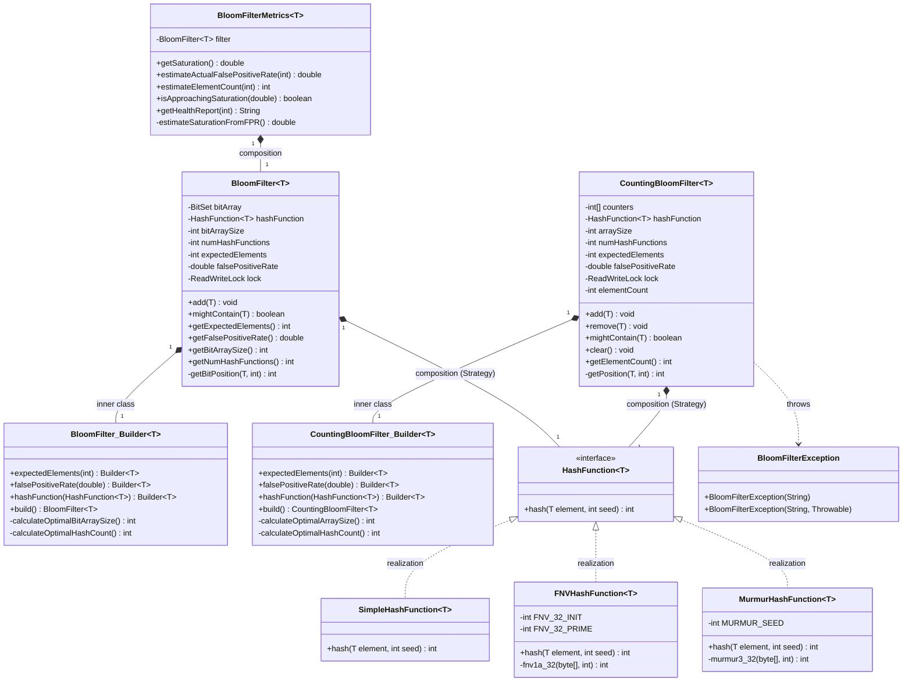

# Bloom Filter

## Functional Requirements

- User can **add** an element to the filter
- User can **check membership** — returns "definitely not present" or "might be present"
- User can **configure** expected element count and acceptable false positive rate
- User can **delete** an element (Counting Bloom Filter variant — Curveball #1)
- User can **reset** the filter (Counting Bloom Filter — Curveball #2)
- User can **monitor** filter health: saturation, estimated FPR, element count (Curveball #3)

## Non-Functional Requirements

- Thread-safe: concurrent add and contains must not corrupt state
- Mathematically sound: bit array size and hash count derived from FPR formula
- O(k) add and contains (k = number of hash functions, typically small constant)
- Pluggable hash functions without modifying the filter

## Constraints

- In-memory only
- Probabilistic: false positives are possible, false negatives are not
- Standard `BloomFilter` does not support deletion (use `CountingBloomFilter`)

## Out of Scope

- Scalable / dynamic-resize Bloom filters
- Distributed Bloom filters
- Persistent / serializable filters

---

## Class Diagram



---

## Core Formulas

| Parameter | Formula |
|---|---|
| Optimal bit array size (m) | `m = -(n × ln p) / (ln 2)²` |
| Optimal hash function count (k) | `k = (m / n) × ln 2` |

Where `n` = expected elements, `p` = target false positive rate.

---

## Overview

A space-efficient probabilistic data structure for membership testing with:
- **Zero false negatives**: If it says "no", the element is definitely not present
- **Possible false positives**: If it says "yes", the element might be present
- **O(k) operations**: Constant time add/contains (k = number of hash functions)
- **Space efficient**: Uses bits instead of storing actual elements

## Quick Start

```java
// Create a Bloom filter for 10,000 URLs with 1% false positive rate
BloomFilter<String> urlFilter = new BloomFilter.Builder<String>()
    .expectedElements(10000)
    .falsePositiveRate(0.01)
    .build();

// Add URLs
urlFilter.add("https://example.com/page1");
urlFilter.add("https://example.com/page2");

// Check membership
boolean exists = urlFilter.mightContain("https://example.com/page1"); // true
boolean notExists = urlFilter.mightContain("https://example.com/page999"); // false (probably)
```

## Design Patterns Used

### 1. Strategy Pattern (HashFunction)
Swap hash algorithms without modifying BloomFilter code:

```java
// High quality, slower
BloomFilter<String> filter1 = new BloomFilter.Builder<String>()
    .expectedElements(1000)
    .hashFunction(new MurmurHashFunction<>())
    .build();

// Faster, lower quality
BloomFilter<String> filter2 = new BloomFilter.Builder<String>()
    .expectedElements(1000)
    .hashFunction(new SimpleHashFunction<>())
    .build();
```

### 2. Builder Pattern
Handles complex construction with automatic parameter calculation:

```java
BloomFilter<String> filter = new BloomFilter.Builder<String>()
    .expectedElements(10000)           // Required
    .falsePositiveRate(0.001)           // Optional (default: 0.01)
    .hashFunction(new FNVHashFunction<>()) // Optional (default: MurmurHash)
    .build();

// Builder automatically calculates:
// - Optimal bit array size: 143776 bits
// - Optimal number of hash functions: 10
```

## Configuration Guide

### Choosing False Positive Rate

| Use Case | Recommended FPR | Trade-off |
|----------|----------------|-----------|
| URL deduplication in web crawler | 1% - 5% | Acceptable to re-crawl some pages |
| Spam email detection | 0.1% - 1% | Balance between false alarms and memory |
| Database query cache | 0.01% - 0.1% | Minimize unnecessary DB queries |
| Security (malicious IP blocking) | 0.001% - 0.01% | Cannot afford false blocks |

### Memory vs Accuracy Trade-off

For 10,000 elements:

| FPR | Bit Array Size | Memory | Hash Functions |
|-----|----------------|--------|----------------|
| 10% | 47,926 bits | ~6 KB | 3 |
| 1% | 95,851 bits | ~12 KB | 7 |
| 0.1% | 143,776 bits | ~18 KB | 10 |
| 0.01% | 191,702 bits | ~24 KB | 13 |

## Hash Function Comparison

| Hash Function | Speed | Quality | Use Case |
|---------------|-------|---------|----------|
| **MurmurHash** | Fast | Excellent | Production (default choice) |
| **FNV** | Very Fast | Good | Performance-critical scenarios |
| **Simple** | Fastest | Fair | Testing, non-critical use cases |

## Common Use Cases

### 1. Web Crawler URL Deduplication
```java
BloomFilter<String> visitedUrls = new BloomFilter.Builder<String>()
    .expectedElements(1_000_000)
    .falsePositiveRate(0.01)
    .build();

void crawl(String url) {
    if (visitedUrls.mightContain(url)) {
        return; // Already visited (or false positive)
    }
    visitedUrls.add(url);
    // Crawl the URL...
}
```

### 2. Database Query Cache
```java
BloomFilter<String> cachedQueries = new BloomFilter.Builder<String>()
    .expectedElements(100_000)
    .falsePositiveRate(0.001)
    .build();

Object executeQuery(String sql) {
    if (!cachedQueries.mightContain(sql)) {
        // Definitely not cached, skip cache lookup
        Object result = database.execute(sql);
        cache.put(sql, result);
        cachedQueries.add(sql);
        return result;
    }
    // Might be cached, check cache
    return cache.getOrCompute(sql, () -> database.execute(sql));
}
```

### 3. Spam Email Detection
```java
BloomFilter<String> spamEmails = new BloomFilter.Builder<String>()
    .expectedElements(10_000_000)
    .falsePositiveRate(0.001)
    .build();

// Load known spam emails
spamEmails.add("spam@example.com");

boolean isSpam(String email) {
    return spamEmails.mightContain(email);
}
```

## Thread Safety

BloomFilter is thread-safe using ReadWriteLock:
- Multiple threads can read concurrently
- Writes are exclusive

```java
BloomFilter<String> sharedFilter = new BloomFilter.Builder<String>()
    .expectedElements(10000)
    .build();

// Safe to use from multiple threads
ExecutorService executor = Executors.newFixedThreadPool(10);
for (int i = 0; i < 100; i++) {
    final int id = i;
    executor.submit(() -> {
        sharedFilter.add("item-" + id);
        boolean exists = sharedFilter.mightContain("item-" + id);
    });
}
```

## SOLID Principles Applied

### Single Responsibility Principle
- `BloomFilter`: Membership testing
- `HashFunction`: Hash generation
- `Builder`: Construction and validation

### Open/Closed Principle
Adding new hash functions requires zero changes to BloomFilter:
```java
// Create your own hash function
public class CustomHashFunction<T> implements HashFunction<T> {
    public int hash(T element, int seed) {
        // Your implementation
    }
}

// Use it without modifying BloomFilter
BloomFilter<String> filter = new BloomFilter.Builder<String>()
    .hashFunction(new CustomHashFunction<>())
    .build();
```

### Dependency Inversion Principle
BloomFilter depends on `HashFunction` interface, not concrete implementations.

## Limitations

1. **No deletion**: Standard Bloom filters don't support removing elements
   - Solution: Use Counting Bloom Filter (see curveball implementation)

2. **Fixed size**: Bit array size is determined at construction
   - Solution: Use Scalable Bloom Filter (see curveball implementation)

3. **False positives**: Trade-off for space efficiency
   - Mitigation: Lower false positive rate (uses more memory)

4. **No element retrieval**: Can only test membership, not retrieve elements
   - This is by design - Bloom filters don't store actual elements

## Performance Characteristics

| Operation | Time Complexity | Space Complexity |
|-----------|----------------|------------------|
| `add(element)` | O(k) | O(1) |
| `mightContain(element)` | O(k) | O(1) |
| Construction | O(1) | O(m) |

where:
- k = number of hash functions (typically 3-10)
- m = bit array size

## Running the Demo

```bash
cd /Volumes/Crucial_X9/LLD_prep
mvn compile
mvn exec:java -Dexec.mainClass="com.lldprep.bloomfilter.BloomFilterDemo"
```

The demo covers:
1. Basic add/contains operations
2. False positive demonstration
3. Hash function strategies
4. Different configurations
5. Thread safety

## Design Choices Explained

### Why Builder Pattern?
- BloomFilter construction requires calculating optimal parameters
- Multiple optional configuration options
- Validation needed before object creation
- Results in immutable, thread-safe BloomFilter

### Why Strategy Pattern for Hash Functions?
- Different use cases need different speed/quality trade-offs
- Allows testing with simple hash functions
- Production can use high-quality MurmurHash
- Follows Open/Closed Principle

### Why ReadWriteLock instead of synchronized?
- Allows concurrent reads (common case)
- Only writes are exclusive
- Better performance for read-heavy workloads

### Why BitSet instead of boolean[]?
- More memory efficient (1 bit per element vs 8 bits)
- Thread-safe operations
- Built-in Java class, well-tested

## Further Reading

- Original paper: "Space/Time Trade-offs in Hash Coding with Allowable Errors" (Burton Bloom, 1970)
- Mathematical analysis: https://en.wikipedia.org/wiki/Bloom_filter
- Production usage: Google Guava's BloomFilter implementation
