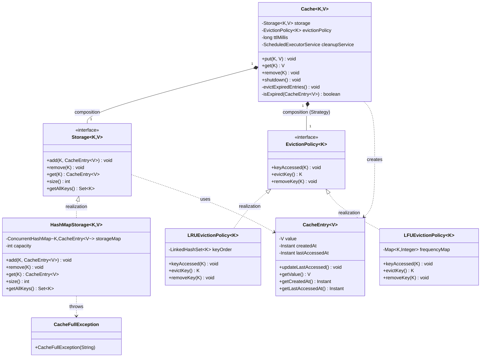

# In-Memory Cache (LRU/LFU + TTL)

## Functional Requirements

- User can **put** a key-value pair into the cache
- User can **get** a value by key (returns null if absent or expired)
- User can **remove** a key from the cache
- Cache automatically **evicts** the least recently/frequently used entry when full
- Cache automatically **expires** entries after a configurable TTL (time-to-live)

## Non-Functional Requirements

- Thread-safe: concurrent reads and writes must not corrupt state
- O(1) average put/get/remove operations
- TTL enforcement: lazy check on access + background periodic cleanup
- Eviction policy must be swappable without modifying the cache

## Constraints

- In-memory only — no persistence
- Capacity-based eviction (by entry count, not byte size)
- Single JVM process

## Out of Scope

- Distributed caching
- Disk-backed storage
- Cache warming / pre-loading
- Metrics / hit-rate tracking

---

## Class Diagram



---

## Design Decisions

| Decision | Rationale |
|---|---|
| `EvictionPolicy` as Strategy interface | Swap LRU ↔ LFU ↔ FIFO without touching `Cache` (OCP) |
| `Storage` as interface | Swap `HashMap` for off-heap or Redis without touching `Cache` (DIP) |
| `synchronized` on `Cache` methods | Coarse-grained lock; simple and correct for this scope |
| Dual TTL enforcement (lazy + background) | Lazy catches expired entries on access; background reclaims memory proactively |
| `LinkedHashSet` in LRU | Maintains insertion order; O(1) remove + re-insert on access |
| `ConcurrentHashMap` in `HashMapStorage` | Background cleanup thread reads `getAllKeys()` concurrently with main thread |

---

## Package Structure

```
cache/
├── Cache.java                    ← Core orchestration
├── CacheMain.java                ← Demo runner
├── model/
│   └── CacheEntry.java           ← Value wrapper with TTL metadata
├── policy/
│   ├── EvictionPolicy.java       ← Strategy interface
│   ├── LRUEvictionPolicy.java    ← Least Recently Used
│   └── LFUEvictionPolicy.java    ← Least Frequently Used (Curveball)
├── storage/
│   ├── Storage.java              ← Storage abstraction
│   └── HashMapStorage.java       ← ConcurrentHashMap implementation
└── exception/
    └── CacheFullException.java
```

---

## Curveball: Add LFU Eviction

**Requirement:** Support Least Frequently Used eviction in addition to LRU.

**Solution:** New class `LFUEvictionPolicy<K>` implementing `EvictionPolicy<K>`. Zero changes to `Cache`, `Storage`, or `LRUEvictionPolicy`.

**Lesson (OCP):** The `EvictionPolicy` interface was the right abstraction — adding LFU required only a new file, not a single edit to existing classes.

**Trade-off:**

| Policy | Evicts | Best For |
|---|---|---|
| LRU | Least recently accessed | General workloads, recency matters |
| LFU | Least frequently accessed | Workloads with stable "hot" keys |

---

## Usage

```java
Storage<String, String> storage = new HashMapStorage<>(100);
EvictionPolicy<String> policy = new LRUEvictionPolicy<>();
Cache<String, String> cache = new Cache<>(storage, policy, 60_000); // 60s TTL

cache.put("user:1", "Alice");
String value = cache.get("user:1"); // "Alice"
cache.remove("user:1");
cache.shutdown();
```
