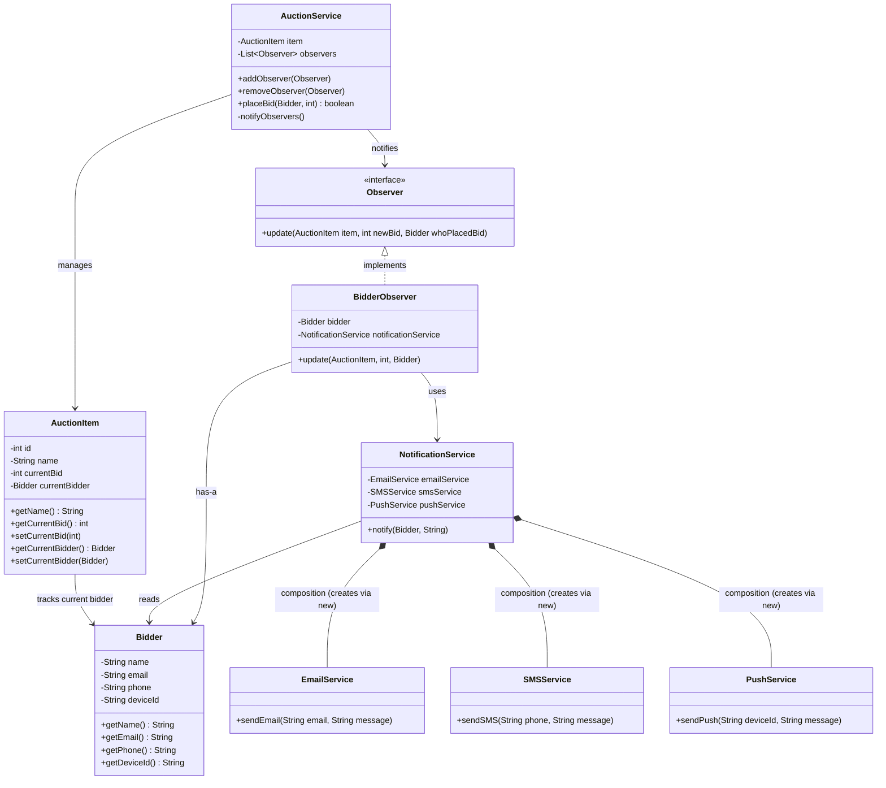

# Observer Pattern Class Diagram

## Mermaid.js Code

## Diagram Explanation

### Core Observer Pattern
- **Observer** (interface) — Contract for all observers
- **BidderObserver** — Concrete observer, decides whether to react
- **AuctionService** — Subject, manages observers and notifies them

### Data Models (Pure Data)
- **Bidder** — User contact info, no behavior
- **AuctionItem** — Auction state, getters/setters only

### Notification System (Strategy-like)
- **NotificationService** — Orchestrates multi-channel notifications
- **EmailService / SMSService / PushService** — Channel implementations

### Key Design Decisions
1. **Separation of Concerns**: Data models (Bidder, AuctionItem) have no logic
2. **Observer owns decision**: BidderObserver decides to skip itself
3. **Subject in Service layer**: AuctionService handles both business logic and notifications
4. **Composition over injection**: NotificationService creates Email/SMS/Push via `new` (strong ownership)
5. **Multi-channel notifications**: NotificationService picks channels based on Bidder preferences
