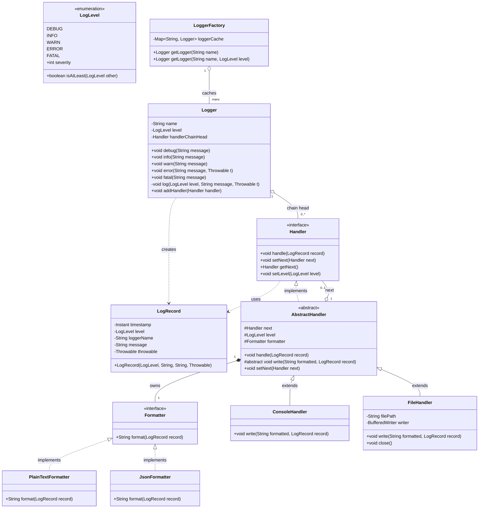

# Logging Framework — Design Document

Follows the D.I.C.E. workflow from `INSTRUCTIONS.md`.

---

## Step 1 — DEFINE (Requirements & Constraints)

### Functional Requirements

1. A caller can log a message at a specific severity level: `DEBUG`, `INFO`, `WARN`, `ERROR`, `FATAL`.
2. The framework routes each log record through a **handler chain**; each handler decides whether to process or pass on.
3. A handler writes to a specific **destination**: Console or File.
4. A handler formats the log record using a pluggable **formatter**: Plain text or JSON.
5. Each handler has a **minimum level threshold** — it only processes records at or above that level.
6. The Logger itself has a **minimum level** — records below it are dropped before entering the chain.
7. Multiple handlers can be attached to the same logger and all matching ones process the record.
8. A handler can be configured to **stop propagation** (do not pass to the next handler in the chain).
9. Log records carry: timestamp, level, logger name, message, and optional `Throwable`.
10. Callers use convenience methods: `logger.debug(msg)`, `logger.info(msg)`, `logger.warn(msg)`, `logger.error(msg, throwable)`, `logger.fatal(msg)`.

### Non-Functional Requirements

- **Thread-safe** — multiple threads can log concurrently without data races.
- **OCP-compliant** — adding a new Handler or Formatter requires zero changes to existing classes.
- **No external dependencies** — pure Java, no SLF4J, Log4j, etc.
- **Minimal overhead** — level check at the Logger before constructing the `LogRecord` (avoid allocation on filtered records).

### Constraints

- In-memory only — FileHandler writes to a real file path (provided at construction), but no log rotation.
- No async/buffered writing — synchronous for simplicity (curveball: async handler as an extension).
- No logger hierarchy / parent propagation (like java.util.logging) — flat model, one logger instance per name.

### Out of Scope

- Log rotation / archiving
- Remote/network handlers (Slack, Splunk, etc.) — architecture supports them, not implemented
- Async handler (listed as a curveball)
- Logger configuration via XML/properties file

---

## Step 2 — IDENTIFY (Entities & Relationships)

### Nouns → Candidate Entities

| Noun | Entity Type | Notes |
|---|---|---|
| Logger | Class | Entry point; holds handler chain head + min level |
| LogRecord | Class (model) | Immutable snapshot: timestamp, level, loggerName, message, throwable |
| LogLevel | Enum | DEBUG(0) < INFO(1) < WARN(2) < ERROR(3) < FATAL(4) — ordered by severity |
| Handler | Interface | Processes a LogRecord and optionally delegates to next in chain |
| ConsoleHandler | Class | Handler impl — writes to stdout/stderr |
| FileHandler | Class | Handler impl — writes to a file |
| AbstractHandler | Abstract Class | Shared logic: level check, next-in-chain reference, formatter delegation |
| Formatter | Interface | Converts LogRecord → String |
| PlainTextFormatter | Class | `[TIMESTAMP] [LEVEL] [LoggerName] message` |
| JsonFormatter | Class | `{"timestamp":..., "level":..., "logger":..., "message":...}` |
| LoggerFactory | Class | Creates / caches Logger instances by name (Flyweight / Factory Method) |

### Verbs → Methods / Relationships

| Verb | Location |
|---|---|
| `log(level, msg, throwable)` | Logger |
| `handle(record)` | Handler |
| `format(record)` | Formatter |
| `setNext(handler)` | AbstractHandler (chain wiring) |
| `getLogger(name)` | LoggerFactory |
| `isLoggable(level)` | AbstractHandler (threshold check) |

### Relationships

```
LoggerFactory ──creates──► Logger             (Factory Method)
Logger         ──has──►    Handler             (Association — chain head)
Handler        ──has──►    Handler             (self-association — next in chain)
AbstractHandler ──has──►   Formatter           (Composition — owns formatter)
AbstractHandler ──implements── Handler         (Realization)
ConsoleHandler  ──extends── AbstractHandler    (Inheritance)
FileHandler     ──extends── AbstractHandler    (Inheritance)
PlainTextFormatter ──implements── Formatter    (Realization)
JsonFormatter      ──implements── Formatter    (Realization)
Logger         ──creates──► LogRecord          (Dependency)
```

### Design Patterns Applied

| Pattern | Where | Why |
|---|---|---|
| **Chain of Responsibility** | Handler chain | Each handler decides to process + forward; Logger doesn't know how many handlers there are |
| **Strategy** | Formatter | ConsoleHandler and FileHandler are both closed for modification — swap formatter without touching handler |
| **Template Method** | AbstractHandler | `handle()` skeleton: check level → format → write → forward. Subclasses only override `write()` |
| **Factory Method** | LoggerFactory | Callers never call `new Logger()` directly; factory caches by name |
| **Flyweight** | LoggerFactory cache | Same Logger instance reused for the same name |

---

## Step 3 — CLASS DIAGRAM (Mermaid.js)



---

## Step 4 — PACKAGE STRUCTURE

```
com.lldprep.logging/
│
├── DESIGN.md                        ← this file
│
├── Logger.java                      ← entry point, holds handler chain
├── LogLevel.java                    ← enum (DEBUG < INFO < WARN < ERROR < FATAL)
│
├── model/
│   └── LogRecord.java               ← immutable log event snapshot
│
├── handler/
│   ├── Handler.java                 ← interface
│   ├── AbstractHandler.java         ← Template Method skeleton
│   ├── ConsoleHandler.java          ← writes to stdout/stderr
│   └── FileHandler.java             ← writes to a file
│
├── formatter/
│   ├── Formatter.java               ← interface
│   ├── PlainTextFormatter.java
│   └── JsonFormatter.java
│
├── factory/
│   └── LoggerFactory.java           ← Factory Method + Flyweight cache
│
├── exception/
│   └── LoggerException.java         ← wraps IO errors from FileHandler
│
└── demo/
    └── LoggingFrameworkDemo.java    ← exercises all features
```

---

## Step 5 — IMPLEMENTATION ORDER (per INSTRUCTIONS.md)

1. `LogLevel.java` — enum with severity ordering
2. `model/LogRecord.java` — immutable data class
3. `formatter/Formatter.java` — interface
4. `formatter/PlainTextFormatter.java` — implementation
5. `formatter/JsonFormatter.java` — implementation
6. `handler/Handler.java` — interface
7. `handler/AbstractHandler.java` — Template Method base
8. `handler/ConsoleHandler.java` — concrete
9. `handler/FileHandler.java` — concrete
10. `factory/LoggerFactory.java` — Factory + Flyweight cache
11. `Logger.java` — orchestrator
12. `exception/LoggerException.java`
13. `demo/LoggingFrameworkDemo.java` — last

---

## Step 6 — EVOLVE (Curveaballs)

| Curveball | Impact on design | Extension strategy |
|---|---|---|
| **Async handler** | FileHandler blocks on I/O | Add `AsyncHandler` wrapping any `Handler`; uses `BlockingQueue` + background thread (Decorator) |
| **New destination** (Slack, DB) | New `Handler` subclass only | Zero changes to existing code — OCP satisfied |
| **New format** (CSV, XML) | New `Formatter` impl only | Zero changes to handlers |
| **Logger hierarchy** (parent/child propagation) | Logger needs parent reference + propagation flag | Add `Logger#parent` + `propagate` flag; `LoggerFactory` builds the tree |
| **Config file** (JSON/YAML) | `LoggerFactory` reads config and wires handlers/formatters | Add `LoggerConfigurator` that parses config and calls factory |
| **Rate-limited logging** | Wrap handler in `RateLimitedHandler` | Decorator pattern — reuse rate limiter from Phase 3 |

---

## Self-Review Checklist

- [x] Requirements written before code
- [x] Class diagram produced
- [x] Every relationship typed
- [x] Every class has a single nameable responsibility
- [x] Adding a new Handler/Formatter requires zero changes to existing classes (OCP)
- [x] AbstractHandler depends on Formatter interface, not PlainTextFormatter (DIP)
- [x] Handler interface is focused — no fat methods (ISP)
- [x] Patterns documented with "why"
- [ ] Thread-safety addressed in implementation (next step)
- [ ] Custom exceptions defined
- [ ] Demo covers all functional requirements
