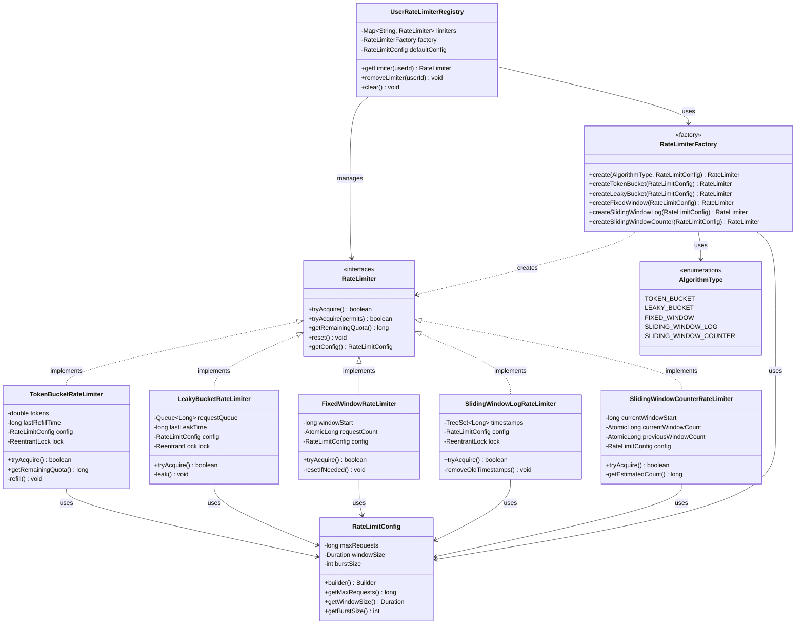

# Rate Limiter - Low-Level Design Document

**Problem**: Design a thread-safe rate limiter to control the rate of requests/operations to prevent system overload and ensure fair resource usage.

**Date**: 2026-03-28  
**Complexity**: O(1) for most operations (Token Bucket, Fixed Window), O(log n) for Sliding Window Log

---

## Step 1: DEFINE — Requirements & Constraints

### Functional Requirements (Actor-Verb-Noun)

- **FR1**: System can limit requests based on configurable rate (e.g., 100 requests per second)
- **FR2**: User can check if a request is allowed without consuming quota
- **FR3**: User can attempt a request and get immediate allow/deny response
- **FR4**: System supports multiple rate limiting algorithms (Token Bucket, Leaky Bucket, Sliding Window, Fixed Window)
- **FR5**: System supports per-user/per-resource rate limiting (not just global)
- **FR6**: User can query current quota status (remaining tokens, refill time)

### Non-Functional Requirements

- **NFR1**: **Thread Safety** — Safe for concurrent access from multiple threads
- **NFR2**: **Performance** — O(1) time complexity for allow/deny decisions (except Sliding Window Log)
- **NFR3**: **Memory Efficient** — Minimal memory overhead per user/resource
- **NFR4**: **Accuracy** — Precise rate limiting without significant drift over time
- **NFR5**: **Fair** — Requests are handled fairly (no starvation)
- **NFR6**: **Configurable** — Easy to adjust rates, burst sizes, and algorithms

### Constraints

- **C1**: **In-Memory** — State stored in memory (no distributed coordination in base version)
- **C2**: **Single JVM** — Works within a single application instance
- **C3**: **No External Dependencies** — Pure Java implementation
- **C4**: **Nanosecond Precision** — Use `System.nanoTime()` for accurate timing

### Out of Scope (Base Implementation)

- Distributed rate limiting across multiple servers (covered in extension)
- Persistent storage of rate limit state
- Dynamic rate adjustment based on system load
- Priority-based rate limiting

---

## Step 2: IDENTIFY — Rate Limiting Algorithms

### Algorithm 1: Token Bucket 🪣

**Concept**: A bucket holds tokens. Tokens are added at a fixed rate. Each request consumes one token. If no tokens available, request is denied.

**Characteristics**:
- **Allows bursts**: Can accumulate tokens up to bucket capacity
- **Smooth rate limiting**: Refills continuously
- **Memory**: O(1) per bucket
- **Time**: O(1) per request

**Parameters**:
- `capacity`: Maximum tokens the bucket can hold
- `refillRate`: Tokens added per second
- `currentTokens`: Current number of tokens
- `lastRefillTime`: Last time tokens were refilled

**Algorithm**:
```
1. Calculate elapsed time since last refill
2. Add tokens: currentTokens += (elapsedTime * refillRate)
3. Cap at capacity: currentTokens = min(currentTokens, capacity)
4. If currentTokens >= 1:
     - Consume 1 token
     - Return ALLOW
5. Else:
     - Return DENY
```

**Use Cases**:
- API rate limiting (e.g., 1000 requests/minute)
- Allowing burst traffic while maintaining average rate
- Cloud service quotas (AWS, GCP)

---

### Algorithm 2: Leaky Bucket 💧

**Concept**: Requests enter a bucket (queue). Requests leak out at a fixed rate. If bucket is full, new requests are denied.

**Characteristics**:
- **Smooths bursts**: Enforces constant output rate
- **Queue-based**: Requests wait in queue
- **Memory**: O(n) where n = queue size
- **Time**: O(1) per request

**Parameters**:
- `capacity`: Maximum requests in queue
- `leakRate`: Requests processed per second
- `queue`: Queue of pending requests
- `lastLeakTime`: Last time requests were processed

**Algorithm**:
```
1. Process (leak) requests from queue based on elapsed time
2. If queue.size() < capacity:
     - Add request to queue
     - Return ALLOW
3. Else:
     - Return DENY
```

**Use Cases**:
- Traffic shaping (network routers)
- Smoothing bursty traffic
- Background job processing

**Difference from Token Bucket**:
- Token Bucket: Allows immediate bursts if tokens available
- Leaky Bucket: Enforces constant rate, smooths all bursts

---

### Algorithm 3: Fixed Window Counter 🪟

**Concept**: Divide time into fixed windows (e.g., 1-minute windows). Count requests in current window. Reset counter at window boundary.

**Characteristics**:
- **Simple**: Easy to implement
- **Memory**: O(1) per window
- **Time**: O(1) per request
- **Problem**: Boundary issue (2x rate at window edges)

**Parameters**:
- `windowSize`: Duration of each window (e.g., 60 seconds)
- `maxRequests`: Maximum requests per window
- `windowStart`: Start time of current window
- `requestCount`: Requests in current window

**Algorithm**:
```
1. If current time >= windowStart + windowSize:
     - Reset: windowStart = current time, requestCount = 0
2. If requestCount < maxRequests:
     - Increment requestCount
     - Return ALLOW
3. Else:
     - Return DENY
```

**Boundary Problem Example**:
```
Window 1: [0s - 60s], limit = 100
Window 2: [60s - 120s], limit = 100

At 59s: 100 requests (allowed)
At 61s: 100 requests (allowed)
Result: 200 requests in 2 seconds! (2x the intended rate)
```

**Use Cases**:
- Simple rate limiting where precision isn't critical
- Analytics (requests per hour/day)
- Low-memory scenarios

---

### Algorithm 4: Sliding Window Log 📊

**Concept**: Keep a log of all request timestamps. Count requests in the sliding window (current time - window size). Remove old timestamps.

**Characteristics**:
- **Accurate**: No boundary issues
- **Memory**: O(n) where n = requests in window
- **Time**: O(log n) for timestamp cleanup (binary search)
- **Expensive**: High memory for high-traffic scenarios

**Parameters**:
- `windowSize`: Size of sliding window (e.g., 60 seconds)
- `maxRequests`: Maximum requests in window
- `timestamps`: Sorted list of request timestamps

**Algorithm**:
```
1. Remove timestamps older than (currentTime - windowSize)
2. If timestamps.size() < maxRequests:
     - Add current timestamp
     - Return ALLOW
3. Else:
     - Return DENY
```

**Use Cases**:
- Precise rate limiting (no boundary issues)
- Security (login attempt limiting)
- Critical systems where accuracy matters

---

### Algorithm 5: Sliding Window Counter (Hybrid) 🔄

**Concept**: Combine Fixed Window Counter with weighted calculation from previous window to approximate sliding window.

**Characteristics**:
- **Balanced**: Better than Fixed Window, cheaper than Sliding Window Log
- **Memory**: O(1) per window
- **Time**: O(1) per request
- **Approximate**: Not perfectly accurate but close

**Formula**:
```
estimatedCount = (prevWindowCount * overlapPercentage) + currentWindowCount

where:
  overlapPercentage = (windowSize - elapsedTimeInCurrentWindow) / windowSize
```

**Example**:
```
Window size: 60s
Max requests: 100
Current time: 30s into current window

Previous window: 80 requests
Current window: 40 requests

Overlap: (60 - 30) / 60 = 50%
Estimated: (80 * 0.5) + 40 = 80 requests

If 80 < 100: ALLOW
```

**Use Cases**:
- Production rate limiting (good balance of accuracy and performance)
- High-traffic APIs
- Cloud services (Cloudflare, AWS)

---

## Step 3: IDENTIFY — Entities & Relationships

### Noun-Verb Analysis

**Nouns** (Candidate Entities):
- Rate Limiter → `RateLimiter` (interface)
- Token Bucket → `TokenBucketRateLimiter` (class)
- Leaky Bucket → `LeakyBucketRateLimiter` (class)
- Fixed Window → `FixedWindowRateLimiter` (class)
- Sliding Window Log → `SlidingWindowLogRateLimiter` (class)
- Sliding Window Counter → `SlidingWindowCounterRateLimiter` (class)
- Rate Limit Config → `RateLimitConfig` (class)
- User/Resource → `String userId` (identifier)
- Request → implicit (method call)

**Verbs** (Candidate Methods):
- "allow request" → `tryAcquire()` or `allowRequest()`
- "check quota" → `getRemainingQuota()`
- "reset limiter" → `reset()`
- "get config" → `getConfig()`

### Relationships

| From | To | Type | Meaning |
|------|-----|------|---------|
| `RateLimiter` | `RateLimitConfig` | **Association** | RateLimiter uses configuration |
| `TokenBucketRateLimiter` | `RateLimiter` | **Realization** | Implements the interface |
| `LeakyBucketRateLimiter` | `RateLimiter` | **Realization** | Implements the interface |
| `FixedWindowRateLimiter` | `RateLimiter` | **Realization** | Implements the interface |
| `SlidingWindowLogRateLimiter` | `RateLimiter` | **Realization** | Implements the interface |
| `SlidingWindowCounterRateLimiter` | `RateLimiter` | **Realization** | Implements the interface |
| `RateLimiterFactory` | `RateLimiter` | **Dependency** | Creates RateLimiter instances |
| `UserRateLimiterRegistry` | `RateLimiter` | **Composition** | Manages per-user limiters |

---

## Step 4: Design Patterns Applied

### 1. **Strategy Pattern** ⭐ (Primary)

**Problem**: Multiple rate limiting algorithms exist, and they should be interchangeable.

**Solution**: `RateLimiter` interface with multiple implementations.

**Benefit**: 
- Swap algorithms without changing client code
- Add new algorithms (e.g., Adaptive Rate Limiter) without modifying existing code
- Open/Closed Principle

**Code Structure**:
```
RateLimiter (interface)
    ├── TokenBucketRateLimiter
    ├── LeakyBucketRateLimiter
    ├── FixedWindowRateLimiter
    ├── SlidingWindowLogRateLimiter
    └── SlidingWindowCounterRateLimiter
```

---

### 2. **Factory Pattern** ⭐ (Primary)

**Problem**: Creating rate limiters with different algorithms and configurations is complex.

**Solution**: `RateLimiterFactory` that creates appropriate limiter based on algorithm type.

**Benefit**:
- Centralized creation logic
- Easy to add new algorithm types
- Encapsulates construction complexity

**Usage**:
```java
RateLimiter limiter = RateLimiterFactory.create(
    AlgorithmType.TOKEN_BUCKET,
    RateLimitConfig.builder()
        .maxRequests(100)
        .windowSize(Duration.ofSeconds(1))
        .build()
);
```

---

### 3. **Registry Pattern** (Supporting)

**Problem**: Need to manage rate limiters for multiple users/resources.

**Solution**: `UserRateLimiterRegistry` that maps userId → RateLimiter.

**Benefit**:
- Centralized management
- Lazy initialization (create limiter on first access)
- Easy cleanup of inactive limiters

---

### 4. **Template Method Pattern** (Implicit)

**Problem**: All rate limiters share common logic (thread safety, timing).

**Solution**: Could use abstract base class with template method, but we'll use composition with helper utilities instead to avoid inheritance.

---

### 5. **Builder Pattern** (Supporting)

**Problem**: `RateLimitConfig` has multiple optional parameters.

**Solution**: Builder pattern for clean configuration.

**Usage**:
```java
RateLimitConfig config = RateLimitConfig.builder()
    .maxRequests(1000)
    .windowSize(Duration.ofMinutes(1))
    .burstSize(50)
    .build();
```

---

## Step 5: Class Diagram (Mermaid.js)



---

## Step 6: SOLID Principles Compliance

### ✅ Single Responsibility Principle (SRP)
- `RateLimiter`: Rate limiting logic only
- `RateLimitConfig`: Configuration data only
- `RateLimiterFactory`: Object creation only
- `UserRateLimiterRegistry`: User-to-limiter mapping only

### ✅ Open/Closed Principle (OCP)
- Adding new algorithm (e.g., Adaptive Rate Limiter) = new class implementing `RateLimiter`
- No modifications to existing implementations
- Factory can be extended with new creation methods

### ✅ Liskov Substitution Principle (LSP)
- Any `RateLimiter` implementation can replace another
- All honor the contract: `tryAcquire()` returns true if allowed, false otherwise
- No implementation throws unexpected exceptions

### ✅ Interface Segregation Principle (ISP)
- `RateLimiter` interface is focused and minimal
- Only essential methods: `tryAcquire()`, `getRemainingQuota()`, `reset()`
- No fat interface forcing unnecessary implementations

### ✅ Dependency Inversion Principle (DIP)
- High-level code depends on `RateLimiter` interface
- Not coupled to concrete implementations
- Factory pattern enables dependency injection

---

## Step 7: Thread Safety Strategies

### Strategy 1: ReentrantLock (Token Bucket, Leaky Bucket, Sliding Window Log)
```java
private final ReentrantLock lock = new ReentrantLock();

public boolean tryAcquire() {
    lock.lock();
    try {
        // Critical section - shared mutable state
        refill();
        if (tokens >= 1) {
            tokens -= 1;
            return true;
        }
        return false;
    } finally {
        lock.unlock();
    }
}
```

**Why**: Need to atomically read-modify-write multiple fields.

---

### Strategy 2: AtomicLong (Fixed Window, Sliding Window Counter)
```java
private final AtomicLong requestCount = new AtomicLong(0);

public boolean tryAcquire() {
    resetIfNeeded();
    long current = requestCount.incrementAndGet();
    if (current <= maxRequests) {
        return true;
    }
    requestCount.decrementAndGet(); // Rollback
    return false;
}
```

**Why**: Simple counter increment, atomic operations sufficient.

---

### Strategy 3: ConcurrentHashMap (UserRateLimiterRegistry)
```java
private final ConcurrentHashMap<String, RateLimiter> limiters = new ConcurrentHashMap<>();

public RateLimiter getLimiter(String userId) {
    return limiters.computeIfAbsent(userId, id -> factory.create(...));
}
```

**Why**: Thread-safe map operations, lazy initialization.

---

## Step 8: Algorithm Comparison

| Algorithm | Time | Memory | Accuracy | Burst Handling | Use Case |
|-----------|------|--------|----------|----------------|----------|
| **Token Bucket** | O(1) | O(1) | High | ✅ Allows bursts | API rate limiting, cloud quotas |
| **Leaky Bucket** | O(1) | O(n) | High | ❌ Smooths bursts | Traffic shaping, network routers |
| **Fixed Window** | O(1) | O(1) | Low (boundary issue) | ⚠️ 2x at boundaries | Simple scenarios, analytics |
| **Sliding Window Log** | O(log n) | O(n) | Perfect | ✅ Accurate | Security, critical systems |
| **Sliding Window Counter** | O(1) | O(1) | High | ✅ Good approximation | Production APIs, high traffic |

**Recommendation**:
- **Production**: Sliding Window Counter (best balance)
- **Burst-friendly**: Token Bucket
- **Strict rate**: Leaky Bucket
- **High accuracy**: Sliding Window Log
- **Simple/low-memory**: Fixed Window

---

## Step 9: Package Structure

```
com.lldprep.ratelimiter/
    ├── DESIGN.md                           (this file)
    ├── README.md                           (usage guide)
    ├── RateLimiter.java                    (interface)
    ├── RateLimitConfig.java                (configuration)
    ├── AlgorithmType.java                  (enum)
    ├── algorithm/
    │   ├── TokenBucketRateLimiter.java
    │   ├── LeakyBucketRateLimiter.java
    │   ├── FixedWindowRateLimiter.java
    │   ├── SlidingWindowLogRateLimiter.java
    │   └── SlidingWindowCounterRateLimiter.java
    ├── factory/
    │   └── RateLimiterFactory.java
    ├── registry/
    │   └── UserRateLimiterRegistry.java
    ├── exception/
    │   └── RateLimitExceededException.java
    ├── distributed/                        (extension)
    │   └── RedisRateLimiter.java
    └── RateLimiterDemo.java                (main demo)
```

---

## Step 10: Curveball Scenarios

| Curveball | How to Handle |
|-----------|---------------|
| **"Support distributed rate limiting"** | Implement `RedisRateLimiter` using Redis for shared state across servers |
| **"Add priority-based limiting"** | Extend with `PriorityRateLimiter` that has separate buckets per priority |
| **"Support dynamic rate adjustment"** | Add `updateConfig(RateLimitConfig)` method, thread-safe config swap |
| **"Add monitoring/metrics"** | Create `RateLimiterMetrics` with counters for allowed/denied/total requests |
| **"Support warmup period"** | Add `WarmupRateLimiter` decorator that gradually increases rate |
| **"Add request queuing"** | Implement `QueueingRateLimiter` that queues denied requests with timeout |

---

## Step 11: Interview Communication Notes

**What I would say during the interview**:

1. **After requirements**: "I'll implement multiple rate limiting algorithms using the Strategy pattern. Token Bucket for burst handling, Sliding Window Counter for production accuracy."

2. **During design**: "I'm using `RateLimiter` interface so algorithms are swappable. This follows OCP - adding a new algorithm doesn't modify existing code."

3. **Thread safety**: "Token Bucket needs `ReentrantLock` because we're atomically updating multiple fields (tokens + timestamp). Fixed Window can use `AtomicLong` since it's just a counter."

4. **Trade-offs**: "Token Bucket allows bursts which is good for APIs. Leaky Bucket smooths traffic which is better for network routers. Sliding Window Counter is the best balance for production."

5. **Proactive extensibility**: "After the base implementation, I can extend this to distributed rate limiting using Redis, or add priority-based limiting with separate buckets."

---

**Next Steps**: Implement the design following this document.
