# ATM Machine — Design Document (D.I.C.E. Format)

A full-featured ATM system with card authentication, PIN validation, cash dispensing chain, transaction logging, and state machine workflow.

---

## Step 1 — DEFINE (Requirements & Constraints)

### Functional Requirements

1. **Card Authentication** — User inserts card; system reads card number and validates card is active/not blocked.
2. **PIN Validation** — User enters 4-digit PIN; system validates against stored hash (3 attempts max, then block card).
3. **Account Selection** — Post PIN validation, user selects account (Checking/Savings) linked to the card.
4. **Transaction Types**:
   - **Balance Inquiry** — Display current balance without modifying it.
   - **Cash Withdrawal** — Deduct amount from account and dispense cash using optimal denomination mix.
   - **Deposit** — Accept cash deposit and credit to account.
   - **PIN Change** — Update PIN with old PIN verification.
5. **Cash Dispensing** — Dispense requested amount using available denominations (100, 200, 500, 2000 notes). If exact amount not possible, return error.
6. **Receipt Printing** — Generate transaction receipt with transaction ID, timestamp, type, amount, and remaining balance.
7. **Transaction Logging** — All transactions logged for audit trail.
8. **Session Timeout** — Auto-eject card after 30 seconds of inactivity.

### Non-Functional Requirements

- **Thread-safe** — Multiple ATMs can operate concurrently; each ATM is single-threaded per session.
- **Consistent cash inventory** — Denomination counts must remain accurate under all operations.
- **Fail-safe** — Card ejected and session cleared on any failure or cancellation.
- **Audit compliance** — Every transaction persisted to immutable log.

### Constraints

- In-memory account and transaction storage (no database).
- Fixed ATM cash capacity per denomination.
- Card block is permanent until manual unblock (simulated).

### Out of Scope

- Network communication to central bank (simulated backend).
- Physical hardware interfaces (card reader, cash dispenser).
- Multi-currency support.
- Transfer between accounts.

---

## Step 2 — IDENTIFY (Entities & Relationships)

### Noun → Verb Extraction

> A **customer** *inserts* a **card** → the **ATM** *validates* the **card** → *requests* **PIN** → *validates* **PIN** against **account** → *displays* **transaction menu** → customer *selects* **transaction type** → ATM *processes* **transaction** → *updates* **account balance** → *dispenses* **cash** via **dispenser chain** → *logs* **transaction** → *prints* **receipt** → *ejects* **card**.

### Nouns → Candidate Entities

| Noun | Entity Type | Responsibility |
|------|-------------|----------------|
| Card | Model | Card number, expiry, linked account IDs, blocked status, PIN hash |
| Account | Model | Account ID, type (Checking/Savings), balance, linked card IDs |
| Transaction | Model | Transaction ID, timestamp, type, amount, account ID, status |
| CashInventory | Model | Denominations → count mapping, total cash available |
| Denomination | Enum | NOTE_100, NOTE_200, NOTE_500, NOTE_2000 with values |
| ATM | Service | Main orchestrator, session state holder, delegates to state handlers |
| ATMState | Interface | State pattern: handle card insert, PIN entry, transaction selection |
| IdleState, CardInsertedState, PINEnteredState, TransactionMenuState, DispensingState | Classes | Concrete state implementations |
| CashDispenser | Abstract Class | Chain of Responsibility: base handler for denomination dispensing |
| Dispenser2000, Dispenser500, Dispenser200, Dispenser100 | Classes | Concrete handlers in the chain |
| CardManager | Service | Card validation, PIN verification, block/unblock operations |
| AccountManager | Service | Account lookup, balance updates, transaction history |
| TransactionLogger | Service | Immutable audit log of all transactions |
| ReceiptPrinter | Service | Generate and format receipt strings |
| ATMException | Exception | Base exception for ATM errors |
| InsufficientFundsException | Exception | Withdrawal exceeds balance |
| InsufficientCashException | Exception | ATM cannot dispense requested amount |
| InvalidPINException | Exception | PIN validation failed |
| CardBlockedException | Exception | Card is blocked |
| InvalidCardException | Exception | Card not found or expired |

### Relationships

```
ATM              ──has──►     ATMState (current state)           (Composition — state pattern)
ATM              ──uses──►    CashDispenser (chain head)           (Association)
ATM              ──uses──►    CardManager                          (Association)
ATM              ──uses──►    AccountManager                       (Association)
ATM              ──uses──►    TransactionLogger                    (Association)
ATM              ──uses──►    ReceiptPrinter                       (Association)
ATM              ──has──►     CashInventory                        (Composition)

ATMState         ◄──implements── IdleState, CardInsertedState, ... (Realization)
ATMState         ──transitions_to──► ATMState                      (Self-transition)

CashDispenser    ──successor──► CashDispenser (next in chain)     (Chain of Responsibility)
Dispenser2000    ──extends──►   CashDispenser                     (Inheritance)

Card             ──links_to──►  Account (1 card → 1..2 accounts)   (Association)
Account          ──has──►       Transaction history               (Aggregation)

CardManager      ──manages──►   Card (repository)                 (Association)
AccountManager   ──manages──►   Account (repository)                (Association)
```

### Design Patterns Applied

| Pattern | Where | Why |
|---------|-------|-----|
| **State** | `ATMState` interface + concrete states | ATM has distinct states with different valid operations; prevents invalid transitions |
| **Chain of Responsibility** | `CashDispenser` chain | Optimal cash dispensing: try 2000s first, then 500s, etc. Each handler tries to fulfill request |
| **Singleton** | `ATM` per physical machine | Single ATM instance manages its own cash inventory |
| **Strategy** | `ReceiptPrinter` interface | Different receipt formats can be swapped (text, HTML, JSON) |
| **Repository** | `CardManager`, `AccountManager` | Abstract data access; could be swapped with database implementation |

---

## Step 3 — CLASS DIAGRAM (Mermaid.js)

```mermaid
classDiagram
    class ATM {
        -String atmId
        -ATMState currentState
        -CashInventory cashInventory
        -CardManager cardManager
        -AccountManager accountManager
        -TransactionLogger transactionLogger
        -ReceiptPrinter receiptPrinter
        -CashDispenser dispenserChain
        -Card currentCard
        -Account currentAccount
        -int failedPinAttempts
        +insertCard(String cardNumber)
        +enterPIN(String pin)
        +selectAccount(AccountType)
        +checkBalance()
        +withdrawCash(BigDecimal amount)
        +depositCash(BigDecimal amount, Map~Denomination,Integer~)
        +changePIN(String oldPIN, String newPIN)
        +cancelTransaction()
        +ejectCard()
        +setState(ATMState)
        +getCashInventory() CashInventory
    }

    class ATMState {
        <<interface>>
        +insertCard(ATM, String cardNumber)
        +enterPIN(ATM, String pin)
        +selectAccount(ATM, AccountType)
        +performTransaction(ATM, TransactionType, BigDecimal)
        +cancel(ATM)
    }

    class IdleState {
        +insertCard(ATM, String)
        +enterPIN(ATM, String) throws IllegalStateException
        +selectAccount(ATM, AccountType) throws IllegalStateException
        +performTransaction(ATM, TransactionType, BigDecimal) throws IllegalStateException
        +cancel(ATM)
    }

    class CardInsertedState {
        -int pinAttempts
        +insertCard(ATM, String) throws IllegalStateException
        +enterPIN(ATM, String)
        +selectAccount(ATM, AccountType) throws IllegalStateException
        +performTransaction(ATM, TransactionType, BigDecimal) throws IllegalStateException
        +cancel(ATM)
    }

    class PINEnteredState {
        +insertCard(ATM, String) throws IllegalStateException
        +enterPIN(ATM, String) throws IllegalStateException
        +selectAccount(ATM, AccountType)
        +performTransaction(ATM, TransactionType, BigDecimal) throws IllegalStateException
        +cancel(ATM)
    }

    class TransactionMenuState {
        +insertCard(ATM, String) throws IllegalStateException
        +enterPIN(ATM, String) throws IllegalStateException
        +selectAccount(ATM, AccountType) throws IllegalStateException
        +performTransaction(ATM, TransactionType, BigDecimal)
        +cancel(ATM)
    }

    class DispensingState {
        +insertCard(ATM, String) throws IllegalStateException
        +enterPIN(ATM, String) throws IllegalStateException
        +selectAccount(ATM, AccountType) throws IllegalStateException
        +performTransaction(ATM, TransactionType, BigDecimal) throws IllegalStateException
        +cancel(ATM)
    }

    class CashDispenser {
        <<abstract>>
        -Denomination denomination
        -CashDispenser nextDispenser
        +dispense(BigDecimal amount, CashInventory) Map~Denomination,Integer~
        +canHandle(BigDecimal) boolean
        +setNext(CashDispenser)
        #dispenseDenomination(BigDecimal, int noteValue, CashInventory) Map~Denomination,Integer~
    }

    class Dispenser2000 {
        +Dispenser2000()
    }

    class Dispenser500 {
        +Dispenser500()
    }

    class Dispenser200 {
        +Dispenser200()
    }

    class Dispenser100 {
        +Dispenser100()
    }

    class Card {
        -String cardNumber
        -String pinHash
        -boolean blocked
        -List~String~ accountIds
        -LocalDate expiryDate
        +validatePIN(String) boolean
        +block()
        +isBlocked() boolean
        +isExpired() boolean
    }

    class Account {
        -String accountId
        -AccountType type
        -BigDecimal balance
        -String cardNumber
        +debit(BigDecimal)
        +credit(BigDecimal)
        +getBalance() BigDecimal
    }

    class Transaction {
        -String transactionId
        -TransactionType type
        -BigDecimal amount
        -String accountId
        -LocalDateTime timestamp
        -TransactionStatus status
    }

    class CashInventory {
        -Map~Denomination,Integer~ notes
        +hasSufficientCash(BigDecimal) boolean
        +dispense(Map~Denomination,Integer~)
        +addCash(Map~Denomination,Integer~)
        +getTotalCash() BigDecimal
        +getAvailableNotes(Denomination) int
    }

    class Denomination {
        <<enumeration>>
        NOTE_100
        NOTE_200
        NOTE_500
        NOTE_2000
        -int value
        +getValue() int
    }

    class TransactionType {
        <<enumeration>>
        BALANCE_INQUIRY
        CASH_WITHDRAWAL
        CASH_DEPOSIT
        PIN_CHANGE
    }

    class AccountType {
        <<enumeration>>
        CHECKING
        SAVINGS
    }

    class CardManager {
        -Map~String,Card~ cards
        +validateCard(String) Card
        +verifyPIN(Card, String) boolean
        +blockCard(String)
    }

    class AccountManager {
        -Map~String,Account~ accounts
        +getAccount(String) Account
        +updateBalance(String, BigDecimal)
    }

    class TransactionLogger {
        -List~Transaction~ transactions
        +log(Transaction)
        +getTransactionHistory(String accountId) List~Transaction~
    }

    class ReceiptPrinter {
        <<interface>>
        +printReceipt(Transaction, BigDecimal balance) String
    }

    class TextReceiptPrinter {
        +printReceipt(Transaction, BigDecimal balance) String
    }

    ATMState <|.. IdleState : implements
    ATMState <|.. CardInsertedState : implements
    ATMState <|.. PINEnteredState : implements
    ATMState <|.. TransactionMenuState : implements
    ATMState <|.. DispensingState : implements

    ATM --> ATMState : has current
    ATM --> CashDispenser : uses
    ATM --> CardManager : uses
    ATM --> AccountManager : uses
    ATM --> TransactionLogger : uses
    ATM --> ReceiptPrinter : uses
    ATM --> CashInventory : has

    CashDispenser <|-- Dispenser2000
    CashDispenser <|-- Dispenser500
    CashDispenser <|-- Dispenser200
    CashDispenser <|-- Dispenser100

    CashDispenser o-- CashDispenser : next
    CashDispenser ..> CashInventory : uses
    CashDispenser ..> Denomination : uses

    CardManager ..> Card : manages
    AccountManager ..> Account : manages
    ATM ..> Card : current
    ATM ..> Account : current

    ReceiptPrinter <|.. TextReceiptPrinter : implements

    TransactionLogger ..> Transaction : logs
```



---

## Step 4 — PACKAGE STRUCTURE

```
com.lldprep.atm/
│
├── DESIGN.md                        ← this file
├── README.md                        ← usage guide
│
├── model/
│   ├── Card.java                    ← Card data + PIN validation
│   ├── Account.java                 ← Account with balance
│   ├── Transaction.java             ← Transaction record
│   ├── CashInventory.java           ← Denomination counts
│   └── enums/
│       ├── Denomination.java        ← NOTE_100, NOTE_200, etc.
│       ├── TransactionType.java     ← WITHDRAWAL, DEPOSIT, etc.
│       ├── AccountType.java         ← CHECKING, SAVINGS
│       └── TransactionStatus.java   ← PENDING, COMPLETED, FAILED
│
├── state/
│   ├── ATMState.java                ← State interface
│   ├── IdleState.java               ← No card inserted
│   ├── CardInsertedState.java       ← Card in, awaiting PIN
│   ├── PINEnteredState.java         ← PIN valid, select account
│   ├── TransactionMenuState.java    ← Account selected, ready for txn
│   └── DispensingState.java         ← Cash being dispensed
│
├── dispenser/
│   ├── CashDispenser.java           ← Abstract chain handler
│   ├── Dispenser2000.java           ← 2000 note handler
│   ├── Dispenser500.java            ← 500 note handler
│   ├── Dispenser200.java            ← 200 note handler
│   └── Dispenser100.java            ← 100 note handler
│
├── service/
│   ├── CardManager.java             ← Card repository + validation
│   ├── AccountManager.java          ← Account repository + updates
│   ├── TransactionLogger.java       ← Audit logging
│   └── ReceiptPrinter.java          ← Receipt generation interface
│
├── exception/
│   ├── ATMException.java            ← Base exception
│   ├── InsufficientFundsException.java
│   ├── InsufficientCashException.java
│   ├── InvalidPINException.java
│   ├── CardBlockedException.java
│   ├── InvalidCardException.java
│   └── InvalidStateException.java
│
└── demo/
    └── ATMDemo.java                 ← Full demo scenarios
```

---

## Step 5 — STATE MACHINE

```
                    ┌─────────────┐
                    │    IDLE     │
                    └──────┬──────┘
                           │ insertCard()
                           ▼
                    ┌─────────────┐
                    │ CARD_INSERTED│
                    └──────┬──────┘
                           │ enterPIN()
              ┌────────────┼────────────┐
              │            │            │
              ▼            ▼            ▼
        ┌─────────┐   ┌─────────┐  ┌─────────┐
        │ PINEntered│   │(3 fails)│  │ cancel  │
        └────┬────┘   └────┬────┘  └────┬────┘
             │             │            │
             │ block card  │            ▼
             │             │       ┌─────────┐
             │             └──────►│  IDLE   │
             │                     └─────────┘
             │ selectAccount()
             ▼
        ┌─────────────┐
        │ TXN_MENU    │
        └──────┬──────┘
               │ performTransaction()
               ▼
        ┌─────────────┐     ┌─────────┐
        │ DISPENSING  │────►│  IDLE   │ (eject)
        └─────────────┘     └─────────┘
```

**Valid Operations by State:**

| State | Valid Operations | Invalid Operations |
|-------|-----------------|-------------------|
| Idle | insertCard | enterPIN, selectAccount, performTransaction |
| CardInserted | enterPIN, cancel | insertCard, selectAccount, performTransaction |
| PINEntered | selectAccount, cancel | insertCard, enterPIN, performTransaction |
| TransactionMenu | performTransaction, cancel | insertCard, enterPIN, selectAccount |
| Dispensing | (none - automatic) | All manual operations |

---

## Step 6 — CASH DISPENSING ALGORITHM (Chain of Responsibility)

```
Request: withdraw ₹2,700

Dispenser2000 (value=2000)
  └─ Can dispense: 2700 / 2000 = 1 note
  └─ Dispense: 1 × 2000 = 2000
  └─ Remaining: 700 → pass to next

Dispenser500 (value=500)
  └─ Can dispense: 700 / 500 = 1 note
  └─ Dispense: 1 × 500 = 500
  └─ Remaining: 200 → pass to next

Dispenser200 (value=200)
  └─ Can dispense: 200 / 200 = 1 note
  └─ Dispense: 1 × 200 = 200
  └─ Remaining: 0 → done!

Result: {2000: 1, 500: 1, 200: 1} = ₹2,700 ✓
```

**Edge Cases:**
- Insufficient notes of one denomination: Try to compensate with lower denominations
- If exact amount impossible: Throw `InsufficientCashException`

---

## Step 7 — IMPLEMENTATION ORDER

1. `exception/ATMException.java` — base checked exception
2. `exception/*Exception.java` — specific exceptions
3. `model/enums/*.java` — Denomination, TransactionType, AccountType, TransactionStatus
4. `model/Card.java` — card data + PIN validation
5. `model/Account.java` — account with balance operations
6. `model/Transaction.java` — transaction record
7. `model/CashInventory.java` — denomination inventory
8. `service/ReceiptPrinter.java` — interface
9. `service/CardManager.java` — card repository
10. `service/AccountManager.java` — account repository
11. `service/TransactionLogger.java` — audit logging
12. `dispenser/CashDispenser.java` — abstract chain handler
13. `dispenser/Dispenser*.java` — concrete handlers (2000, 500, 200, 100)
14. `state/ATMState.java` — state interface
15. `state/IdleState.java` — idle state
16. `state/CardInsertedState.java` — card inserted
17. `state/PINEnteredState.java` — PIN validated
18. `state/TransactionMenuState.java` — ready for transaction
19. `state/DispensingState.java` — dispensing cash
20. `ATM.java` — main orchestrator
21. `demo/ATMDemo.java` — full demo

---

## Step 8 — EVOLVE (Curveballs)

| Curveball | Impact on Design | Extension Strategy |
|-----------|-----------------|-------------------|
| **Multi-currency support** | Currency enum needed | Add `Currency` enum to Account; dispenser checks currency compatibility |
| **Transfer between accounts** | New transaction type | Add `TRANSFER` to TransactionType; source and target account IDs in Transaction |
| **Cheque deposit** | New deposit subtype | Add `DepositDetails` abstract class with `CashDepositDetails` and `ChequeDepositDetails` subclasses |
| **Daily withdrawal limit** | Account needs tracking | Add `dailyWithdrawnAmount` and `lastWithdrawalDate` to Account; reset daily |
| **Biometric authentication** | Alternative to PIN | Add `BiometricAuth` interface; `FingerprintAuth`, `IrisAuth` implementations; inject into CardInsertedState |
| **Remote ATM monitoring** | Central dashboard | Add `ATMObserver` interface; `MonitoringService` subscribes to balance alerts, cash low events |
| **Receipt via SMS/Email** | Digital receipts | Add `SMSReceiptPrinter`, `EmailReceiptPrinter` implementing ReceiptPrinter |
| **Cash recycling (deposits reusable)** | Inventory increases on deposit | `CashInventory.addCash()` already supports; just call after successful deposit |

---

## Step 9 — THREAD SAFETY ANALYSIS

| Component | Thread Safety Strategy |
|-----------|----------------------|
| `ATM` | Single session per ATM instance; external synchronization if shared |
| `CashInventory` | `synchronized` methods or `ReentrantLock` for dispenser operations |
| `CardManager` | `ConcurrentHashMap` for card repository |
| `AccountManager` | `ConcurrentHashMap` for account repository; `synchronized` on Account for balance updates |
| `TransactionLogger` | `CopyOnWriteArrayList` or `synchronized` list |
| `CashDispenser` | Stateless; relies on synchronized CashInventory |

---

## Self-Review Checklist

- [x] Requirements written before any class design
- [x] State machine clearly defined with valid/invalid transitions
- [x] Chain of Responsibility for optimal cash dispensing
- [x] Class diagram with typed relationships
- [x] Every class has a single nameable responsibility
- [x] Adding new denominations requires only new handler class (OCP)
- [x] Adding new transaction types: extend enum + add state handler (OCP)
- [x] Adding new receipt formats: implement ReceiptPrinter (OCP)
- [x] State pattern prevents invalid operations at compile-time (type-safe)
- [x] Patterns documented with "why"
- [x] Thread-safety addressed
- [x] Custom exceptions defined in `exception/`
- [x] Demo covers all major scenarios
