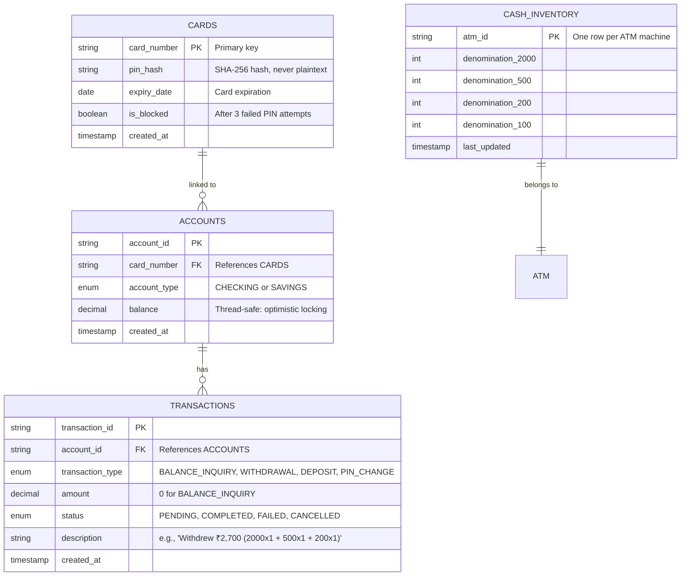

# ATM Machine — Database Schema

> **Why this exists:** During LLD interviews, you are often asked how you'd persist the in-memory system.
> This document bridges the gap between "in-memory implementation" and "production database."
> Even if the coding round is in-memory only, verbalizing the schema shows SDE3-level thinking.
>
> See `INSTRUCTIONS.md` Section 2.5 for the schema convention.

---

## ER Diagram (Mermaid)

---

## Table Definitions

### 1. `cards` — Authentication & Identity

| Column | Type | Constraints | Notes |
|--------|------|------------|-------|
| `card_number` | `VARCHAR(19)` | `PRIMARY KEY` | Format: `XXXX-XXXX-XXXX-XXXX` |
| `pin_hash` | `VARCHAR(64)` | `NOT NULL` | SHA-256 hash. Never store plaintext PIN. |
| `expiry_date` | `DATE` | `NOT NULL` | Cards expired are rejected at insertion |
| `is_blocked` | `BOOLEAN` | `DEFAULT FALSE` | Set `TRUE` after 3 consecutive failed PIN attempts |
| `created_at` | `TIMESTAMP` | `DEFAULT NOW()` | Audit timestamp |

**Business Rules:**
- PIN validation: `hash( userInput ) == pin_hash`
- Expiry check: `expiry_date >= CURRENT_DATE`
- Block check: fail-fast if `is_blocked == TRUE`
- One card can be linked to 0–N accounts (checking + savings)

### 2. `accounts` — Financial Records

| Column | Type | Constraints | Notes |
|--------|------|------------|-------|
| `account_id` | `VARCHAR(20)` | `PRIMARY KEY` | e.g., `ACC-1001` |
| `card_number` | `VARCHAR(19)` | `FOREIGN KEY → cards` | Many-to-one: one card, multiple accounts |
| `account_type` | `ENUM` | `NOT NULL` | `CHECKING` or `SAVINGS` |
| `balance` | `DECIMAL(15,2)` | `NOT NULL, DEFAULT 0` | Use optimistic locking (`version` column) for concurrent ATMs |
| `version` | `INTEGER` | `DEFAULT 0` | Optimistic lock for concurrent debit/credit |
| `created_at` | `TIMESTAMP` | `DEFAULT NOW()` | |

**Business Rules:**
- Balance can never go negative (enforced at application layer + DB constraint)
- Debit: `UPDATE accounts SET balance = balance - ?, version = version + 1 WHERE account_id = ? AND version = ? AND balance >= ?`
  - If affected rows = 0 → retry or throw `InsufficientFundsException` / `OptimisticLockException`
- Credit: No balance check needed, same optimistic lock pattern

**Why `version` column (optimistic locking):**
Multiple ATMs can process transactions on the same account simultaneously. Instead of `SELECT ... FOR UPDATE` (pessimistic), use a version column. The first ATM to `UPDATE` wins; the second retries. For LLD interviews, this shows you understand distributed concurrency beyond `synchronized`.

### 3. `transactions` — Audit Trail

| Column | Type | Constraints | Notes |
|--------|------|------------|-------|
| `transaction_id` | `VARCHAR(10)` | `PRIMARY KEY` | UUID shortened to 8 chars (e.g., `A3F2B9C1`) |
| `account_id` | `VARCHAR(20)` | `FOREIGN KEY → accounts` | Many-to-one |
| `transaction_type` | `ENUM` | `NOT NULL` | `BALANCE_INQUIRY`, `WITHDRAWAL`, `DEPOSIT`, `PIN_CHANGE` |
| `amount` | `DECIMAL(15,2)` | `DEFAULT 0` | 0 for `BALANCE_INQUIRY` and `PIN_CHANGE` |
| `status` | `ENUM` | `DEFAULT 'PENDING'` | `PENDING → COMPLETED / FAILED / CANCELLED` |
| `description` | `TEXT` | | Human-readable: denom breakdown, failure reason |
| `created_at` | `TIMESTAMP` | `DEFAULT NOW()` | Immutable — never update after creation |

**Business Rules:**
- Each transaction is immutable once `COMPLETED` or `FAILED`
- `status` lifecycle: `PENDING` → ( `COMPLETED` | `FAILED` | `CANCELLED` )
- `BALANCE_INQUIRY` counts as a transaction (audit trail)
- Index on `(account_id, created_at DESC)` for transaction history queries

### 4. `cash_inventory` — Physical Cash Tracking

| Column | Type | Constraints | Notes |
|--------|------|------------|-------|
| `atm_id` | `VARCHAR(10)` | `PRIMARY KEY` | e.g., `ATM-001` |
| `denom_2000` | `INTEGER` | `DEFAULT 0, CHECK >= 0` | Count of ₹2000 notes |
| `denom_500` | `INTEGER` | `DEFAULT 0, CHECK >= 0` | Count of ₹500 notes |
| `denom_200` | `INTEGER` | `DEFAULT 0, CHECK >= 0` | Count of ₹200 notes |
| `denom_100` | `INTEGER` | `DEFAULT 0, CHECK >= 0` | Count of ₹100 notes |
| `last_updated` | `TIMESTAMP` | `DEFAULT NOW()` | |

**Business Rules:**
- Denomination columns use `CHECK >= 0` — count can never go negative
- Cash refill updates: `UPDATE cash_inventory SET denom_X = denom_X + ?, last_updated = NOW() WHERE atm_id = ?`
- Cash dispense: `UPDATE cash_inventory SET denom_X = denom_X - ?, last_updated = NOW() WHERE atm_id = ? AND denom_X >= ?`
  - If affected rows = 0 → insufficient cash for that denomination

---

## Index Strategy

| Table | Index | Reason |
|-------|-------|--------|
| `cards` | `PRIMARY KEY (card_number)` | Direct card lookup by number |
| `cards` | `INDEX idx_blocked (is_blocked)` | Admin queries: list all blocked cards |
| `accounts` | `INDEX idx_card (card_number)` | Fetch all accounts linked to a card |
| `accounts` | `INDEX idx_account_id_version (account_id, version)` | Optimistic lock lookup |
| `transactions` | `INDEX idx_account_time (account_id, created_at DESC)` | Transaction history sorted by recency |
| `transactions` | `INDEX idx_status (status)` | Reconciliation queries (find all FAILED txns) |

---

## Concurrency Model

The in-memory implementation uses `synchronized` blocks. In a real database:

| Scenario | In-Memory | Database |
|----------|-----------|----------|
| PIN validation | `synchronized` on `CardManager` | `SELECT * FROM cards WHERE card_number = ?` |
| Balance check + debit | `synchronized` on `Account` | `UPDATE ... WHERE version = ? AND balance >= ?` (optimistic lock) |
| Cash dispense | `synchronized` on `CashInventory` | `UPDATE ... WHERE denomination_count >= ?` + row-level lock |
| Transaction log | `synchronized` on `TransactionLogger` | `INSERT INTO transactions` (append-only, no contention) |

**Why optimistic locking for accounts:**
- Pessimistic (`SELECT FOR UPDATE`) blocks all concurrent transactions on the same account — fine for a single ATM, bad for 100 ATMs.
- Optimistic locking lets concurrent transactions proceed; only retries on write conflict.
- This maps to SDE3 expectations — they care about how your in-memory design evolves to distributed.

---

## Migration from In-Memory to Persisted

If asked "how would you persist this?" in an interview:

1. **`CardManager`** (in-memory `ConcurrentHashMap`) → `cards` table
2. **`AccountManager`** (in-memory `ConcurrentHashMap`) → `accounts` table with version column
3. **`TransactionLogger`** (in-memory `List`) → `transactions` table (append-only)
4. **`CashInventory`** (in-memory `EnumMap`) → `cash_inventory` table
5. Add a `DataSource` / `ConnectionPool` abstraction at the `ATM` constructor level (DIP)
6. Each manager gets a `*Repository` interface; in-memory impl for tests, JDBC impl for production

---

## Key Takeaways for Interviews

- **Never store plaintext PINs** — always hash (even in in-memory demos, the code uses `Objects.hash()` as a stand-in for SHA-256)
- **Balance is never negative** — enforce at DB level with a `CHECK` constraint AND at app level with a guard
- **Transaction log is append-only** — never `UPDATE` or `DELETE` a completed transaction
- **Optimistic locking over pessimistic** for account balance — scales better in multi-ATM scenarios
- **Schema mirrors the domain model** — Card → Account → Transaction is a natural 1→many→many chain
