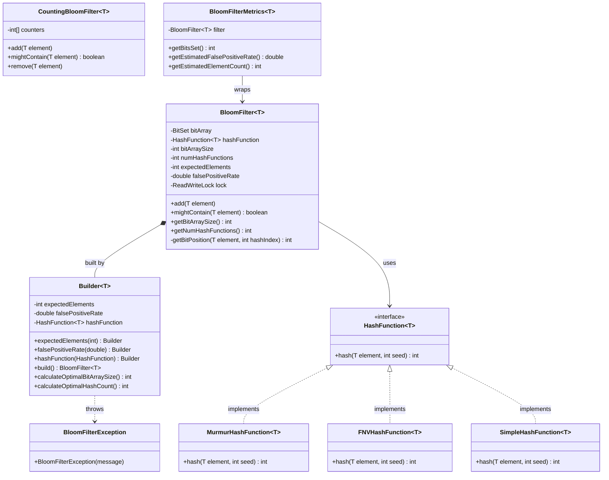

# Bloom Filter — Design Document (D.I.C.E. Format)

Probabilistic membership data structure: O(k) add/query, zero false negatives, configurable false-positive rate.
Extended with `CountingBloomFilter` (deletion support) and `BloomFilterMetrics` (observability).

Follows the D.I.C.E. workflow from `INSTRUCTIONS.md`.

---

## Step 1 — DEFINE (Requirements & Constraints)

### Functional Requirements

1. A caller can **add an element** to the filter.
2. A caller can **query membership** (`mightContain`) — returns `false` means DEFINITELY absent; `true` means POSSIBLY present.
3. A caller can **configure the expected number of elements** and a **desired false-positive rate** — the filter auto-computes optimal bit array size and hash count.
4. A caller can **plug in a custom hash function** (MurmurHash, FNV, Simple, or any future implementation).
5. The **`CountingBloomFilter`** additionally supports **deletion** of elements (curveball extension).
6. **`BloomFilterMetrics`** exposes observability: bits set, false-positive rate estimate, element count.

### Non-Functional Requirements

- **O(k) time** for `add()` and `mightContain()` where k = number of hash functions (typically 5–10).
- **O(m) space** where m = bit array size (computed from n and p).
- **Zero false negatives** — if `mightContain()` returns `false`, the element is definitely not present.
- **Thread-safe** — `ReentrantReadWriteLock`: concurrent reads, exclusive writes.
- **OCP-compliant** — new hash functions added via `HashFunction<T>` without modifying `BloomFilter`.

### Constraints

- Standard `BloomFilter` does not support deletion (bit-sharing between elements).
- In-memory `BitSet` only — no persistence.
- Single JVM process.
- TTL / element expiry not supported.

### Out of Scope

- Distributed bloom filters (Cassandra, Redis).
- Scalable Bloom Filters (dynamic resizing).
- Persistence across JVM restarts.

---

## Step 2 — IDENTIFY (Entities & Relationships)

### Noun → Verb extraction

> A **caller** *adds* an **element** → **Builder** *computes* optimal **bit array size** and **hash count** → **BloomFilter** *hashes* element k times using **HashFunction** → *sets* bits in **BitSet** → on query, *checks* all k bits → returns membership verdict.

### Nouns → Candidate Entities

| Noun | Entity Type | Notes |
|---|---|---|
| BloomFilter | Class | Core: `BitSet` + `HashFunction` + `ReadWriteLock`; constructed via inner `Builder` |
| BloomFilter.Builder | Inner class | Builder: computes `m = -(n·ln p)/(ln 2)²` and `k = (m/n)·ln 2`; validates inputs |
| HashFunction | Interface | Strategy: `hash(element, seed) → int`; seed simulates k independent hash functions |
| MurmurHashFunction | Class | Default hash — good distribution, fast |
| FNVHashFunction | Class | FNV-1a — alternative; strong avalanche effect |
| SimpleHashFunction | Class | Simple polynomial hash — educational baseline |
| CountingBloomFilter | Class | Extends `BloomFilter` concept with `int[]` counter array to support deletion |
| BloomFilterMetrics | Class | Wraps a `BloomFilter`; exposes bits set, estimated FPR, element count |
| BloomFilterException | Exception | Unchecked; thrown on invalid Builder parameters |

### Verbs → Methods / Relationships

| Verb | Lives on |
|---|---|
| `add(element)` | `BloomFilter`, `CountingBloomFilter` |
| `mightContain(element)` | `BloomFilter`, `CountingBloomFilter` |
| `remove(element)` | `CountingBloomFilter` only |
| `hash(element, seed)` | `HashFunction` |
| `calculateOptimalBitArraySize()` | `BloomFilter.Builder` |
| `calculateOptimalHashCount()` | `BloomFilter.Builder` |
| `getBitPosition(element, hashIndex)` | `BloomFilter` (private) |

### Relationships

```
BloomFilter        ──uses──►      HashFunction (injected)    (Association — Strategy/DIP)
BloomFilter        ──owns──►      BitSet                     (Composition)
BloomFilter        ──owns──►      ReadWriteLock              (Composition)
BloomFilter.Builder ──creates──►  BloomFilter                (Factory / Builder)
HashFunction       ◄──implements── MurmurHashFunction        (Realization)
HashFunction       ◄──implements── FNVHashFunction           (Realization)
HashFunction       ◄──implements── SimpleHashFunction        (Realization)
CountingBloomFilter ──extends──►  BloomFilter concept        (conceptual — separate impl)
BloomFilterMetrics ──wraps──►     BloomFilter                (Decorator / Association)
BloomFilter.Builder ──throws──►   BloomFilterException       (Dependency)
```

### Design Patterns Applied

| Pattern | Where | Why |
|---|---|---|
| **Strategy** | `HashFunction<T>` | Swap MurmurHash / FNV / Simple without modifying `BloomFilter` — classic OCP via injection |
| **Builder** | `BloomFilter.Builder` | `falsePositiveRate` and `hashFunction` are optional; math formulas hidden inside builder — callers can't misconfigure |
| **Facade** | `BloomFilter` public API (`add` / `mightContain`) | Hides bit manipulation, lock management, seed-based hashing |
| **Decorator** | `BloomFilterMetrics` wraps `BloomFilter` | Adds observability transparently — `BloomFilter` has zero monitoring knowledge |

---

## Step 3 — CLASS DIAGRAM (Mermaid.js)



---

## Step 4 — PACKAGE STRUCTURE

```
com.lldprep.bloomfilter/
│
├── DESIGN_DICE.md                   ← this file
├── DESIGN.md                        ← original design (retained)
├── README.md
│
├── BloomFilter.java                 ← core: BitSet + HashFunction + ReadWriteLock + Builder
├── CountingBloomFilter.java         ← curveball: int[] counters enabling deletion
├── BloomFilterMetrics.java          ← decorator: observability wrapper
│
├── hash/
│   ├── HashFunction.java            ← Strategy interface: hash(element, seed) → int
│   ├── MurmurHashFunction.java      ← default — good distribution, fast
│   ├── FNVHashFunction.java         ← FNV-1a — strong avalanche
│   └── SimpleHashFunction.java      ← polynomial — educational baseline
│
├── exception/
│   └── BloomFilterException.java    ← unchecked; thrown on invalid Builder params
│
├── BloomFilterDemo.java             ← main demo: add / mightContain / FPR scenarios
└── CurveballDemo.java               ← CountingBloomFilter deletion demo
```

---

## Step 5 — IMPLEMENTATION ORDER (per INSTRUCTIONS.md)

1. `exception/BloomFilterException.java`
2. `hash/HashFunction.java` — interface
3. `hash/MurmurHashFunction.java`
4. `hash/FNVHashFunction.java`
5. `hash/SimpleHashFunction.java`
6. `BloomFilter.java` (with inner `Builder`) — depends on `HashFunction`
7. `CountingBloomFilter.java` — curveball extension
8. `BloomFilterMetrics.java` — decorator
9. `BloomFilterDemo.java` + `CurveballDemo.java` — last

---

## Step 6 — EVOLVE (Curveballs)

| Curveball | Impact on current design | Extension strategy |
|---|---|---|
| **Deletion support** | Standard `BloomFilter` cannot delete (shared bits) | `CountingBloomFilter` replaces `BitSet` with `int[]` counters. `remove()` decrements counters; `mightContain()` checks > 0. Already implemented. |
| **New hash function** (e.g. xxHash) | Zero changes to `BloomFilter` | `XxHashFunction implements HashFunction<T>`. Inject into `Builder.hashFunction()`. OCP satisfied. |
| **Observability** (bits used, estimated FPR) | Zero changes to `BloomFilter` | `BloomFilterMetrics` wraps `BloomFilter` as a Decorator. Already implemented. |
| **Scalable Bloom Filter** (auto-resize when FPR degrades) | New class | `ScalableBloomFilter` holds a `List<BloomFilter>`. When current filter's estimated FPR exceeds threshold, add a new larger filter. `add()` appends to latest; `mightContain()` checks all. |
| **Persistence** | Store `BitSet` bytes | Serialize `bitArray.toByteArray()` to disk/Redis. Deserialize on startup. `BloomFilter` interface unchanged. |

---

## The Math (Builder)

**Optimal bit array size:**
```
m = -(n × ln p) / (ln 2)²
```
where n = expected elements, p = desired false-positive rate.

**Optimal hash function count:**
```
k = (m / n) × ln 2
```

**Actual false-positive rate at k hash functions and m bits with n elements:**
```
FPR ≈ (1 - e^(-kn/m))^k
```

The `Builder` encapsulates this math — callers only specify `expectedElements` and `falsePositiveRate`.

---

## Thread Safety Analysis

| Operation | Mechanism |
|---|---|
| `add(element)` | `writeLock()` — exclusive; no concurrent reads during bit-setting |
| `mightContain(element)` | `readLock()` — concurrent reads allowed |
| `CountingBloomFilter.remove()` | `writeLock()` — exclusive |

---

## Self-Review Checklist

- [x] Requirements written before any class design
- [x] Class diagram with typed relationships
- [x] Every class has a single nameable responsibility
- [x] Adding a new hash function requires zero changes to `BloomFilter` (OCP)
- [x] `BloomFilter` depends on `HashFunction` interface, not concrete types (DIP)
- [x] `BloomFilter.Builder` encapsulates math — callers cannot misconfigure
- [x] `BloomFilterMetrics` decorates without modifying `BloomFilter` (OCP + Decorator)
- [x] Patterns documented with "why"
- [x] Thread-safety via `ReentrantReadWriteLock`
- [x] Custom exception in `exception/`
- [x] Demo covers all 6 functional requirements + curveball deletion
