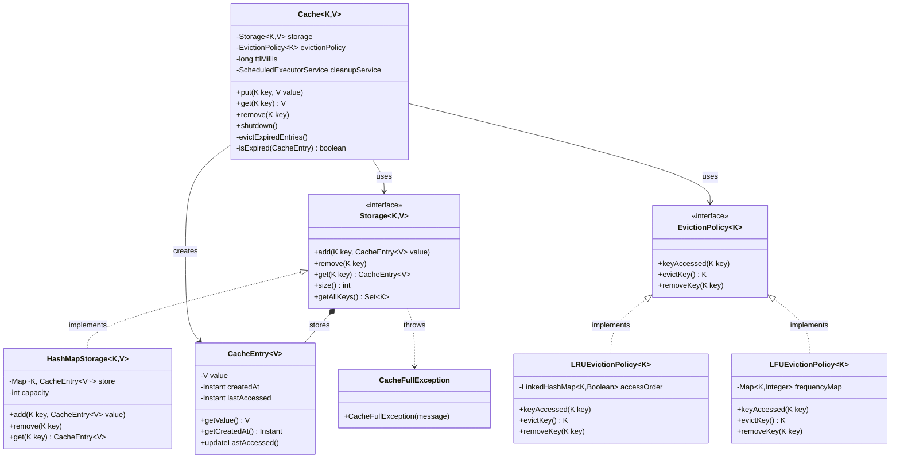

# In-Memory Cache — Design Document (D.I.C.E. Format)

Generic, thread-safe in-memory cache with pluggable eviction policy and TTL-based expiry.

Follows the D.I.C.E. workflow from `INSTRUCTIONS.md`.

---

## Step 1 — DEFINE (Requirements & Constraints)

### Functional Requirements

1. A caller can **put a key-value pair** into the cache.
2. A caller can **get a value by key** — returns `null` if absent or expired.
3. A caller can **remove a key** explicitly.
4. The cache **evicts the least-eligible key** automatically when full, using a pluggable eviction policy.
5. Entries **expire automatically** after a configured TTL — both on access and via background cleanup.
6. The caller can **shut down the cache** to stop the background cleanup thread.

### Non-Functional Requirements

- **O(1) get/put** — backed by `HashMap` with `synchronized` for thread-safety.
- **Pluggable eviction** — LRU, LFU, or any future policy swapped via `EvictionPolicy<K>` interface (OCP).
- **Pluggable storage** — `Storage<K,V>` interface decouples the data store from eviction logic (DIP).
- **Thread-safe** — `synchronized` on `Cache` methods; background cleanup snapshots keys before iterating.
- **Generic** — `Cache<K, V>` works for any key and value type.

### Constraints

- In-memory only — no disk persistence.
- Single JVM process.
- TTL is set once at construction — no per-entry TTL.
- Capacity enforced by `Storage` implementation.

### Out of Scope

- Distributed caching (Redis, Memcached).
- Per-entry TTL.
- Async / non-blocking cache operations.
- Cache loader / read-through pattern.

---

## Step 2 — IDENTIFY (Entities & Relationships)

### Noun → Verb extraction

> A **caller** *puts* a **key-value pair** → the **cache** *checks* **storage** capacity → if full, asks **eviction policy** to *evict* a key → *stores* the **entry** → **background thread** *scans* expired **entries** and removes them.

### Nouns → Candidate Entities

| Noun | Entity Type | Notes |
|---|---|---|
| Cache | Class | Orchestrator: coordinates storage + eviction + TTL cleanup |
| Storage | Interface | Physical key→entry map contract: `add / remove / get / getAllKeys` |
| HashMapStorage | Class | `HashMap`-backed `Storage` implementation with capacity limit |
| EvictionPolicy | Interface | Strategy: `keyAccessed / evictKey / removeKey` |
| LRUEvictionPolicy | Class | Evicts least-recently used key via `LinkedHashMap` access order |
| LFUEvictionPolicy | Class | Evicts least-frequently used key via frequency counter map |
| CacheEntry | Class (model) | Wraps the value with `createdAt` and `lastAccessed` timestamps |
| CacheFullException | Exception | Unchecked; thrown by `Storage.add()` when at capacity |

### Verbs → Methods / Relationships

| Verb | Lives on |
|---|---|
| `put(key, value)` | `Cache` |
| `get(key)` | `Cache` |
| `remove(key)` | `Cache` |
| `evictKey()` | `EvictionPolicy` |
| `keyAccessed(key)` | `EvictionPolicy` |
| `add / get / remove / getAllKeys` | `Storage` |
| `evictExpiredEntries()` | `Cache` (background daemon) |
| `shutdown()` | `Cache` |

### Relationships

```
Cache            ──uses──►     Storage (injected)        (Association — DIP)
Cache            ──uses──►     EvictionPolicy (injected) (Association — DIP)
Cache            ──creates──►  CacheEntry                (Dependency)
Storage          ──contains──► CacheEntry                (Composition)
HashMapStorage   ──implements── Storage                  (Realization)
LRUEvictionPolicy ──implements── EvictionPolicy          (Realization)
LFUEvictionPolicy ──implements── EvictionPolicy          (Realization)
Storage          ──throws──►   CacheFullException        (Dependency)
```

### Design Patterns Applied

| Pattern | Where | Why |
|---|---|---|
| **Strategy** | `EvictionPolicy<K>` | Swap LRU ↔ LFU ↔ any future policy by injecting a different implementation — zero changes to `Cache` |
| **Strategy** | `Storage<K,V>` | Swap `HashMap` for off-heap or Redis-backed storage without touching eviction logic |
| **Template Method** | `Cache.put()` — fixed steps: store → catch full → evict → retry | The skeleton is fixed; eviction algorithm is delegated |

---

## Step 3 — CLASS DIAGRAM (Mermaid.js)



---

## Step 4 — PACKAGE STRUCTURE

```
com.lldprep.cache/
│
├── DESIGN_DICE.md                   ← this file
├── README.md                        ← usage guide
│
├── Cache.java                       ← orchestrator: put/get/remove + TTL cleanup daemon
│
├── model/
│   └── CacheEntry.java              ← value wrapper with createdAt + lastAccessed timestamps
│
├── storage/
│   ├── Storage.java                 ← interface: add / remove / get / getAllKeys
│   └── HashMapStorage.java          ← HashMap-backed Storage with capacity enforcement
│
├── policy/
│   ├── EvictionPolicy.java          ← interface: keyAccessed / evictKey / removeKey
│   ├── LRUEvictionPolicy.java       ← LinkedHashMap access-order eviction
│   └── LFUEvictionPolicy.java       ← frequency-counter eviction
│
├── exception/
│   └── CacheFullException.java      ← unchecked; thrown by Storage.add() at capacity
│
└── CacheMain.java                   ← demo: put/get/eviction/TTL/shutdown scenarios
```

---

## Step 5 — IMPLEMENTATION ORDER (per INSTRUCTIONS.md)

1. `exception/CacheFullException.java` — unchecked exception
2. `model/CacheEntry.java` — pure value wrapper
3. `storage/Storage.java` — interface
4. `policy/EvictionPolicy.java` — interface
5. `storage/HashMapStorage.java` — Storage implementation
6. `policy/LRUEvictionPolicy.java` — EvictionPolicy implementation
7. `policy/LFUEvictionPolicy.java` — EvictionPolicy implementation
8. `Cache.java` — orchestrator (depends on all above)
9. `CacheMain.java` — demo last

---

## Step 6 — EVOLVE (Curveballs)

| Curveball | Impact on current design | Extension strategy |
|---|---|---|
| **FIFO eviction** | New policy only | `FIFOEvictionPolicy implements EvictionPolicy` using a `Queue<K>` for insertion order. Zero changes to `Cache`. |
| **Per-entry TTL** | `CacheEntry` gains a `ttlMillis` field | `Cache.isExpired()` reads `entry.getTtl()` instead of the global `ttlMillis`. `put(key, value, ttl)` overload added. Minimal change. |
| **Max-size eviction on every put (no exception)** | `Storage.add()` contract change | `HashMapStorage` can silently evict instead of throwing. Alternatively wrap in `Cache.put()` loop — already done via `CacheFullException` catch. |
| **Off-heap or Redis storage** | Storage interface unchanged | `RedisStorage implements Storage<K,V>` — inject into `Cache`. Zero changes to eviction logic. |
| **Cache metrics** (hit rate, miss rate) | `Cache` gains counters | Add `AtomicLong hits / misses` in `Cache.get()`. Expose via `CacheMetrics` record. SRP preserved — metrics are passive counters. |

---

## Thread Safety Analysis

| Operation | Mechanism |
|---|---|
| `put / get / remove` | `synchronized` on `Cache` instance — single monitor for storage + policy |
| `evictExpiredEntries()` | Also `synchronized` — background thread uses same monitor |
| Key snapshot in cleanup | `new ArrayList<>(storage.getAllKeys())` — snapshot before iterating to avoid `ConcurrentModificationException` |

---

## Self-Review Checklist

- [x] Requirements written before any class design
- [x] Class diagram with typed relationships
- [x] Every class has a single nameable responsibility
- [x] Adding a new eviction policy requires zero changes to `Cache` (OCP)
- [x] Adding a new storage backend requires zero changes to `Cache` or eviction (OCP)
- [x] `Cache` depends on `Storage` and `EvictionPolicy` interfaces, not concrete types (DIP)
- [x] `Storage` interface is minimal (ISP)
- [x] `EvictionPolicy` interface is minimal (ISP)
- [x] Patterns documented with "why"
- [x] Thread-safety addressed with `synchronized` + key snapshot
- [x] Custom exception defined in `exception/`
- [x] Demo covers all 6 functional requirements
