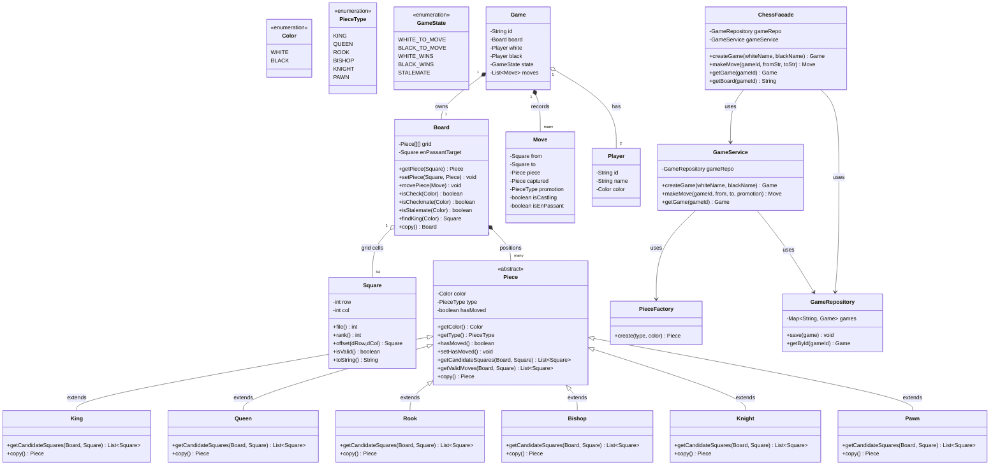

# Chess — Design Document (D.I.C.E.)

Follows the D.I.C.E. workflow from `INSTRUCTIONS.md`.

---

## Step 1 — DEFINE (Requirements & Constraints)

### Functional Requirements

1. Two players (White and Black) can play a standard chess game on an 8×8 board.
2. Players alternate turns, starting with White.
3. Each piece type has legal moves: Pawn, Rook, Knight, Bishop, Queen, King.
4. A move is invalid if it leaves the player's own king in check (pin / self-check prevention).
5. Check detection: after every move, determine if the opponent's king is under attack.
6. Checkmate detection: the king is in check AND has no legal escape.
7. Stalemate detection: the player to move has no legal moves but is not in check.
8. Castling: kingside and queenside (king and rook have not moved, no pieces between, king does not move through or into check).
9. En passant: pawn captures an opponent's pawn that just moved two squares.
10. Pawn promotion: pawn reaching the eighth rank promotes (default: Queen).
11. Move history: every game maintains a chronological list of moves played.
12. Game state is queriable: active, check, checkmate, stalemate.

### Non-Functional Requirements

- **Correctness over performance** — move validation must be exhaustive and correct; performance is secondary for an 8×8 grid.
- **Polymorphism over instanceof** — each piece subtype owns its move-generation logic. No switch-on-piece-type in validation.
- **Immutable move records** — once a move is executed and validated, it is never mutated.
- **Fail-fast** — invalid moves throw immediately before any board mutation occurs.

### Constraints

- In-memory only — no persistence.
- Single game per `GameService` instance; multiple games managed by `GameRepository`.
- Standard chess rules only (no Fischer Random / Chess960, no draw-by-repetition tracking beyond stalemate).
- Algebraic notation (`Square`) uses zero-indexed row (0=rank8, 7=rank1) and col (0=a, 7=h).

### Out of Scope

- Draw by threefold repetition / fifty-move rule.
- Draw by insufficient material.
- Chess clock / time control.
- Algebraic notation parsing (SAN/UCI).
- AI / engine integration.
- Undo / redo.

---

## Step 2 — IDENTIFY (Entities & Relationships)

### Noun → Verb extraction

> A **player** starts a **game**. The **board** holds 32 **pieces** at their starting **squares**. On each turn, a player chooses a **move** — from **square** to **square** — the **piece** generates its candidate squares, the **board** filters for legality (no self-check), the move is recorded, and the game **state** advances.

### Entities

| Entity | Type | Responsibility |
|--------|------|---------------|
| `Color` | Enum | WHITE, BLACK |
| `PieceType` | Enum | KING, QUEEN, ROOK, BISHOP, KNIGHT, PAWN |
| `Square` | Record | (row, col) — a single cell on the board |
| `Piece` | Abstract Class | Color + PieceType + hasMoved flag; declares `getCandidateSquares(Board, Square)` |
| `King/Queen/Rook/Bishop/Knight/Pawn` | Class | Each owns its movement logic via `getCandidateSquares()` |
| `Board` | Class | 8×8 grid; copy constructor for look-ahead; `isCheck(color)`, `isCheckmate/Stalemate(color)` |
| `Move` | Record | from, to, piece, captured piece, promotion type, castling flag, en passant flag |
| `Player` | Record | id, name, color |
| `Game` | Class | Board + two players + current turn + state + move history; `state` = WHITE_TO_MOVE, BLACK_TO_MOVE, WHITE_WINS, BLACK_WINS, STALEMATE |
| `GameState` | Enum | WHITE_TO_MOVE, BLACK_TO_MOVE, WHITE_WINS, BLACK_WINS, STALEMATE |

### Relationships

```
Game ──owns──► Board            (1:1, Composition)
Game ──has──► Player × 2        (1:2, Aggregation)
Game ──records──► Move          (1:N, Composition)
Board ──holds──► Piece           (1:N, Association — pieces sit on squares)
Piece ──references──► Square     (position is on Board, not stored in Piece)
```

### Design Patterns Applied

| Pattern | Where | Why |
|---------|-------|-----|
| **Template Method** | `Piece.getValidMoves()` → calls abstract `getCandidateSquares()`, board filters for self-check | Every piece shares the same post-filter step; subclasses vary only move-generation |
| **Factory** | `PieceFactory.create(PieceType, Color)` | Centralises piece instantiation; board setup never uses `new King(...)` directly |
| **Repository** | `GameRepository` | In-memory store; swappable for DB |
| **Facade** | `ChessFacade` | Single entry point: `createGame()`, `makeMove()`, `getGameState()` |
| **Strategy** | Castling rule, en passant rule, promotion rule could be extracted behind interfaces for variant support | Not extracted yet (one-impl case), but the *design* keeps the extension axis visible |

---

## Step 3 — CLASS DIAGRAM (Mermaid.js)



---

## Step 4 — CORE ALGORITHM

### Move Validation Pipeline

Every `makeMove()` flows through these stages:

```
1. Parse from/to squares from algebraic notation (e.g., "e2" → Square(6,4))
2. Validate game is active (not checkmate/stalemate)
3. Validate correct player's turn
4. Get piece at 'from' square — must exist and belong to current player
5. Piece.getCandidateSquares(Board, from) — geometry only (what squares can this piece reach, ignoring self-check?)
6. Board filters candidates: for each candidate, simulate the move on a COPY of the board, then test isCheck(currentColor).
   Keep only moves where the king is NOT in check after simulation.
7. If 0 legal moves → checkmate or stalemate (depending on isCheck)
8. Validate that 'to' is in the filtered legal-moves set
9. Execute: create Move record, update board, flip turn, detect check/checkmate/stalemate on opponent
```

### Check Detection

```
isCheck(Color defendingColor):
    kingSquare = findKing(defendingColor)
    for every square on board:
        piece = getPiece(square)
        if piece.color != defendingColor:  // attacker
            if kingSquare is in piece.getCandidateSquares(board, square):
                return true
    return false
```

### Checkmate / Stalemate

```
isCheckmate(defendingColor):
    return isCheck(defendingColor) AND hasNoLegalMoves(defendingColor)

isStalemate(defendingColor):
    return NOT isCheck(defendingColor) AND hasNoLegalMoves(defendingColor)

hasNoLegalMoves(color):
    for each square (r, c) on board:
        piece = getPiece(r, c)
        if piece.color == color:
            if getValidMoves(piece, square).size() > 0:
                return false
    return true
```

### Castling (King)

King moves two squares toward a rook; rook jumps over king to the adjacent square.

Conditions:
1. King has NOT moved.
2. Target rook has NOT moved.
3. Squares between king and rook are empty.
4. King is NOT currently in check.
5. King does NOT pass through a square that is attacked.
6. King does NOT land on a square that is attacked (already covered by general move validation).

### En Passant (Pawn)

When a pawn moves two squares forward from its starting rank, the adjacent enemy pawn on the same rank can capture it *as if* it had moved only one square.

The board stores `enPassantTarget` — the square behind the double-stepped pawn. On the very next turn, if an enemy pawn is diagonally adjacent to that square, the pawn can capture to the en-passant target, removing the original pawn from its actual position.

### Pawn Promotion

A pawn reaching row 0 (white) or row 7 (black) must promote. Default promotion is Queen; the API accepts an optional `PieceType`.

---

## Step 5 — BOARD DATA STRUCTURE

```
grid: Piece[8][8]
- grid[row][col] = piece at that square, or null
- row 0 = rank 8 (top), row 7 = rank 1 (bottom)
- col 0 = file a, col 7 = file h

Square record: (int row, int col)
- toString() → algebraic: column letter + rank number
  e.g., Square(6, 4) → "e2", Square(4, 4) → "e4"
```

---

## Step 6 — IMPLEMENTATION ORDER

1. Enums: `Color`, `PieceType`, `GameState`
2. Record: `Square`
3. Model: `Piece` (abstract), `King`, `Queen`, `Rook`, `Bishop`, `Knight`, `Pawn`
4. Model: `Move`, `Player`, `Game`
5. Model: `Board` (grid + copy constructor + check/checkmate/stalemate + move logic)
6. Factory: `PieceFactory`
7. Exception: `ChessException`, `InvalidMoveException`, `GameNotFoundException`, `GameOverException`
8. Repository: `GameRepository`
9. Service: `GameService`
10. Facade: `ChessFacade`
11. Demo: `ChessDemo`

---

## Step 7 — EVOLVE (Curveballs)

| Curveball | Extension Strategy | Pattern |
|-----------|-------------------|---------|
| **Fischer Random / Chess960** | New `StartingPositionStrategy` — generates back-rank layout; `Rook` castling logic adjusts to rook's initial file. `PieceFactory` uses strategy. | Strategy |
| **Three-check variant** | New `WinCondition` interface checked after every move; `StandardWinCondition`, `ThreeCheckWinCondition`. `Game` delegates. | Strategy |
| **Draw-by-repetition** | `Game` keeps `Map<String, Integer>` of position hashes; after 3 repeats, auto-draw. `Board.hashCode()` returns Zobrist-compatible hash. | |
| **Pause / resign / offer draw** | `GameState` gains `PAUSED`, `RESIGNED`, `DRAW_OFFERED`. `GameService` exposes `resign(id)`, `offerDraw(id)`, `acceptDraw(id)`. | State |
| **Undo move** | `Game` stores `Stack<Board>` snapshots; `undo()` pops and restores. | Memento |
| **AI / engine integration** | `MoveStrategy` interface: `HumanMoveStrategy` (via facade), `MinimaxMoveStrategy`. `GameService` delegates turn. | Strategy |

---

## Self-Review Checklist

- [x] Requirements written before code
- [x] Class diagram produced with typed relationships
- [x] Every relationship typed
- [x] Algorithms documented (move validation pipeline, check/checkmate/stalemate, castling, en passant, promotion)
- [x] Board data structure documented (8×8 grid, Square record, algebraic notation mapping)
- [x] Patterns documented with "why" (Template Method, Factory, Repository, Facade)
- [x] Custom exceptions defined
- [x] At least one curveball scenario documented
