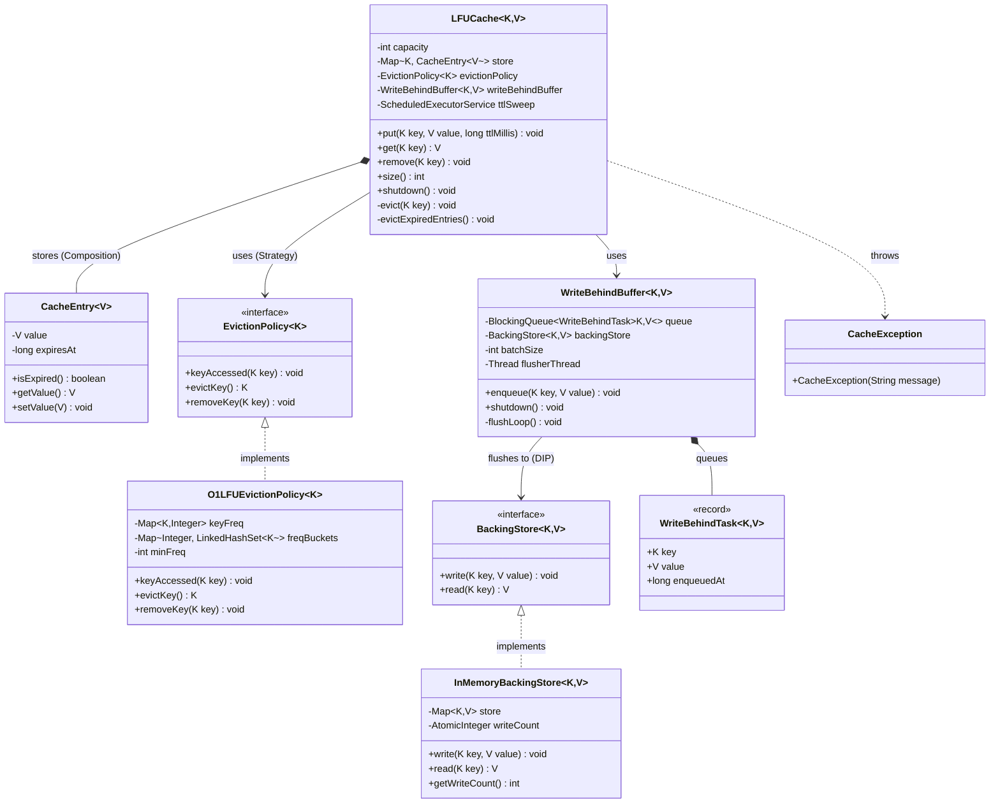

# LFU Cache with TTL + Write-Behind — Design Document (D.I.C.E.)

**Interview Source:** Apple Coding Interview  
**Sourced from:** Reddit · r/developersIndia (seen 2026-06-09)  
Follows the D.I.C.E. workflow from `INSTRUCTIONS.md`.

---

## Step 1 — DEFINE (Requirements & Constraints)

### Functional Requirements

1. A caller can **put(key, value, ttlMillis)** — insert or update a key with a per-entry TTL.
2. A caller can **get(key)** — returns the value, or `null` if absent or expired.
3. A caller can **remove(key)** explicitly.
4. The cache **evicts the least-frequently used key** when at capacity. Tie-break: LRU (oldest key among equal-frequency keys is evicted first).
5. Entries **expire per-entry** — each key has its own TTL, set at insert time.
6. On every `put`, the value is **asynchronously written to a backing store** (write-behind). The `put` call returns immediately without waiting for the DB write.
7. A background thread **sweeps expired entries** periodically to reclaim memory.

### Non-Functional Requirements

- **O(1) get/put/evict** — all three must be constant time.
- **Per-entry TTL** — global TTL is insufficient; each key may have a different expiry.
- **Write-behind throughput** — `put()` must not block on the DB write path.
- **Thread-safe** — concurrent `get` and `put` from multiple threads must be safe.

### Constraints

- In-memory store backed by a `BackingStore<K, V>` abstraction.
- Single JVM process.
- Write-behind uses eventual persistence — a data loss window exists between enqueue and flush.
- Capacity is fixed at construction time.

### Out of Scope

- Read-through (cache miss → fetch from DB automatically).
- Distributed cache (no Redis, no cluster).
- Multi-currency or serialisation of values.
- Write-behind retry or dead-letter queue.

---

## Step 2 — IDENTIFY (Entities & Relationships)

### Noun → Verb extraction

> A **caller** *puts* a **key-value pair** with a **TTL** → the **cache** checks **capacity** → if full, asks **EvictionPolicy** for the **victim key** → stores a **CacheEntry** → enqueues a **WriteBehindTask** → a background **flusher thread** *drains* tasks from the **WriteBehindBuffer** → *writes* to **BackingStore**. On `get`, cache checks if **entry** is expired, signals **EvictionPolicy** to increment frequency.

### Entities

| Entity | Type | Responsibility |
|--------|------|---------------|
| `LFUCache<K,V>` | Class | Orchestrator: put/get/remove, capacity enforcement, TTL sweep |
| `CacheEntry<V>` | Class (model) | Value + per-entry `expiresAt` timestamp |
| `EvictionPolicy<K>` | Interface | Strategy: `keyAccessed`, `evictKey`, `removeKey` |
| `O1LFUEvictionPolicy<K>` | Class | O(1) LFU via `minFreq` + frequency buckets |
| `BackingStore<K,V>` | Interface | Durable persistence target: `write`, `read` |
| `InMemoryBackingStore<K,V>` | Class | HashMap-backed store for demo/testing |
| `WriteBehindBuffer<K,V>` | Class | Async write queue + flusher thread |
| `WriteBehindTask<K,V>` | Record | Single pending write: key, value, enqueuedAt |
| `CacheException` | Exception | Programming errors (invalid capacity, null eviction) |

### Design Patterns Applied

| Pattern | Where | Why |
|---------|-------|-----|
| **Strategy** | `EvictionPolicy<K>` → `O1LFUEvictionPolicy` | Swap LFU ↔ LRU ↔ ARC without touching `LFUCache`. New algorithm = new class only. |
| **Strategy** | `BackingStore<K,V>` → `InMemoryBackingStore`, future `JdbcBackingStore` | Backing store is an injection point — test with in-memory, deploy with JDBC. |
| **Producer-Consumer** | `WriteBehindBuffer` / flusher thread | Decouples the hot write path from slow I/O. Cache returns in ~ns; DB write happens off the critical path. |

---

## Step 3 — CLASS DIAGRAM (Mermaid.js)



---

## Step 4 — THE O(1) LFU ALGORITHM

This is the DSA core of the problem. The naive LFU uses `Collections.min()` — O(n). Apple specifically asks why O(1) matters.

### Why O(n) is wrong at scale

At 1M keys and 10K TPS, eviction is called every time the cache is full. O(n) = 1M comparisons per insert = 10B comparisons per second. At that point the eviction policy IS the bottleneck.

### Data Structures

```
keyFreq:     HashMap<K, Integer>                     key → its current access count
freqBuckets: HashMap<Integer, LinkedHashSet<K>>      frequency → keys at that frequency
                                                     (LinkedHashSet = insertion-ordered for LRU tiebreak)
minFreq:     int                                     lowest occupied frequency bucket
```

### Operations

**`keyAccessed(key)`** — called on every get/put:
```
freq = keyFreq[key] or 0

if freq > 0:                           // existing key (get or update)
    remove key from freqBuckets[freq]
    if freqBuckets[freq] is empty:
        delete freqBuckets[freq]
        if minFreq == freq: minFreq++  // next bucket is now min
else:                                  // new key insertion
    minFreq = 1                        // invariant: always 1 after new insert

keyFreq[key] = freq + 1
freqBuckets[freq+1].add(key)           // LinkedHashSet preserves insertion order
```

**`evictKey()`**:
```
bucket = freqBuckets[minFreq]
victim = bucket.first()    // oldest key in min-frequency bucket (LRU tiebreak)
removeKey(victim)
return victim
```

**`removeKey(key)`**:
```
freq = keyFreq.remove(key)
freqBuckets[freq].remove(key)
if freqBuckets[freq] is empty: delete freqBuckets[freq]
```

### Complexity Analysis

| Operation | Time | Why |
|-----------|------|-----|
| `keyAccessed` | O(1) | HashMap lookup + LinkedHashSet add/remove |
| `evictKey` | O(1) | `minFreq` points directly to the right bucket; `iterator().next()` is O(1) |
| `removeKey` | O(1) | HashMap lookup + LinkedHashSet remove (hash-based) |

### Key Invariant: `minFreq`

After inserting a NEW key: `minFreq` MUST be reset to 1.  
After a `get` (existing key): if `minFreq`'s bucket becomes empty, `minFreq++`.  
After eviction: `minFreq` is still valid because we only evict from `freqBuckets[minFreq]`.

**Critical subtlety:** If you update an existing key via `put()`, you must NOT reset `minFreq` to 1 — only increment the key's frequency. Resetting `minFreq` on every put is a common bug in interviews.

### Worked Example

```
Capacity = 3. Sequence: put(a), put(b), put(c), get(a), get(a), get(b), put(d)

After put(a), put(b), put(c):
  keyFreq:     {a:1, b:1, c:1}
  freqBuckets: {1: [a, b, c]}   (insertion order: a oldest)
  minFreq:     1

After get(a): freq a→2
  keyFreq:     {a:2, b:1, c:1}
  freqBuckets: {1: [b, c], 2: [a]}
  minFreq:     1  (bucket 1 still has b, c)

After get(a): freq a→3
  keyFreq:     {a:3, b:1, c:1}
  freqBuckets: {1: [b, c], 3: [a]}
  minFreq:     1

After get(b): freq b→2
  keyFreq:     {a:3, b:2, c:1}
  freqBuckets: {1: [c], 2: [b], 3: [a]}
  minFreq:     1

put(d): at capacity → evict minFreq=1 → bucket[1] = [c] → evict c
  keyFreq:     {a:3, b:2, d:1}
  freqBuckets: {1: [d], 2: [b], 3: [a]}
  minFreq:     1  (reset because d is a new key)
```

---

## Step 5 — WRITE-BEHIND DESIGN

### What it is

Write-behind (also called write-back): the cache returns from `put()` immediately after updating the in-memory store. The write to the backing store (DB, Redis, disk) happens asynchronously on a background thread.

### vs Write-Through

| | Write-Through | Write-Behind |
|---|---|---|
| `put()` latency | High — blocks until DB write | Low — returns in nanoseconds |
| Durability | Immediate | Eventual (data loss window) |
| Use case | Finance, payment records | Analytics, feeds, counters |
| DB write load | Every put | Batched; can coalesce duplicates |

### Implementation: Producer-Consumer

```
put(key, value)
  │
  ├─► store.put(key, new CacheEntry(value, ttl))    ← fast path, in-memory
  └─► writeBehindBuffer.enqueue(key, value)          ← non-blocking queue.offer()

WriteBehindBuffer.flushLoop() [background thread]:
  head = queue.poll(100ms)          ← blocks up to 100ms for first item
  batch = [head] + queue.drainTo(batchSize-1)   ← grab up to N more without blocking
  for task in batch: backingStore.write(task.key, task.value)
```

### Batching benefit

`BlockingQueue.drainTo()` atomically pulls up to `batchSize` tasks in one call. In high-throughput scenarios this amortises per-write overhead (connection acquisition, transaction commit) across N writes per batch.

### Data loss window

If the JVM crashes between `enqueue` and `backingStore.write()`, those writes are lost. Mitigation strategies (out of scope here but interview-worthy):
- Persist the write-behind queue to a WAL (Write-Ahead Log)
- Use an append-only log (Kafka topic) as the queue
- Reduce `batchSize` to 1 if durability trumps throughput

---

## Step 6 — PER-ENTRY TTL vs GLOBAL TTL

### Why per-entry TTL matters

The existing `Cache<K,V>` in this repo uses a single global TTL set at construction:
```java
this.ttlMillis = ttlMillis; // same for ALL entries
```

In practice, a cache serves heterogeneous data:
- User session token → TTL 30 min
- Product catalogue entry → TTL 24 hours
- Rate-limit counter → TTL 1 min

Per-entry TTL is modelled by storing `expiresAt = System.currentTimeMillis() + ttlMillis` in `CacheEntry`. No central clock needed — each entry carries its own deadline.

### Two-level TTL enforcement

1. **Lazy (on access):** `get(key)` checks `entry.isExpired()`. Expired entries are removed before returning `null`. This is O(1) and covers the hot path.

2. **Background sweep:** A `ScheduledExecutorService` daemon runs every `N` milliseconds, scans all keys, and removes expired ones. Without this, entries that are never accessed again would linger in memory forever.

---

## Step 7 — CONCURRENCY MODEL

| Operation | Strategy |
|-----------|----------|
| `put / get / remove` | `synchronized(this)` on `LFUCache` — single monitor guards `store` map + `evictionPolicy` state atomically |
| `evictExpiredEntries()` | Same monitor — background sweep thread uses same lock |
| Key snapshot in sweep | `new ArrayList<>(store.keySet())` before iterating — prevents `ConcurrentModificationException` |
| `writeBehindBuffer.enqueue()` | `BlockingQueue.offer()` — lock-free on producer side |
| `flushLoop()` | Separate thread; `backingStore` has no shared state with the cache |

**Why one lock instead of fine-grained?**  
The `store` map and `evictionPolicy` data structures must stay in sync. A `get()` that updates `keyFreq` in the policy must happen atomically with the `ConcurrentHashMap` read. Fine-grained locking would require locking both structures together anyway, making it equivalent to a single monitor.

---

## Step 8 — IMPLEMENTATION ORDER

1. `exception/CacheException.java`
2. `model/CacheEntry.java` — value + `expiresAt`
3. `model/WriteBehindTask.java` — record
4. `policy/EvictionPolicy.java` — interface
5. `policy/O1LFUEvictionPolicy.java`
6. `store/BackingStore.java` — interface
7. `store/InMemoryBackingStore.java`
8. `writebehind/WriteBehindBuffer.java`
9. `LFUCache.java`
10. `demo/LFUCacheDemo.java`

---

## Step 9 — EVOLVE (Curveballs)

| Curveball | Extension | Pattern |
|-----------|-----------|---------|
| **LRU policy** | New `LRUEvictionPolicy implements EvictionPolicy` using `LinkedHashMap(accessOrder=true)`. Zero changes to `LFUCache`. | Strategy (OCP) |
| **ARC (Adaptive Replacement Cache)** | New `ARCEvictionPolicy` — two LRU lists (recency + frequency). Same interface. | Strategy |
| **Write-through mode** | Inject `BackingStore` directly into `LFUCache`; call `backingStore.write()` synchronously in `put()`. No `WriteBehindBuffer`. Flag or separate class. | Strategy |
| **Write-behind retry** | `WriteBehindBuffer` catches exception from `backingStore.write()`, re-enqueues with backoff. No changes to `LFUCache`. | Decorator |
| **Coalesce duplicate writes** | In `flushLoop()`, deduplicate by key before calling `backingStore.write()` — last write wins. Reduces DB load for hot keys. | — |
| **Cache metrics** | `LFUCache` gains `AtomicLong hits, misses, evictions`. Expose via `CacheStats getStats()`. | SRP |
| **No-TTL entries** | `put(key, value, 0)` → `expiresAt = -1` in `CacheEntry`; `isExpired()` returns false. Already handled. | — |

---

## Self-Review Checklist

- [x] Requirements written before code
- [x] Class diagram with typed relationships
- [x] O(1) LFU algorithm documented with data structures, invariant, and worked example
- [x] Write-behind design documented (Producer-Consumer, batching, data-loss window)
- [x] Per-entry TTL vs global TTL comparison documented
- [x] Concurrency model documented
- [x] Patterns with "why" (Strategy, Producer-Consumer)
- [x] Custom exceptions in `exception/`
- [x] Demo covers: LFU eviction, LRU tiebreak, per-entry TTL, update path, write-behind async
- [x] Curveballs demonstrate OCP — new variants never modify existing classes

---

## Gap vs Existing Cache (com.lldprep.systems.cache)

| Feature | Existing `Cache<K,V>` | This `LFUCache<K,V>` |
|---------|----------------------|---------------------|
| TTL scope | Global (one TTL at construction) | Per-entry (each key has own `expiresAt`) |
| LFU complexity | O(n) — `Collections.min()` scan | O(1) — `minFreq` + `freqBuckets` |
| Write-behind | ✗ | ✓ — `WriteBehindBuffer` + `BackingStore` |
| Update path | Always evicts + re-inserts | In-place value update, freq++ (no eviction) |
