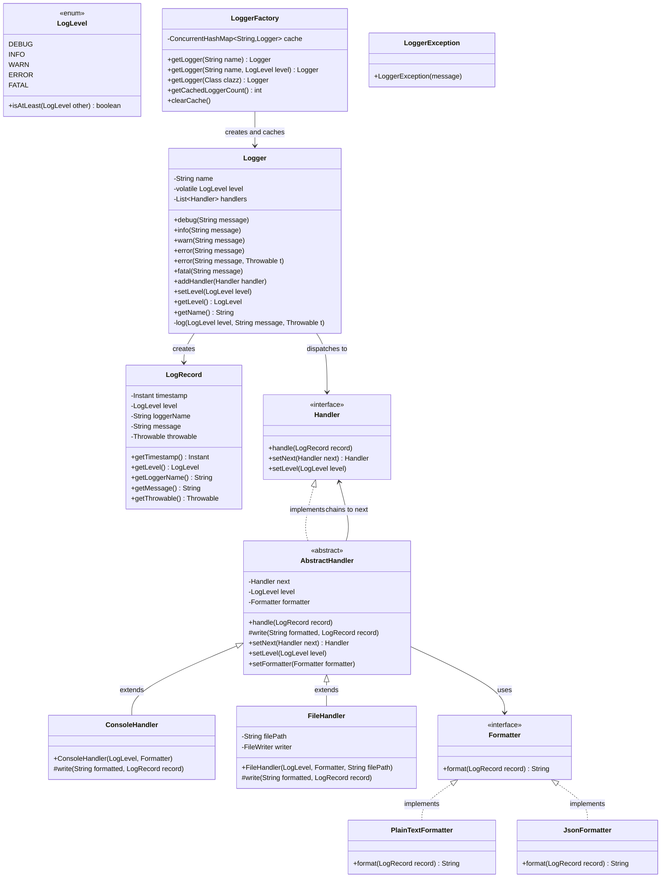

# Logging Framework — Design Document (D.I.C.E. Format)

Extensible, multi-handler logging framework with severity filtering, pluggable formatters, and chain-of-responsibility dispatch.

Follows the D.I.C.E. workflow from `INSTRUCTIONS.md`.

---

## Step 1 — DEFINE (Requirements & Constraints)

### Functional Requirements

1. A caller can **log at 5 severity levels**: `DEBUG / INFO / WARN / ERROR / FATAL`.
2. Each `Logger` has a **minimum level** — records below it are dropped before any allocation.
3. A `Logger` can have **multiple handlers** — each receives every record that passes the logger's threshold.
4. Each `Handler` has its own **independent level threshold** — a `WARN` console handler and a `DEBUG` file handler can coexist on the same logger.
5. Handlers are **chained** — `setNext()` links handlers so a record propagates through the entire chain.
6. Handlers use a **pluggable `Formatter`** — swap `PlainTextFormatter` ↔ `JsonFormatter` by injection.
7. The `LoggerFactory` **caches loggers by name** — two callers requesting the same name get the same instance (Flyweight).
8. The logger's minimum level can be **changed at runtime** (`setLevel()`).

### Non-Functional Requirements

- **Thread-safe** — `Logger.log()` snapshots the handler list; `addHandler()` is `synchronized`; `level` is `volatile` for immediate visibility.
- **Zero allocation on filtered records** — `Logger.log()` returns immediately if `recordLevel` < `this.level` before allocating a `LogRecord`.
- **OCP-compliant** — new handlers (`SlackHandler`, `DatabaseHandler`) and new formatters (`XmlFormatter`) added without modifying existing code.
- **Immutable `LogRecord`** — passed through the entire handler chain with no mutation risk.

### Constraints

- In-memory / synchronous — no async log queue.
- Single JVM process.
- Handler chain is singly-linked (no removal from middle of chain).
- No MDC / thread-local context (Mapped Diagnostic Context).

### Out of Scope

- Async logging queue (Log4j async appender style).
- Log rotation for `FileHandler`.
- Structured logging with typed fields.
- Remote log shipping (Splunk, ELK).

---

## Step 2 — IDENTIFY (Entities & Relationships)

### Noun → Verb extraction

> A **caller** *calls* `logger.warn(msg)` → **Logger** *checks* its level threshold → *creates* an immutable **LogRecord** → *iterates* attached **Handlers** → each **Handler** *checks* its own threshold → *formats* the record via **Formatter** → *writes* to its destination → *forwards* to the next handler in the chain.

### Nouns → Candidate Entities

| Noun | Entity Type | Notes |
|---|---|---|
| Logger | Class | Entry point: level gating, `LogRecord` creation, handler dispatch |
| LogLevel | Enum | `DEBUG < INFO < WARN < ERROR < FATAL`; `isAtLeast(other)` for threshold check |
| LogRecord | Class (immutable) | Snapshot: `timestamp / level / loggerName / message / throwable` — created once per log call |
| Handler | Interface | Chain of Responsibility node: `handle(record) / setNext(handler) / setLevel(level)` |
| AbstractHandler | Abstract class | Template Method: fixed `handle()` algorithm (check level → format → `write()` → forward) |
| ConsoleHandler | Class | `write()` → `System.out` / `System.err` |
| FileHandler | Class | `write()` → `FileWriter` |
| Formatter | Interface | Strategy: `format(record) → String` |
| PlainTextFormatter | Class | Human-readable: `[LEVEL] [timestamp] [logger] message` |
| JsonFormatter | Class | Machine-readable JSON object |
| LoggerFactory | Class | Factory + Flyweight: `ConcurrentHashMap<name, Logger>` — `computeIfAbsent` for lazy creation |
| LoggerException | Exception | Unchecked; thrown on logger configuration errors |

### Verbs → Methods / Relationships

| Verb | Lives on |
|---|---|
| `debug / info / warn / error / fatal` | `Logger` |
| `log(level, message, throwable)` | `Logger` (private) |
| `addHandler(handler)` / `setLevel(level)` | `Logger` |
| `handle(record)` | `Handler`, `AbstractHandler` |
| `write(formatted, record)` | `ConsoleHandler`, `FileHandler` (abstract method) |
| `setNext(handler)` | `AbstractHandler` |
| `format(record)` | `Formatter`, `PlainTextFormatter`, `JsonFormatter` |
| `getLogger(name)` / `getLogger(class)` | `LoggerFactory` |

### Relationships

```
Logger           ──creates──►      LogRecord                     (Dependency)
Logger           ──dispatches to── Handler (list)                (Association)
Handler          ◄──implements──   AbstractHandler               (Realization)
AbstractHandler  ──forwards to──►  Handler (next in chain)       (Chain of Responsibility)
AbstractHandler  ──uses──►         Formatter (injected)          (Association — Strategy/DIP)
AbstractHandler  ◄──extends──      ConsoleHandler                (Inheritance)
AbstractHandler  ◄──extends──      FileHandler                   (Inheritance)
Formatter        ◄──implements──   PlainTextFormatter            (Realization)
Formatter        ◄──implements──   JsonFormatter                 (Realization)
LoggerFactory    ──creates──►      Logger                        (Factory / Flyweight)
LoggerFactory    ──caches──►       Logger (by name)              (Association)
```

### Design Patterns Applied

| Pattern | Where | Why |
|---|---|---|
| **Chain of Responsibility** | `Handler.setNext()` + `AbstractHandler.handle()` | `Logger` doesn't need to know how many handlers are attached or what they do. Each handler independently decides: process + forward? skip + forward? Handlers compose without `Logger` changes. |
| **Template Method** | `AbstractHandler.handle()` (final) + `write()` (abstract) | The algorithm is fixed: check level → format → `write()` → forward. Only the destination (`System.out` vs `FileWriter`) varies per subclass. Prevents subclasses from forgetting level checking or chain forwarding. |
| **Strategy** | `Formatter` interface | Swap `PlainText` ↔ `JSON` by injecting a different `Formatter` into any `Handler` — zero handler code changes. |
| **Factory + Flyweight** | `LoggerFactory` | Same logger name → same instance. Avoids duplicate handler chains. Level changes propagate everywhere the logger is used. `computeIfAbsent` ensures atomic creation under concurrency. |

---

## Step 3 — CLASS DIAGRAM (Mermaid.js)



---

## Step 4 — PACKAGE STRUCTURE

```
com.lldprep.logging/
│
├── DESIGN_DICE.md                       ← this file
├── DESIGN.md                            ← original design (retained)
│
├── Logger.java                          ← entry point: level gate + LogRecord creation + handler dispatch
├── LogLevel.java                        ← enum: DEBUG / INFO / WARN / ERROR / FATAL + isAtLeast()
│
├── model/
│   └── LogRecord.java                   ← immutable event: timestamp / level / loggerName / message / throwable
│
├── handler/
│   ├── Handler.java                     ← Chain of Responsibility interface: handle / setNext / setLevel
│   ├── AbstractHandler.java             ← Template Method: final handle(), abstract write()
│   ├── ConsoleHandler.java              ← write() → System.out / System.err
│   └── FileHandler.java                 ← write() → FileWriter
│
├── formatter/
│   ├── Formatter.java                   ← Strategy interface: format(record) → String
│   ├── PlainTextFormatter.java          ← [LEVEL] [timestamp] [logger] message
│   └── JsonFormatter.java               ← {"level":"...","timestamp":"...","logger":"...","message":"..."}
│
├── factory/
│   └── LoggerFactory.java               ← Factory + Flyweight: ConcurrentHashMap<name, Logger>
│
├── exception/
│   └── LoggerException.java             ← unchecked; configuration errors
│
└── demo/
    └── LoggingFrameworkDemo.java        ← exercises all features + handler chaining
```

---

## Step 5 — IMPLEMENTATION ORDER (per INSTRUCTIONS.md)

1. `exception/LoggerException.java`
2. `LogLevel.java` — enum with `isAtLeast()`
3. `model/LogRecord.java` — immutable snapshot
4. `formatter/Formatter.java` — interface
5. `formatter/PlainTextFormatter.java`
6. `formatter/JsonFormatter.java`
7. `handler/Handler.java` — interface
8. `handler/AbstractHandler.java` — Template Method skeleton
9. `handler/ConsoleHandler.java`
10. `handler/FileHandler.java`
11. `Logger.java` — depends on `LogLevel`, `LogRecord`, `Handler`
12. `factory/LoggerFactory.java`
13. `demo/LoggingFrameworkDemo.java` — last

---

## Step 6 — EVOLVE (Curveballs)

| Curveball | Impact | Extension strategy |
|---|---|---|
| **New handler** (Slack, Database, HTTP) | Zero changes to `Logger`, `AbstractHandler`, any existing handler | `SlackHandler extends AbstractHandler` — override `write()` to POST to Slack webhook. Chain it after `FileHandler`. |
| **New formatter** (XML, CSV) | Zero changes to all handlers | `XmlFormatter implements Formatter` — inject into any handler. OCP fully satisfied. |
| **Async logging** (non-blocking `log()`) | `Logger.log()` must not block caller | `AsyncLogger` wraps `Logger` — `log()` puts `LogRecord` on a `BlockingQueue`; background thread drains queue and calls real handlers. Zero changes to handlers or formatters. |
| **Log rotation** (new file per day/size) | `FileHandler.write()` checks size/date | Override `write()` in `RollingFileHandler extends AbstractHandler` — auto-rotate on size or date. |
| **MDC (thread-local context)** | Attach request ID, user ID to every record | `LogRecord` gains `Map<String, String> context` populated from `ThreadLocal<Map>` in `Logger.log()`. Formatters include context fields. Backward-compatible. |
| **Runtime level change propagates** | Already handled | `Logger.level` is `volatile` — `setLevel()` is visible to all threads immediately. Flyweight ensures all holders of the same logger see the change. |

---

## Key Architectural Decisions

**Why `AbstractHandler` uses Template Method (`final handle()`) instead of letting subclasses override freely?**

If `handle()` were overridable, subclasses could forget to:
1. Check their own level threshold → logs at wrong verbosity
2. Forward to `next` → silently breaks the chain

Making `handle()` `final` in `AbstractHandler` guarantees the algorithm is always: check → format → `write()` → forward. Subclasses have one job: implement `write()`.

**Why always forward to `next` even if THIS handler skipped the record?**

A `WARN` threshold `ConsoleHandler` chained before a `DEBUG` threshold `FileHandler` must still let `DEBUG` records reach the file handler. If forwarding were conditional on processing, you'd have to place handlers in threshold-ascending order, which is fragile. Unconditional forwarding = chain order doesn't matter.

---

## Thread Safety Analysis

| Component | Mechanism |
|---|---|
| `Logger.level` | `volatile` — `setLevel()` visible across threads immediately |
| `Logger.addHandler()` | `synchronized` on `Logger` instance |
| `Logger.log()` snapshots handlers | `synchronized (handlers) { snapshot = new ArrayList<>(handlers); }` — holds lock only for copy, not during dispatch |
| `LoggerFactory.cache` | `ConcurrentHashMap.computeIfAbsent` — atomic lazy logger creation |
| `LogRecord` | Immutable — no synchronization needed after construction |
| `FileHandler.write()` | Should use `synchronized` or `BufferedWriter` if concurrent write from multiple loggers |

---

## Self-Review Checklist

- [x] Requirements written before any class design
- [x] Class diagram with typed relationships
- [x] Every class has a single nameable responsibility
- [x] Adding a new handler requires zero changes to `Logger`, `AbstractHandler`, or any existing handler (OCP)
- [x] Adding a new formatter requires zero changes to any handler (OCP)
- [x] `AbstractHandler` depends on `Formatter` interface, not concrete types (DIP)
- [x] `Logger` depends on `Handler` interface, not concrete handlers (DIP)
- [x] Template Method prevents subclasses from breaking level-check or chain-forwarding invariants
- [x] Flyweight in `LoggerFactory` prevents duplicate handler chains for the same logger name
- [x] `volatile level` ensures runtime level changes are immediately visible
- [x] `LogRecord` immutability ensures thread-safety across handler chain
- [x] Patterns documented with "why"
- [x] Custom exception in `exception/`
- [x] Demo covers all 8 functional requirements
