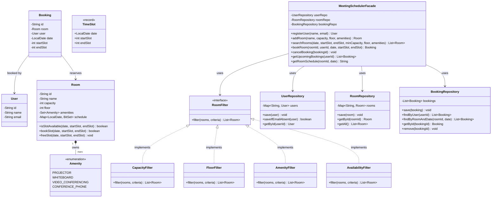

# Meeting Room Scheduler — Design Document (D.I.C.E.)

Follows the D.I.C.E. workflow from `INSTRUCTIONS.md`.

---

## Step 1 — DEFINE (Requirements & Constraints)

### Functional Requirements

1. A user can **register** with name and email.
2. An admin can **add a meeting room** with name, capacity, floor, and amenities (projector, whiteboard, video conferencing).
3. Any user can **search/filter** available rooms by date + time slot, minimum capacity, floor, and required amenities.
4. A user can **book a meeting room** for a specific date, start time, and duration.
   - **Invariant: no two meetings can overlap in the same room.** Attempting a conflicting booking must fail.
   - The user booking the room is the meeting organiser.
   - Working hours: 9:00 AM to 6:00 PM.
   - Time granularity: 30-minute slots (18 slots per day).
   - Duration: 30 minutes minimum, up to the full working day, in 30-minute increments.
   - Booking must be for a future date (today or later).
5. A user can **cancel** a booking they made.
6. A user can **view their upcoming bookings** — all future meetings they are organising.
7. A user can **view a room's schedule** for a given date — all booked slots for that room.

### Non-Functional Requirements

- **Correctness under concurrency** — two users trying to book the same room at overlapping times must not both succeed. Only one wins.
- **O(1) availability check per room per date** — BitSet per room per date so overlap detection is a single bit-scan, not a linear booking scan.
- **In-memory only** — no database, no persistence.
- **Single JVM process.**

### Constraints

- Working hours: 9:00 AM to 6:00 PM (9 hours = 18 half-hour slots).
- Time slots are in 30-minute increments.
- Maximum advance booking: 30 days from today.
- Room capacity: 2 to 50 people.
- Meeting participants: organiser only (no attendee list required).
- No recurring meetings.

### Out of Scope

- User authentication / login.
- Meeting invitations / attendee management / RSVP.
- Recurring / repeating meetings.
- Notifications (email/push).
- Waitlist for conflicted slots.
- Multi-building / multi-office support.
- Calendar integration.

---

## Step 2 — IDENTIFY (Entities & Relationships)

### Noun → Verb extraction

> A **user** *registers* → an admin *adds* a **room** with **amenities** → any user *searches* for available rooms using **filters** → a user *books* a room for a **time slot**, creating a **booking** → the system *checks* the room's **schedule** for conflicts → a user *cancels* their booking → the system *frees* the slot.

### Entities

| Entity | Type | Responsibility |
|--------|------|---------------|
| `User` | Class | Identity — id, name, email |
| `Room` | Class | Name, capacity, floor, amenities, schedule (per-date BitSet) |
| `Amenity` | Enum | PROJECTOR, WHITEBOARD, VIDEO_CONFERENCING, CONFERENCE_PHONE |
| `Booking` | Class | Which room, which user, which date, which slot range |
| `RoomFilter` | Interface | Accept or reject a room given search criteria |
| `TimeSlot` | Record | Date + start slot + end slot — value object for time range |

### Relationships

```
User ──books──► Booking        (1:N, Association)
Booking ──reserves──► Room      (N:1, Association)
Room ──has──► Amenity[]         (Composition — Room owns its amenities set)
Room ──owns──► Schedule         (Composition — Map<LocalDate, BitSet> lives inside Room)
```

### Design Patterns Applied

| Pattern | Where | Why |
|---------|-------|-----|
| **Strategy** | `RoomFilter` → `CapacityFilter`, `FloorFilter`, `AmenityFilter`, `AvailabilityFilter` | Each search criterion is a separate class. New filter = new class, zero changes to search logic. |
| **Repository** | `UserRepository`, `RoomRepository`, `BookingRepository` | In-memory stores, swappable for DB. Keeps service layer free of storage concerns. |
| **Facade** | `MeetingSchedulerFacade` | Single entry point: `registerUser()`, `addRoom()`, `searchRooms()`, `bookRoom()`, `cancelBooking()`. Hides filter, booking, and schedule details. |

---

## Step 3 — CLASS DIAGRAM (Mermaid.js)



---

## Step 4 — CORE ALGORITHM: Availability via BitSet

### Problem

Naively checking room availability means scanning all bookings for that room+date and testing overlap. O(b) per check, where b = number of bookings.

### Solution — Per-Room, Per-Date BitSet

Each `Room` owns `Map<LocalDate, BitSet> schedule`. Bit i = 1 means slot i is booked.

```
9:00 AM  = slot 0
9:30 AM  = slot 1
10:00 AM = slot 2
...
5:00 PM  = slot 16
5:30 PM  = slot 17
```

**Booking a slot (9:30 AM to 11:00 AM → slots 1, 2, 3):**
```
BitSet dayBits = schedule.computeIfAbsent(date, d -> new BitSet(18));
// Check: is any bit from 1 to 3 (exclusive 4) already set?
int conflict = dayBits.nextSetBit(1);
if (conflict == -1 || conflict >= 4) {
    // Safe — set bits 1, 2, 3
    dayBits.set(1, 4);  // set(start, end) exclusive
    return true;
}
return false;  // conflict at slot 'conflict'
```

**Freeing a slot on cancellation:**
```
dayBits.clear(startSlot, endSlot);
```

Complexity: O(1) amortised per operation — `nextSetBit` skips large cleared regions.

**Thread safety:** The `schedule` map is `ConcurrentHashMap`. The per-room `synchronized(room)` block protects the check-and-set sequence, preventing TOCTOU races on the same room.

---

## Step 5 — SLOT MATH

```
Slot conversion:
  slot = (hour - 9) * 2 + (minute / 30)

  startSlot = (startHour - 9) * 2 + (startMinute / 30)
  slotCount = durationMinutes / 30
  endSlot   = startSlot + slotCount

Validation:
  startSlot ∈ [0, 17]
  endSlot   ∈ [1, 18]
  endSlot   ≤ 18
```

---

## Step 6 — SEARCH / FILTER PIPELINE

The `searchRooms` method chains filters in order of increasing cost:

1. **CapacityFilter** — cheap: `room.getCapacity() >= minCapacity`
2. **FloorFilter** — cheap: `room.getFloor() == requestedFloor` (if floor specified)
3. **AmenityFilter** — cheap: `room.getAmenities().containsAll(requestedAmenities)`
4. **AvailabilityFilter** — expensive (touches BitSet): `room.isSlotAvailable(date, startSlot, endSlot)`

This ordering ensures we eliminate rooms with cheap checks before paying the BitSet scan cost.

Each filter implements `RoomFilter`:
```java
List<Room> filter(List<Room> rooms, SearchCriteria criteria);
```

A null criteria field means "skip this filter" — the filter passes all rooms through.

---

## Step 7 — CONCURRENCY MODEL

### Critical Section: `bookRoom`

Two threads trying to book overlapping slots on the same room must not both succeed.

**Approach:** `synchronized` on the Room object. The Room's `bookSlot` method is synchronized, making the entire check-and-set atomic.

```java
// Inside Room.java
public synchronized boolean bookSlot(LocalDate date, int startSlot, int endSlot) {
    BitSet dayBits = schedule.computeIfAbsent(date, d -> new BitSet(18));
    int firstSet = dayBits.nextSetBit(startSlot);
    if (firstSet != -1 && firstSet < endSlot) {
        return false;  // conflict
    }
    dayBits.set(startSlot, endSlot);
    return true;
}
```

### Why not lock the whole facade?

Locking only the affected Room means Alice booking Room A while Bob books Room B proceed fully in parallel — they share no state. A global lock would serialise all bookings unnecessarily.

### Thread Safety Summary

| Operation | Strategy |
|-----------|----------|
| `bookRoom` | `synchronized` on the Room object during check-and-set |
| `cancelBooking` | `synchronized` on the Room object during clear |
| `searchRooms` | Read-only on `ConcurrentHashMap` — no lock needed. BitSet reads are atomic per-word on JVM, so availability scan is safe without locks. |
| `registerUser` / `addRoom` | `ConcurrentHashMap.putIfAbsent` for uniqueness |

---

## Step 8 — IMPLEMENTATION ORDER

1. Enums: `Amenity`
2. Model: `User`, `Room`, `Booking`, `TimeSlot` (record)
3. Exceptions: `MeetingSchedulerException`, `RoomNotFoundException`, `BookingConflictException`, `InvalidBookingException`
4. Policy: `RoomFilter` interface, `CapacityFilter`, `FloorFilter`, `AmenityFilter`, `AvailabilityFilter`
5. Repository: `UserRepository`, `RoomRepository`, `BookingRepository`
6. Service/Facade: `MeetingSchedulerFacade`
7. Demo: `MeetingSchedulerDemo`

---

## Step 9 — EVOLVE (Curveballs)

| Curveball | Extension Strategy | Pattern |
|-----------|-------------------|---------|
| **Attendee list** | `Booking` gains `List<User> attendees`. Capacity check includes attendees count. | |
| **Room maintenance windows** | `Room` gains `List<TimeSlot> blockedSlots`. `bookSlot` checks both schedule and blocked. | |
| **Multi-building support** | `Room` gains `String buildingId`. New `BuildingFilter implements RoomFilter`. | Strategy (OCP) |
| **Recurring meetings** | New `RecurringBookingService` wraps facade, calls `bookRoom` on a schedule. | Decorator |
| **Admin approval flow** | `Booking` gains `Status` enum (PENDING, APPROVED, REJECTED). New `ApprovalService`. | State pattern candidate |
| **Most-booked room analytics** | New `AnalyticsService` queries `BookingRepository`. Zero changes to existing classes. | SRP |
| **AI agent booking traffic** | Rate limiter on `bookRoom` per user. Agents retry with exponential backoff on `BookingConflictException`. | |

---

## Self-Review Checklist

- [x] Requirements written before code
- [x] Class diagram produced with typed relationships
- [x] Every relationship typed
- [x] Core algorithm documented (BitSet availability check — O(1))
- [x] Slot math and validation documented
- [x] Concurrency model documented (per-Room synchronized)
- [x] Patterns documented with "why" (Strategy, Repository, Facade)
- [x] Custom exceptions defined
- [x] Curveballs listed with extension strategies
