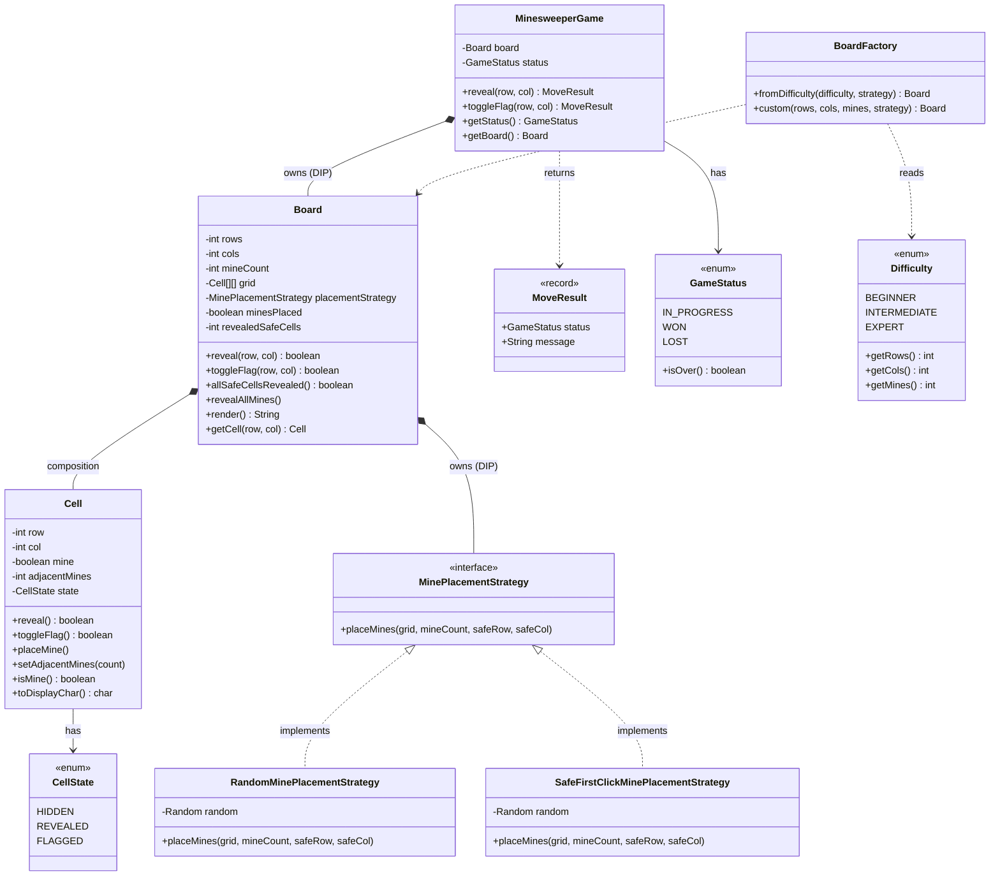

# Minesweeper — Design Document (D.I.C.E. Format)

A classic Minesweeper engine: configurable board, first-click-safe mine placement, recursive
flood-fill reveal, flagging, and win/loss detection — with a pluggable mine-placement strategy.

Follows the D.I.C.E. workflow from `INSTRUCTIONS.md`.
Reference: [algomaster.io — Design Minesweeper](https://algomaster.io/learn/lld/design-minesweeper).

---

## Step 1 — DEFINE (Requirements & Constraints)

### Functional Requirements

1. A player can **start a game** with a configurable board — via a difficulty preset or custom `(rows, cols, mines)`.
2. A player can **reveal a cell**.
3. Revealing a **mine** ends the game as a **loss**.
4. Revealing a cell with **zero adjacent mines flood-fills** — the reveal cascades to neighbouring cells automatically.
5. A player can **flag / unflag** a suspected mine.
6. A **flagged cell cannot be revealed** (the flag protects it).
7. The game is **won** when every non-mine cell has been revealed.
8. The system **tracks game status**: IN_PROGRESS, WON, LOST — and rejects moves after the game ends.
9. The board can be **rendered** for display at any time.

### Non-Functional Requirements

- **Extensible mine placement** — plain-random vs first-click-safe vs seeded-for-tests, swappable without touching the board.
- **O(1) win detection** — a running `revealedSafeCells` counter, not a full-board scan per move.
- **Reproducible** — placement RNG is injectable so tests and demos can pin a seed.
- **Move serialization** — a game is one interactive session; a reveal and its win/loss check apply atomically.

### Constraints

- In-memory only — no persistence, single JVM.
- Board dimensions and mine count fixed at construction.
- `0 < mines < rows × cols` (at least one safe cell must exist).

### Out of Scope

- GUI / rendering beyond ASCII.
- Timer, scoring, leaderboards.
- Multiplayer / networked play.
- Chording (reveal-around-a-number) and auto-flagging (curveball — see Step 6).

---

## Step 2 — IDENTIFY (Entities & Relationships)

### Noun → Verb extraction

> A **player** *starts* a **game** on a **board** of **cells**. On the first **reveal**, the
> **placement strategy** *scatters* **mines** away from the clicked cell; the **board** then
> *computes* each cell's **adjacent-mine count**. Revealing a zero-count cell *flood-fills* its
> neighbours. Revealing a mine *loses*; revealing the last safe cell *wins*. A player may *flag*
> a cell to protect it from reveal. The **game** *owns* the **status** transitions.

### Nouns → Candidate Entities

| Noun | Entity Type | Notes |
|---|---|---|
| CellState | Enum | HIDDEN, REVEALED, FLAGGED |
| GameStatus | Enum | IN_PROGRESS, WON, LOST; `isOver()` |
| Difficulty | Enum | BEGINNER / INTERMEDIATE / EXPERT — carries (rows, cols, mines) |
| Cell | Class | row, col, mine, adjacentMines, state; owns `reveal` / `toggleFlag` |
| Board | Class | grid, lazy placement, adjacency, flood-fill reveal, win-count |
| MoveResult | Record | Immutable `(status, message)` returned per move |
| MinePlacementStrategy | Interface | `placeMines(grid, mineCount, safeRow, safeCol)` |
| RandomMinePlacementStrategy | Class | Uniform random; first click may hit a mine |
| SafeFirstClickMinePlacementStrategy | Class | Keeps the first click + its 8 neighbours mine-free |
| BoardFactory | Class | Builds a Board from a Difficulty or custom dims |
| MinesweeperGame | Class | Facade + orchestrator: reveal / toggleFlag / getStatus / getBoard; owns status transitions; serializes moves |

### Verbs → Methods / Relationships

| Verb | Lives on |
|---|---|
| `reveal(row, col)` | `MinesweeperGame`, `Board` |
| `toggleFlag(row, col)` | `MinesweeperGame`, `Board`, `Cell` |
| `placeMines(grid, count, safeR, safeC)` | `MinePlacementStrategy` + impls |
| `allSafeCellsRevealed()` | `Board` |
| `revealAllMines()` | `Board` (loss rendering) |
| `getStatus()` | `MinesweeperGame` |
| `reveal()` / `toggleFlag()` (self) | `Cell` |
| `fromDifficulty / custom` | `BoardFactory` |

### Relationships

```
MinesweeperGame ──owns──►           Board                          (Composition / DIP)
Board ──owns──►                     MinePlacementStrategy          (Composition / DIP)
Board *── Cell                                                      (Composition — board owns its grid)
RandomMinePlacementStrategy ──implements──► MinePlacementStrategy   (Realization)
SafeFirstClickMinePlacementStrategy ──implements──► MinePlacementStrategy (Realization)
BoardFactory ──creates──► Board                                     (Dependency)
MinesweeperGame ──returns──► MoveResult                             (Dependency)
Cell ──has──► CellState                                             (Association)
MinesweeperGame ──has──► GameStatus                                 (Association)
```

### Design Patterns Applied

| Pattern | Where | Why |
|---|---|---|
| **Strategy** | `MinePlacementStrategy` | Placement policy (random / first-click-safe / seeded) varies independently of the board — new policy = new class, zero board edits (OCP). |
| **Facade** | `MinesweeperGame` (concrete class) | Hides the board, placement, flood-fill, and status logic behind reveal/flag. No interface — one engine, nothing swaps it (Facade is a role, not a Java interface). |
| **Factory** | `BoardFactory` | Maps a `Difficulty` preset → board dims in one place; injects the strategy (DIP). |
| **Rich Domain Model** | `Cell` | The cell owns its own reveal/flag transitions — no external setter can force an illegal state (e.g. reveal a flagged cell). |

---

## Step 3 — CLASS DIAGRAM (Mermaid.js)



---

## Step 4 — PACKAGE STRUCTURE

```
com.lldprep.systems.minesweeper/
│
├── DESIGN_DICE.md                                 ← this file
├── README.md
├── class_diagram.mermaid
│
├── model/
│   ├── CellState.java                             ← enum: HIDDEN, REVEALED, FLAGGED
│   ├── GameStatus.java                            ← enum: IN_PROGRESS, WON, LOST + isOver()
│   ├── Difficulty.java                            ← enum: presets → (rows, cols, mines)
│   ├── Cell.java                                  ← rich model: owns reveal/flag transitions
│   ├── Board.java                                 ← grid, lazy placement, adjacency, flood-fill
│   └── MoveResult.java                            ← record: (status, message)
│
├── policy/
│   ├── MinePlacementStrategy.java                 ← interface: placeMines(grid, count, safeR, safeC)
│   ├── RandomMinePlacementStrategy.java           ← uniform random (first click unsafe)
│   └── SafeFirstClickMinePlacementStrategy.java   ← first click + neighbours kept mine-free
│
├── factory/
│   └── BoardFactory.java                          ← Difficulty / custom → Board
│
├── service/
│   └── MinesweeperGame.java                       ← Facade + orchestrator; owns status; serializes moves
│
├── exception/
│   ├── MinesweeperException.java                  ← base unchecked
│   ├── OutOfBoundsException.java                  ← move outside the board
│   └── GameOverException.java                     ← move after WON / LOST
│
└── demo/
    └── MinesweeperDemo.java                        ← exercises all 9 FRs + curveball + errors
```

---

## Step 5 — IMPLEMENTATION ORDER

1. Enums: `CellState`, `GameStatus`, `Difficulty`
2. `Cell` (rich model)
3. `exception/` — base + `OutOfBoundsException`, `GameOverException`
4. `policy/MinePlacementStrategy` interface
5. `policy/` impls — `RandomMinePlacementStrategy`, `SafeFirstClickMinePlacementStrategy`
6. `Board` (depends on the strategy interface), `MoveResult`
7. `factory/BoardFactory`
8. `service/MinesweeperGame`
9. `demo/MinesweeperDemo`

---

## Step 6 — EVOLVE (Curveballs)

| Curveball | Impact on current design | Extension strategy |
|---|---|---|
| **First click must be safe** | Placement must know the first click | Already handled — placement is *lazy* (deferred to first reveal) and receives `safeRow/safeCol`. Swap in `SafeFirstClickMinePlacementStrategy` at build time. Zero board changes. |
| **Chording** (click a number to reveal all its unflagged neighbours if flag count matches) | New reveal semantic | Add `Board.chord(row, col)` that reuses the existing flood-fill per neighbour, and a `MinesweeperGame.chord` facade method. Existing reveal untouched. |
| **Auto-flag remaining mines on win** | Post-win board polish | Add `Board.flagAllMines()`, called by `MinesweeperGame` when status flips to WON. No signature change. |
| **Custom / non-rectangular boards** | Grid assumptions | `Board` already validates dims independently; a `HexBoard` would implement a shared `Board` abstraction with its own `neighbours()`. Flood-fill logic is neighbour-agnostic. |
| **Undo last move** | Need move history | Wrap moves in a **Command** (`RevealCommand`, `FlagCommand`) with `undo()`; `MinesweeperGame` keeps a stack. Cell state is trivially reversible. |
| **Live mine-counter / timer for a UI** | State changes must be broadcast | Add an `Observer` (`onCellsRevealed`, `onFlagChanged`) that `MinesweeperGame` notifies after each move. Inject observers at construction (OCP). |
```
