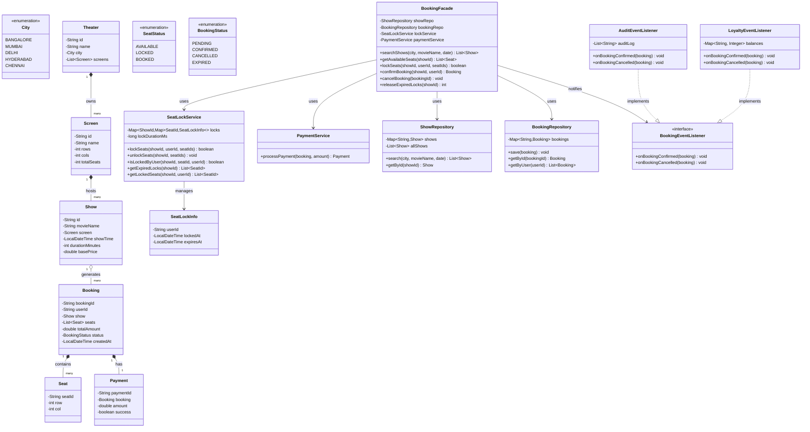

# Movie Booking System (BookMyShow) — Design Document

Follows the D.I.C.E. workflow from `INSTRUCTIONS.md`.

---

## Step 1 — DEFINE (Requirements & Constraints)

### Functional Requirements

1. A user can **search shows** by city + movie name + date, and see results ranked by showtime.
2. A user can **view seat availability** for a specific show — seats are either AVAILABLE, LOCKED, or BOOKED.
3. A user can **select and lock seats** for a show. Lock expires after 5 minutes if payment is not completed.
4. A user can **confirm booking** by completing payment. Payment is simplified to a status toggle (PENDING → CONFIRMED).
5. Locked seats that expire are **auto-released** and become available again.
6. A user can **cancel a booking** — seats return to AVAILABLE.
7. The system **prevents double-booking** — two users cannot book the same seat for the same show.
8. Shows have a **fixed screen layout** (rows × columns). Each seat is identified by row letter + column number (e.g., "A3", "F12").

### Non-Functional Requirements

- **Thread-safe seat locking** — concurrent booking attempts on the same show must not result in double-booked seats.
- **Lock expiry** — seats held beyond 5 minutes auto-release. No permanent lock leaks.
- **Read-heavy optimization** — searches and seat views are read-dominated; write lock only during booking.
- **O(1) seat lock check** — the lock mechanism must not scan all seats.

### Constraints

- In-memory only — no database, no persistence.
- Single JVM process.
- Screen size: 10 rows × 15 columns = 150 seats per screen (configurable).
- Lock expiry: 5 minutes (configurable).
- Payment processing is mocked — no real payment gateway.

### Out of Scope

- User registration / authentication — user ID is passed in.
- Real Email/SMS notification — listener infrastructure exists (`BookingEventListener`), concrete `NotificationEventListener` is extensible but not implemented.
- Real payment gateway integration.
- Dynamic pricing by demand.
- Cancellation refund policy.
- Concession / food ordering.

---

## Step 2 — IDENTIFY (Entities & Relationships)

### Noun → Verb extraction

> A **user** *searches* for **shows** in a **city** → the system *returns* matching **shows** for each **screen** in each **theater** → the user *selects* **seats** → the system *locks* them → the user *pays* → the system *confirms* the **booking**.

### Entities

| Entity | Type | Responsibility |
|--------|------|---------------|
| City | Enum | Geographic location (BANGALORE, MUMBAI, DELHI, etc.) |
| Theater | Class | Has multiple screens, located in a city |
| Screen | Class | Has a seating layout (rows × cols), belongs to a theater |
| Show | Class | A movie playing on a screen at a specific time |
| Seat | Class | Identified by row+col, has a status per show |
| SeatStatus | Enum | AVAILABLE, LOCKED, BOOKED |
| Booking | Class | Links user → seats → show; has payment status |
| BookingStatus | Enum | PENDING (locked), CONFIRMED (paid), CANCELLED, EXPIRED |
| SeatLock | Data structure | Per-show: Map<SeatId, LockInfo> with expiry time |
| Payment | Class | Simplified: amount + status. Mocks success. |

### Relationships

```
City ──has──► Theater (1:N)
Theater ──owns──► Screen (1:N, Composition)
Screen ──hosts──► Show (1:N, movie + time)
Show ──generates──► Booking (1:N)
Show ──manages──► SeatLock (1:1, per-show lock map)
Booking ──contains──► Seat (M:N, a booking can have multiple seats)
Booking ──has──► Payment (1:1)
User ──creates──► Booking (1:N)
```

### Design Patterns Applied

| Pattern | Where | Why |
|---------|-------|-----|
| **Strategy** | `SeatLockService` — lock expiry via `ScheduledExecutorService` or poll-on-access | Swap expiry strategy without touching booking logic |
| **Facade** | `BookingFacade` — `searchShows()` → `lockSeats()` → `confirmBooking()` | Single entry point hides ShowService, SeatLockService, PaymentService, BookingService |
| **Observer** | `BookingEventListener` → `AuditEventListener`, `LoyaltyEventListener` — notify on booking confirmed/cancelled | Decouple post-booking side-effects. New listeners = new classes, zero facade changes (OCP). |
| **Repository** | `ShowRepository`, `TheaterRepository`, `BookingRepository` | In-memory data stores; swappable for DB later |

---

## Step 3 — CLASS DIAGRAM (Mermaid.js)



---

## Step 4 — CONCURRENCY MODEL

This is the **hardest part** of the system. Two users try to book overlapping seats simultaneously.

### Chosen Strategy: Pessimistic Seat-Level Locking with Timed Expiry

```
lockSeats(showId, userId, [A1, A2, A3]):
  synchronized (showId.intern()) {  // or ConcurrentHashMap.compute
    for each seatId:
      existing = locks[showId][seatId]
      if existing != null AND existing.userId != userId AND not expired:
        return false  // seat is locked by another user
    for each seatId:
      locks[showId][seatId] = new LockInfo(userId, now, now+5min)
    return true
  }
```

**Why pessimistic over optimistic?**
- Optimistic (check-version-then-update) fails under high contention for the same seat — retry loops waste time.
- Pessimistic with a lock on the show's seat map is correct by construction.
- Lock duration is microseconds (an in-memory HashMap operation), so contention is negligible.

### Lock Release Strategies (Two Layers)

1. **Explicit release:** User cancels → `unlockSeats()` or booking fails.
2. **Lazy expiry:** On next `lockSeats()` call, expired locks are cleaned up from the active set. A scheduled background sweeper runs every 60 seconds as Curveball enhancement.

### Why Not `synchronized` on the Entire Show?

That would serialize ALL seat operations on a show — a user checking seat A1 blocks a user booking seat Z15 (no conflict). A `ConcurrentHashMap.compute()` on individual seat keys gives finer granularity.

### Thread Safety Summary

| Operation | Strategy |
|-----------|----------|
| `lockSeats()` | `ConcurrentHashMap.compute()` per seat — atomic check-and-set |
| `confirmBooking()` | After lock acquired — no concurrent access to same locked seats |
| `cancelBooking()` | `ConcurrentHashMap.compute()` per seat to release |
| `getAvailableSeats()` | Read-only snapshot of lock map — `ConcurrentHashMap` iterator |
| `releaseExpiredLocks()` | Background sweep via `ScheduledExecutorService` |

---

## Step 5 — IMPLEMENTATION ORDER (per INSTRUCTIONS.md)

1. Enums: `City`, `SeatStatus`, `BookingStatus`, `SeatCategory`
2. Model entities: `Seat`, `Theater`, `Screen`, `Show`, `Booking`, `Payment`, `SeatLockInfo`
3. Repository layer: `ShowRepository`, `BookingRepository`
4. Service layer: `SeatLockService`, `PaymentService`
5. Listener layer: `BookingEventListener` (interface), `AuditEventListener`, `LoyaltyEventListener`
6. Facade: `BookingFacade`
7. Demo: `MovieBookingDemo`

---

## Step 6 — EVOLVE (Curveballs)

| Curveball | Extension Strategy | Pattern |
|-----------|-------------------|---------|
| **Different seat categories** (Gold ₹300, Silver ₹200) | `Seat` gains `category` field; `Show` holds `Map<Category, Double>`. Zero changes to booking flow. | |
| **Cancellation refund policy** | `Booking` gains `refundAmount` field; `cancelBooking()` calculates refund based on time-to-show | Strategy (`RefundPolicy` interface) |
| **Show recommendations** | New `RecommendationService` — no changes to existing | New service |
| **Concurrent payment gateway** | `PaymentService` becomes async — `CompletableFuture<Payment>` | Adapter pattern for real gateway |
| **Seat preferences** (aisle, front row, etc.) | `Seat` gains `List<String> tags`; `SearchService` filters by tags | |
| **Multi-language movie metadata** | `Show` gains `Map<Locale, String> description` | |

---

## Self-Review Checklist

- [x] Requirements written before code
- [x] Class diagram produced with typed relationships
- [x] Every relationship typed (composition, aggregation, association)
- [x] Concurrency model documented (pessimistic seat-level locking)
- [x] Patterns documented with "why" (Facade, Strategy, Observer, Repository)
- [ ] Thread-safety addressed in implementation
- [ ] Custom exceptions defined
- [ ] Demo covers all 8 functional requirements
- [ ] At least one curveball demonstrated
