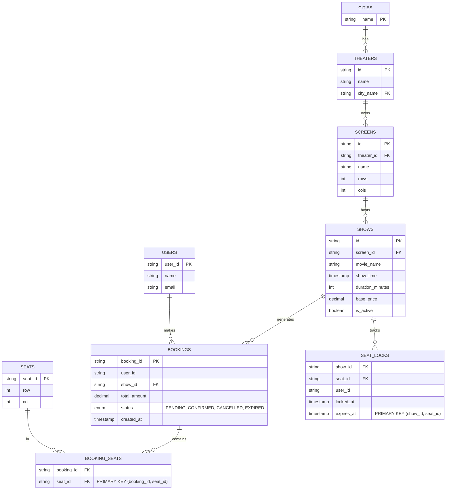

# Movie Booking System (BookMyShow) — Database Schema

> How the in-memory entities map to relational tables.

---

## ER Diagram

---

## Table Definitions

### 1. `cities` — Geographic master

Stored as enum in code; table for referential integrity.

| Column | Type | Constraints |
|--------|------|------------|
| `name` | `VARCHAR(30)` | `PRIMARY KEY` |

### 2. `theaters` — Cinema chains + individual screens

| Column | Type | Constraints |
|--------|------|------------|
| `id` | `VARCHAR(20)` | `PRIMARY KEY` |
| `name` | `VARCHAR(100)` | `NOT NULL` |
| `city_name` | `VARCHAR(30)` | `FOREIGN KEY → cities.name` |

**Index:** `(city_name)` for city-based theater search.

### 3. `screens` — Individual screening halls

| Column | Type | Constraints |
|--------|------|------------|
| `id` | `VARCHAR(20)` | `PRIMARY KEY` |
| `theater_id` | `VARCHAR(20)` | `FOREIGN KEY → theaters.id` |
| `name` | `VARCHAR(50)` | `NOT NULL` |
| `rows` | `INTEGER` | `NOT NULL` |
| `cols` | `INTEGER` | `NOT NULL` |

### 4. `shows` — Movie screening at a specific time

| Column | Type | Constraints |
|--------|------|------------|
| `id` | `VARCHAR(20)` | `PRIMARY KEY` |
| `screen_id` | `VARCHAR(20)` | `FOREIGN KEY → screens.id` |
| `movie_name` | `VARCHAR(200)` | `NOT NULL` |
| `show_time` | `TIMESTAMP` | `NOT NULL` |
| `duration_minutes` | `INTEGER` | `NOT NULL` |
| `base_price` | `DECIMAL(10,2)` | `NOT NULL` |
| `is_active` | `BOOLEAN` | `DEFAULT TRUE` |

**Index:** `(movie_name, show_time)` for search by movie + date.
**Index:** `(screen_id, show_time)` to prevent overlapping shows on same screen.

### 5. `bookings` — User's ticket reservation

| Column | Type | Constraints |
|--------|------|------------|
| `booking_id` | `VARCHAR(20)` | `PRIMARY KEY` |
| `user_id` | `VARCHAR(50)` | `NOT NULL` |
| `show_id` | `VARCHAR(20)` | `FOREIGN KEY → shows.id` |
| `total_amount` | `DECIMAL(10,2)` | `NOT NULL` |
| `status` | `ENUM('PENDING','CONFIRMED','CANCELLED','EXPIRED')` | `NOT NULL` |
| `created_at` | `TIMESTAMP` | `DEFAULT NOW()` |

**Index:** `(user_id, created_at)` for user booking history.

### 6. `booking_seats` — Junction table (M:N)

| Column | Type | Constraints |
|--------|------|------------|
| `booking_id` | `VARCHAR(20)` | `FOREIGN KEY → bookings.id` |
| `seat_id` | `VARCHAR(5)` | `FOREIGN KEY → seats.id` |
| — | — | `PRIMARY KEY (booking_id, seat_id)` |

### 7. `seat_locks` — Temporary hold table

This is the **concurrency hot table**. All booking contention flows through this.

| Column | Type | Constraints |
|--------|------|------------|
| `show_id` | `VARCHAR(20)` | `FOREIGN KEY → shows.id` |
| `seat_id` | `VARCHAR(5)` | `NOT NULL` |
| `user_id` | `VARCHAR(50)` | `NOT NULL` |
| `locked_at` | `TIMESTAMP` | `NOT NULL` |
| `expires_at` | `TIMESTAMP` | `NOT NULL` |
| — | — | `PRIMARY KEY (show_id, seat_id)` |

**Index:** `(expires_at)` for sweeping expired locks.
**Business Rule:** A seat is "available" if no row exists OR `expires_at < NOW()`.

### 8. `users` — Bookers

| Column | Type | Constraints |
|--------|------|------------|
| `user_id` | `VARCHAR(50)` | `PRIMARY KEY` |
| `name` | `VARCHAR(100)` | `NOT NULL` |
| `email` | `VARCHAR(200)` | `UNIQUE` |

---

## Concurrency Model — Booking Flow in DB

| Step | In-Memory | SQL Equivalent |
|------|-----------|---------------|
| Lock seats | `synchronized(showLock)` + `ConcurrentHashMap.computeIfAbsent` | `SELECT ... FOR UPDATE` on `seat_locks WHERE show_id = ? AND seat_id IN (...)` |
| Check availability | Loop: check each seat's `SeatLockInfo` | `SELECT seat_id FROM seat_locks WHERE show_id = ? AND seat_id IN (?) AND expires_at > NOW()` — must be empty except for same user |
| Reserve (insert lock) | `locks.put(seatId, lockInfo)` | `INSERT INTO seat_locks (show_id, seat_id, user_id, locked_at, expires_at) VALUES (...)` |
| Confirm (create booking) | `new Booking(...)` → `bookingRepository.save()` | `BEGIN; INSERT INTO bookings (...); INSERT INTO booking_seats (...); DELETE FROM seat_locks WHERE show_id = ? AND user_id = ?; COMMIT;` |
| Cancel | `booking.cancel()` + `lockService.unlockSeats()` | `UPDATE bookings SET status = 'CANCELLED'; DELETE FROM booking_seats;` — locks auto-expire or delete |

**Key concurrency decision:** In the DB, the lock operation uses `SELECT ... FOR UPDATE` (row-level pessimistic lock) on the `seat_locks` table. This is the DB equivalent of Java's `synchronized(showLock)`. The lock scope is the show + specific seats, not the entire show — fine-grained enough for high throughput.

**Lock sweep:** A cron job runs every 60s: `DELETE FROM seat_locks WHERE expires_at < NOW()`. This is the DB equivalent of `releaseExpiredLocks()`.

---

## Migration from In-Memory

| In-Memory Component | Database Table |
|---------------------|---------------|
| `ShowRepository.showMap` | `shows` + `screens` + `theaters` (JOIN) |
| `BookingRepository.bookingMap` | `bookings` + `booking_seats` |
| `SeatLockService.showLocks` | `seat_locks` |
| `City` enum | `cities` table |
| `Seat` (generated from row/col) | `seats` table (pre-populated per screen) |
