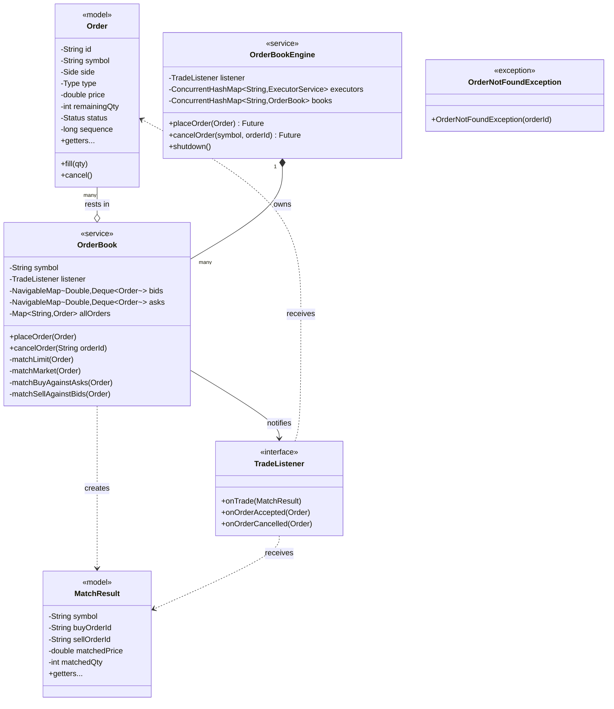

# Order Book Engine — Design Document

## 1. D — Define (Requirements & Constraints)

### Functional Requirements
- Buyer can place a **bid (BUY) order** with a symbol, price, and quantity
- Seller can place an **ask (SELL) order** with a symbol, price, and quantity
- System matches a BUY order against the **lowest available ask** when `bid.price >= ask.price`
- System matches a SELL order against the **highest available bid** when `ask.price <= bid.price`
- Unmatched (or partially matched) **LIMIT orders rest** in the book until filled or cancelled
- System supports **partial fills** — one large order can be filled against multiple resting orders
- Participant can **cancel a resting order** by order ID before it is fully filled
- System supports **MARKET orders** — fill immediately at best available price, no price constraint
- System notifies listeners of **trade events** (fills), **accepted orders**, and **cancellations**

### Non-Functional Requirements
- **Thread-safe**: Multiple external threads (producers) can submit orders concurrently
- **High throughput**: Different symbols must process orders in **parallel** without blocking each other
- **Low latency per symbol**: All operations for a symbol are serialized on a single thread — no lock contention inside the matching engine
- **Price-time priority**: Among orders at the same price level, earlier orders are matched first (FIFO)
- **O(log n)** order placement and cancellation

### Constraints
- In-memory only — no persistence
- Matching is synchronous within a symbol's thread
- Market orders do not rest in the book; unfilled quantity is discarded

### Out of Scope
- Stop-loss, iceberg, or FOK/IOC order types
- Order expiry / TTL
- Fee calculation or clearing
- Distributed / multi-node matching
- Persistent storage or crash recovery

---

## 2. I — Identify (Schema & Entities)

### Entities and Relationships

| Entity | Type | Responsibility |
|---|---|---|
| `Order` | Model | Value object: symbol, side, type, price, qty, status |
| `MatchResult` | Model | Immutable fill event: buyId, sellId, price, qty |
| `TradeListener` | Interface | Callback for trade/accept/cancel events |
| `OrderBook` | Service | Per-symbol matching engine; owns bid/ask price levels |
| `OrderBookEngine` | Service | Routes orders to symbol executors; owns executor map |
| `OrderNotFoundException` | Exception | Thrown when cancel targets unknown/terminal order |

### Relationship Types

```
OrderBookEngine  *--  OrderBook          (composition — engine owns books)
OrderBookEngine  *--  ExecutorService    (composition — engine owns executors)
OrderBook        o--  Order              (aggregation — book holds resting orders)
OrderBook        -->  TradeListener      (dependency — notifies on events)
MatchResult      -->  Order              (dependency — references order IDs)
```

### Class Diagram



### Order State Machine

```
         place()
OPEN ────────────────► PARTIALLY_FILLED
  │                          │
  │ fill() to 0              │ fill() to 0
  ▼                          ▼
FILLED ◄──────────────────── FILLED
  
OPEN ──── cancel() ────► CANCELLED
PARTIALLY_FILLED ──── cancel() ────► CANCELLED
```

---

## 3. C — Code (Implementation)

### Package Structure

```
com.lldprep.orderbook/
    model/
        Order.java          ← BUY/SELL, LIMIT/MARKET, partial fill, sequence#
        MatchResult.java    ← Immutable fill event
    service/
        TradeListener.java  ← Callback interface (Strategy pattern)
        OrderBook.java      ← Per-symbol matching (TreeMap + Deque)
        OrderBookEngine.java← Executor dispatch (thread confinement)
    exception/
        OrderNotFoundException.java
    demo/
        OrderBookDemo.java  ← All 5 scenarios including concurrent producers
```

### Design Patterns Applied

| Pattern | Where | Why |
|---|---|---|
| **Thread Confinement** | `OrderBookEngine` → `SingleThreadExecutor` per symbol | Eliminates all locking inside `OrderBook`; serial safety by design |
| **Strategy** | `TradeListener` interface | Decouple event handling from matching logic; swap logging/persistence/alerting without touching `OrderBook` |
| **Producer-Consumer** | External threads → `ExecutorService` queue → `OrderBook` | External threads are producers; the single executor thread is the consumer |
| **Facade** | `OrderBookEngine.placeOrder()` / `cancelOrder()` | Hides executor selection, book lookup, and async dispatch behind a simple API |

### Concurrency Model — Thread Confinement

```
External Thread 1  ──┐
External Thread 2  ──┤──► executors["AAPL"] ──► OrderBook(AAPL)  [single thread, no locks]
External Thread N  ──┘

External Thread 1  ──┐
External Thread 2  ──┤──► executors["AMZN"] ──► OrderBook(AMZN)  [single thread, no locks]
External Thread N  ──┘
```

- `ConcurrentHashMap` is the **only** shared mutable structure — used for `computeIfAbsent` to lazily register new symbols
- Everything inside `OrderBook` (the `TreeMap`s, `HashMap`) is accessed by exactly one thread — plain (non-concurrent) collections are sufficient

### Data Structure Choice — Why TreeMap over PriorityQueue

| Concern | `PriorityQueue` | `TreeMap<price, Deque<Order>>` |
|---|---|---|
| Best price access | O(log n) peek | O(log n) `firstEntry()` |
| Time priority within level | ❌ Not preserved | ✅ Deque is FIFO |
| Cancel by order ID | ❌ O(n) scan | ✅ O(1) via side HashMap + O(log n) level remove |
| Iterate all levels | O(n log n) | O(n) in-order |

---

## 4. E — Evolve (Curveball Handling)

| Curveball | Impact | How to Handle |
|---|---|---|
| **Add IOC / FOK order types** | New `Type` enum values + matching condition | Add `matchIOC()` / `matchFOK()` in `OrderBook` — no existing method changes |
| **Add stop-loss orders** | Orders only become active when price crosses a trigger | Add a `StopOrderBook` per symbol that promotes orders to `OrderBook` on price events |
| **Persist fills to DB** | `TradeListener` impl writes to DB | Strategy pattern: swap in a `PersistingTradeListener` — `OrderBook` untouched |
| **Multiple listeners (fan-out)** | Notify audit log + risk engine + UI simultaneously | Composite `TradeListener` that delegates to a list of listeners |
| **Rate limiting per participant** | Reject orders above N/sec from one user | Add `RateLimiter` check in `OrderBookEngine.placeOrder()` before dispatch |
| **Graceful drain on shutdown** | In-flight orders must complete | Use `executor.awaitTermination()` after `shutdown()` in `OrderBookEngine` |
| **Cross-symbol arbitrage check** | Need to read two books atomically | Introduce a coordinator layer — never lock inside individual `OrderBook`s |

---

## 5. Performance Characteristics

| Operation | Time Complexity | Notes |
|---|---|---|
| Place order (no match) | O(log n) | TreeMap insert at price level |
| Place order (match k levels) | O(k log n) | k = number of price levels swept |
| Cancel order | O(log n) | HashMap O(1) lookup + TreeMap level O(log n) remove |
| Best bid/ask query | O(log n) | `firstEntry()` on TreeMap |

### Throughput
- **Bottleneck**: Single executor per symbol — but matching logic is nanosecond-fast
- **Parallelism**: Scales linearly with number of symbols (each symbol is independent)
- **No lock contention**: Eliminates `synchronized` / `ReentrantLock` overhead entirely inside the hot path

---

## 6. Thread Safety Analysis

| Operation | Thread | Safety Mechanism |
|---|---|---|
| `placeOrder()` from any thread | External | `CompletableFuture.runAsync()` to symbol's executor — serialized |
| `cancelOrder()` from any thread | External | Same — serialized on symbol's executor |
| `OrderBook` mutations | Symbol executor only | Thread confinement — no concurrent access possible |
| New symbol registration | Any | `ConcurrentHashMap.computeIfAbsent()` — atomic |
| `TradeListener` callbacks | Symbol executor | Must be non-blocking; heavy work should be handed off |
