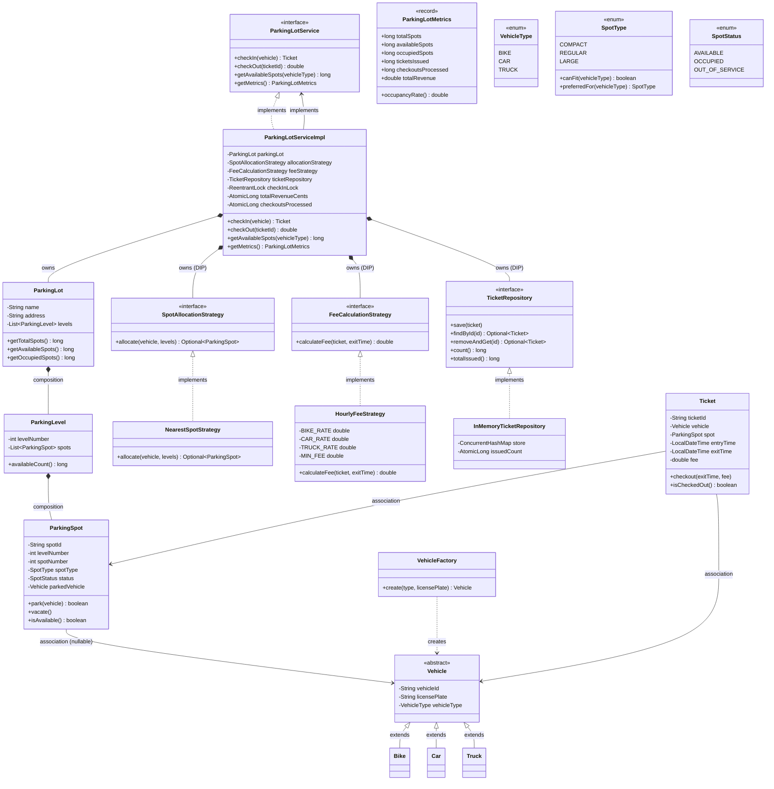

# Parking Lot System — Design Document (D.I.C.E. Format)

Multi-level parking lot with vehicle-type-aware spot allocation, concurrent entry/exit,
and pluggable fee and allocation strategies.

Follows the D.I.C.E. workflow from `INSTRUCTIONS.md`.

---

## Step 1 — DEFINE (Requirements & Constraints)

### Functional Requirements

1. A vehicle can **check in** to the parking lot and receive a ticket.
2. A vehicle can **check out** by presenting a ticket, freeing the spot and paying a fee.
3. The system **assigns the most appropriate spot** — smallest compatible type, nearest level first.
4. The system supports **multiple levels** (configured at build time).
5. The system supports **multiple vehicle types**: Bike, Car, Truck.
6. The system supports **multiple spot types**: COMPACT, REGULAR, LARGE.
7. A caller can **query available spots** by vehicle type at any time.
8. The system **exposes live metrics**: total, available, occupied, revenue, tickets issued.
9. Concurrent check-in from multiple lanes must not cause **double-booking**.

### Non-Functional Requirements

- **Thread-safe** — concurrent entry/exit from multiple threads.
- **O(n) spot allocation** — linear scan over spots per level; acceptable for typical lot sizes.
- **O(1) ticket lookup** — `ConcurrentHashMap` for O(1) average ticket retrieval and removal.
- **Atomic checkout** — `ConcurrentHashMap.remove()` ensures only one thread processes a given ticket.

### Constraints

- In-memory only — no persistence, no disk.
- Single JVM process.
- Levels and spot counts fixed at construction time.

### Out of Scope

- Reservation / pre-booking.
- Payment gateway integration (fee is computed, not charged).
- Dynamic level addition at runtime.
- Valet parking.
- EV charging (curveball — see Step 6).

---

## Step 2 — IDENTIFY (Entities & Relationships)

### Noun → Verb extraction

> A **vehicle** *checks in* → the **service** *asks* the **allocation strategy** to *find* a **spot** from **levels** → the **spot** is *marked* OCCUPIED → a **ticket** is *issued* and *saved* in the **repository**. On checkout, the **service** *removes* the **ticket**, *computes* the **fee** via the **fee strategy**, *vacates* the **spot**, and *returns* the amount.

### Nouns → Candidate Entities

| Noun | Entity Type | Notes |
|---|---|---|
| VehicleType | Enum | BIKE, CAR, TRUCK |
| SpotType | Enum | COMPACT, REGULAR, LARGE; carries `canFit` and `preferredFor` logic |
| SpotStatus | Enum | AVAILABLE, OCCUPIED, OUT_OF_SERVICE |
| Vehicle | Abstract class | vehicleId, licensePlate, vehicleType |
| Bike / Car / Truck | Concrete classes | Extend Vehicle; no extra state |
| ParkingSpot | Class | spotId, level, spotNumber, spotType, status, parkedVehicle |
| ParkingLevel | Class | levelNumber, List\<ParkingSpot\> |
| ParkingLot | Class | name, address, List\<ParkingLevel\>; aggregate root |
| Ticket | Class | ticketId, vehicle, spot, entryTime, exitTime, fee |
| ParkingLotMetrics | Record | Immutable snapshot: occupancy + revenue |
| SpotAllocationStrategy | Interface | `allocate(Vehicle, List<ParkingLevel>)` |
| NearestSpotStrategy | Class | Prefers smallest compatible type; lowest level first |
| FeeCalculationStrategy | Interface | `calculateFee(Ticket, LocalDateTime)` |
| HourlyFeeStrategy | Class | Tiered hourly rates by vehicle type; minimum fee |
| TicketRepository | Interface | `save / findById / removeAndGet / count / totalIssued` |
| InMemoryTicketRepository | Class | ConcurrentHashMap; AtomicLong counter |
| VehicleFactory | Class | Static factory; creates typed Vehicle from VehicleType enum |
| ParkingLotService | Interface | Facade: checkIn / checkOut / getAvailableSpots / getMetrics |
| ParkingLotServiceImpl | Class | Orchestrates all collaborators; holds checkInLock |

### Verbs → Methods / Relationships

| Verb | Lives on |
|---|---|
| `checkIn(vehicle)` | `ParkingLotService`, `ParkingLotServiceImpl` |
| `checkOut(ticketId)` | `ParkingLotService`, `ParkingLotServiceImpl` |
| `allocate(vehicle, levels)` | `SpotAllocationStrategy`, `NearestSpotStrategy` |
| `park(vehicle)` / `vacate()` | `ParkingSpot` |
| `calculateFee(ticket, exitTime)` | `FeeCalculationStrategy`, `HourlyFeeStrategy` |
| `canFit(vehicleType)` | `SpotType` |
| `preferredFor(vehicleType)` | `SpotType` |
| `save / removeAndGet` | `TicketRepository`, `InMemoryTicketRepository` |
| `getAvailableSpots(vehicleType)` | `ParkingLotService` |
| `getMetrics()` | `ParkingLotService` |

### Relationships

```
ParkingLotServiceImpl ──implements──► ParkingLotService         (Realization)
ParkingLotServiceImpl ──owns──►       ParkingLot                (Composition)
ParkingLotServiceImpl ──owns──►       SpotAllocationStrategy    (Composition / DIP)
ParkingLotServiceImpl ──owns──►       FeeCalculationStrategy    (Composition / DIP)
ParkingLotServiceImpl ──owns──►       TicketRepository          (Composition / DIP)
InMemoryTicketRepository ──implements──► TicketRepository       (Realization)
NearestSpotStrategy ──implements──► SpotAllocationStrategy      (Realization)
HourlyFeeStrategy ──implements──► FeeCalculationStrategy        (Realization)
ParkingLot *── ParkingLevel                                      (Composition — lot owns levels)
ParkingLevel *── ParkingSpot                                     (Composition — level owns spots)
Ticket ──► ParkingSpot                                           (Association — ticket references its spot)
Ticket ──► Vehicle                                               (Association — ticket references its vehicle)
ParkingSpot ──► Vehicle                                          (Association — spot holds parked vehicle, nullable)
VehicleFactory ──creates──► Vehicle                              (Dependency)
Bike / Car / Truck ──extends──► Vehicle                         (Inheritance)
```

### Design Patterns Applied

| Pattern | Where | Why |
|---|---|---|
| **Facade** | `ParkingLotService` interface | Hides levels, spots, allocation, fee calculation — callers see one clean API |
| **Strategy (×2)** | `SpotAllocationStrategy`, `FeeCalculationStrategy` | Swap allocation logic (nearest / EV-priority) or billing (hourly / flat-rate) without touching service |
| **Factory Method** | `VehicleFactory.create()` | Decouples callers from concrete Bike/Car/Truck constructors; OCP for new vehicle types |
| **Template Method (implicit)** | `NearestSpotStrategy` — two-pass scan (preferred first, overflow second) | Encodes a fixed algorithm skeleton with per-type variation |

---

## Step 3 — CLASS DIAGRAM (Mermaid.js)



---

## Step 4 — PACKAGE STRUCTURE

```
com.lldprep.systems.parkinglot/
│
├── DESIGN_DICE.md                          ← this file
├── README.md
│
├── model/
│   ├── VehicleType.java                    ← enum: BIKE, CAR, TRUCK
│   ├── SpotType.java                       ← enum: COMPACT, REGULAR, LARGE + canFit/preferredFor
│   ├── SpotStatus.java                     ← enum: AVAILABLE, OCCUPIED, OUT_OF_SERVICE
│   ├── Vehicle.java                        ← abstract: vehicleId, licensePlate, vehicleType
│   ├── Bike.java / Car.java / Truck.java   ← concrete vehicles
│   ├── ParkingSpot.java                    ← spot with synchronized park/vacate
│   ├── ParkingLevel.java                   ← ordered list of spots
│   ├── ParkingLot.java                     ← aggregate root: name, address, levels
│   ├── Ticket.java                         ← ticketId, vehicle, spot, entryTime, exitTime, fee
│   └── ParkingLotMetrics.java              ← record: occupancy + revenue snapshot
│
├── policy/
│   ├── SpotAllocationStrategy.java         ← interface: allocate(vehicle, levels)
│   ├── NearestSpotStrategy.java            ← two-pass: preferred type first, overflow second
│   ├── FeeCalculationStrategy.java         ← interface: calculateFee(ticket, exitTime)
│   └── HourlyFeeStrategy.java              ← tiered hourly rates + minimum fee
│
├── service/
│   ├── ParkingLotService.java              ← Facade interface
│   └── ParkingLotServiceImpl.java          ← Orchestrator; ReentrantLock for atomic checkIn
│
├── repository/
│   ├── TicketRepository.java               ← interface: save / findById / removeAndGet
│   └── InMemoryTicketRepository.java       ← ConcurrentHashMap + AtomicLong counter
│
├── factory/
│   └── VehicleFactory.java                 ← static factory: VehicleType → Vehicle subclass
│
├── exception/
│   ├── ParkingLotException.java            ← base unchecked
│   ├── NoSpotAvailableException.java       ← thrown when lot is full for a vehicle type
│   └── InvalidTicketException.java         ← thrown for unknown / already-checked-out tickets
│
└── demo/
    └── ParkingLotDemo.java                 ← exercises all 9 FRs including concurrent check-in
```

---

## Step 5 — IMPLEMENTATION ORDER

1. Enums: `VehicleType`, `SpotType`, `SpotStatus`
2. Abstract `Vehicle` + `Bike`, `Car`, `Truck`
3. `ParkingSpot`, `ParkingLevel`, `ParkingLot`
4. `Ticket`, `ParkingLotMetrics` (record)
5. `exception/` — all three exceptions
6. `policy/` interfaces — `SpotAllocationStrategy`, `FeeCalculationStrategy`
7. `policy/` implementations — `NearestSpotStrategy`, `HourlyFeeStrategy`
8. `repository/` — `TicketRepository`, `InMemoryTicketRepository`
9. `factory/VehicleFactory`
10. `service/ParkingLotService`, `service/ParkingLotServiceImpl`
11. `demo/ParkingLotDemo`

---

## Step 6 — EVOLVE (Curveballs)

| Curveball | Impact on current design | Extension strategy |
|---|---|---|
| **EV charging spots** | New spot type needed | Add `EV` to `SpotType` enum. Add `EVPreferenceStrategy implements SpotAllocationStrategy` that first looks for EV spots for electric vehicles. Zero changes to service or models. |
| **Reserved / pre-booked spots** | Spot must be held before arrival | Add `RESERVED` to `SpotStatus`. Add `ReservationService` interface with `reserve(vehicleType, duration)` → returns `ReservationToken`. `ParkingLotServiceImpl.checkIn` accepts optional `ReservationToken`; if provided, skips allocation and uses reserved spot directly. |
| **Monthly pass / flat-rate billing** | Different fee algorithm | Add `FlatRateFeeStrategy implements FeeCalculationStrategy`. Inject into `ParkingLotServiceImpl` at build time. Zero changes to service interface. |
| **Display board showing availability** | Changes in spot availability must be broadcast | Add `SpotObserver` interface with `onAvailabilityChanged(levelNumber, spotType, availableCount)`. `ParkingLotServiceImpl` maintains `List<SpotObserver>` and notifies after `checkIn`/`checkOut`. Inject observers at construction (OCP — no service changes). |
| **Multiple gates / concurrent levels** | Current single lock is a bottleneck | Replace `ReentrantLock checkInLock` with a `ReentrantLock[]` indexed by level number. `checkIn` locks only the target level returned by the strategy. Each level becomes an independent concurrency domain. |
| **Dynamic pricing** (peak-hour surcharge) | Rate changes based on time of day | `HourlyFeeStrategy` already accepts `LocalDateTime exitTime`. Subclass `PeakHourFeeStrategy` that checks `exitTime.getHour()` and applies a multiplier. Zero interface changes. |
