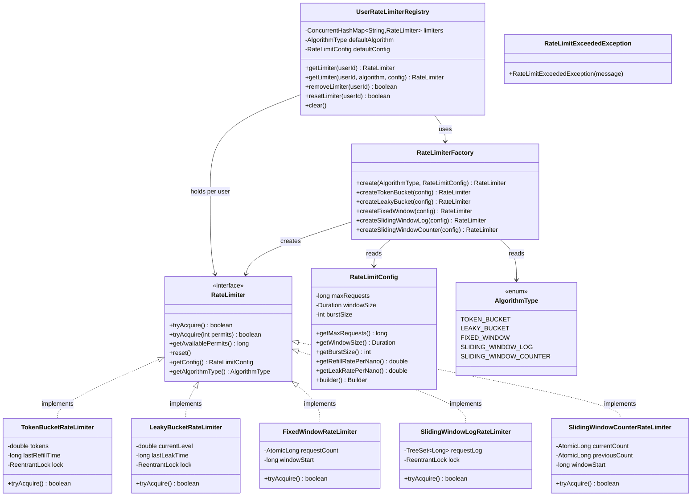

# Rate Limiter — Design Document (D.I.C.E. Format)

Five interchangeable rate-limiting algorithms behind a single interface, with per-user registry.

Follows the D.I.C.E. workflow from `INSTRUCTIONS.md`.

---

## Step 1 — DEFINE (Requirements & Constraints)

### Functional Requirements

1. A caller can **acquire a single permit** (`tryAcquire()`) — non-blocking, returns `true`/`false`.
2. A caller can **acquire multiple permits** (`tryAcquire(int permits)`) for operations that consume multiple quota units.
3. A caller can **inspect available permits** (`getAvailablePermits()`) for monitoring.
4. A caller can **reset** a limiter to its initial state.
5. A caller can **choose an algorithm** (Token Bucket, Leaky Bucket, Fixed Window, Sliding Window Log, Sliding Window Counter) via `RateLimiterFactory`.
6. A system can manage **per-user rate limiters** via `UserRateLimiterRegistry` with lazy initialization and per-user custom config.

### Non-Functional Requirements

- **Non-blocking** — `tryAcquire()` always returns immediately.
- **Thread-safe** — all implementations use `ReentrantLock` or `AtomicLong`.
- **O(1) time** for Token Bucket, Leaky Bucket, Fixed Window, Sliding Window Counter.
- **O(n) time/space** for Sliding Window Log (n = requests in window) — highest accuracy.
- **OCP-compliant** — new algorithms added by implementing `RateLimiter`; factory extended with one `case`.
- **Immutable config** — `RateLimitConfig` is final with a Builder; shared safely across threads.

### Constraints

- In-memory only — no distributed state.
- Single JVM process.
- Sliding Window Counter uses two buckets (current + previous); approximation, not perfect accuracy.

### Out of Scope

- Distributed rate limiting (Redis Lua scripts, token bucket in Redis).
- Blocking `acquire()` with wait.
- Per-resource or hierarchical rate limits.

---

## Step 2 — IDENTIFY (Entities & Relationships)

### Noun → Verb extraction

> A **caller** *calls* `tryAcquire()` on a **RateLimiter** → the **algorithm** *checks* internal state (tokens / counter / log) using **RateLimitConfig** → returns allow/deny → **Factory** *creates* the right algorithm → **Registry** *manages* one limiter per user.

### Nouns → Candidate Entities

| Noun | Entity Type | Notes |
|---|---|---|
| RateLimiter | Interface | Strategy contract: `tryAcquire / tryAcquire(n) / getAvailablePermits / reset / getConfig / getAlgorithmType` |
| RateLimitConfig | Class (immutable) | `maxRequests`, `windowSize`, `burstSize`; Builder with validation; `getRefillRatePerNano()` |
| AlgorithmType | Enum | `TOKEN_BUCKET / LEAKY_BUCKET / FIXED_WINDOW / SLIDING_WINDOW_LOG / SLIDING_WINDOW_COUNTER` |
| TokenBucketRateLimiter | Class | Tokens refill continuously; allows burst up to `burstSize`; `AtomicLong` + `ReentrantLock` |
| LeakyBucketRateLimiter | Class | Smooths traffic — leaks at constant rate regardless of burst; `ReentrantLock` |
| FixedWindowRateLimiter | Class | Counter resets at window boundary; `AtomicLong` counter + window start time |
| SlidingWindowLogRateLimiter | Class | Exact: stores timestamps of all requests in window; `TreeSet<Long>` + `ReentrantLock` |
| SlidingWindowCounterRateLimiter | Class | Approximation: weighted sum of current + previous window buckets; `AtomicLong` |
| RateLimiterFactory | Class | Factory: `create(AlgorithmType, RateLimitConfig)` → `RateLimiter` |
| UserRateLimiterRegistry | Class | Registry: `ConcurrentHashMap<userId, RateLimiter>`; lazy init via `computeIfAbsent` |
| RateLimitExceededException | Exception | Unchecked; thrown when caller uses throw-on-exceed variant |

### Verbs → Methods / Relationships

| Verb | Lives on |
|---|---|
| `tryAcquire()` / `tryAcquire(permits)` | `RateLimiter` (interface + all implementations) |
| `getAvailablePermits()` / `reset()` | `RateLimiter` |
| `create(AlgorithmType, config)` | `RateLimiterFactory` |
| `getLimiter(userId)` / `removeLimiter(userId)` | `UserRateLimiterRegistry` |
| `getRefillRatePerNano()` / `getLeakRatePerNano()` | `RateLimitConfig` |

### Relationships

```
RateLimiter          ◄──implements── TokenBucketRateLimiter         (Realization)
RateLimiter          ◄──implements── LeakyBucketRateLimiter         (Realization)
RateLimiter          ◄──implements── FixedWindowRateLimiter         (Realization)
RateLimiter          ◄──implements── SlidingWindowLogRateLimiter    (Realization)
RateLimiter          ◄──implements── SlidingWindowCounterRateLimiter (Realization)
RateLimiterFactory   ──creates──►    RateLimiter                    (Factory)
RateLimiterFactory   ──reads──►      AlgorithmType                  (Dependency)
RateLimiterFactory   ──reads──►      RateLimitConfig                (Dependency)
UserRateLimiterRegistry ──uses──►    RateLimiterFactory             (Dependency)
UserRateLimiterRegistry ──holds──►   RateLimiter (per user)         (Association)
All implementations  ──reads──►      RateLimitConfig                (Association)
```

### Design Patterns Applied

| Pattern | Where | Why |
|---|---|---|
| **Strategy** | `RateLimiter` interface | Five algorithms are interchangeable — callers and `Registry` depend only on the interface; algorithm choice is a deployment decision |
| **Factory** | `RateLimiterFactory` | Centralizes construction; callers never `new` a concrete class; adding a new algorithm only requires a new `case` in the factory |
| **Builder** | `RateLimitConfig.Builder` | `burstSize` is optional (defaults to `maxRequests`); cross-field validation (`burstSize >= maxRequests`) lives in `build()` |
| **Registry** | `UserRateLimiterRegistry` | Per-user lazy initialization via `computeIfAbsent`; atomically creates a limiter on first access; supports removal for inactive users |

---

## Step 3 — CLASS DIAGRAM (Mermaid.js)



---

## Step 4 — PACKAGE STRUCTURE

```
com.lldprep.ratelimiter/
│
├── DESIGN_DICE.md                            ← this file
├── DESIGN.md                                 ← original design (retained)
├── README.md
│
├── RateLimiter.java                          ← Strategy interface
├── RateLimitConfig.java                      ← immutable config with Builder
├── AlgorithmType.java                        ← enum of algorithm choices
│
├── algorithm/
│   ├── TokenBucketRateLimiter.java           ← burst-friendly; continuous refill
│   ├── LeakyBucketRateLimiter.java           ← traffic shaping; constant drain
│   ├── FixedWindowRateLimiter.java           ← simple; boundary spike risk
│   ├── SlidingWindowLogRateLimiter.java      ← exact; O(n) space
│   └── SlidingWindowCounterRateLimiter.java  ← best balance; O(1) approximation
│
├── factory/
│   └── RateLimiterFactory.java               ← Factory: algorithm type → RateLimiter
│
├── registry/
│   └── UserRateLimiterRegistry.java          ← Registry: per-user lazy RateLimiter map
│
├── exception/
│   └── RateLimitExceededException.java       ← unchecked; thrown on exceeded limit
│
└── RateLimiterDemo.java                      ← demo: all 5 algorithms + registry
```

---

## Step 5 — IMPLEMENTATION ORDER (per INSTRUCTIONS.md)

1. `exception/RateLimitExceededException.java`
2. `AlgorithmType.java` — enum
3. `RateLimitConfig.java` — immutable config with Builder
4. `RateLimiter.java` — interface
5. `algorithm/TokenBucketRateLimiter.java`
6. `algorithm/LeakyBucketRateLimiter.java`
7. `algorithm/FixedWindowRateLimiter.java`
8. `algorithm/SlidingWindowLogRateLimiter.java`
9. `algorithm/SlidingWindowCounterRateLimiter.java`
10. `factory/RateLimiterFactory.java`
11. `registry/UserRateLimiterRegistry.java`
12. `RateLimiterDemo.java` — last

---

## Step 6 — EVOLVE (Curveballs)

| Curveball | Impact | Extension strategy |
|---|---|---|
| **New algorithm** (e.g. Adaptive Rate Limiting) | Factory + one new class | `AdaptiveRateLimiter implements RateLimiter`. Add `ADAPTIVE` to `AlgorithmType`. Add one `case` in factory. Zero changes to `Registry` or existing algorithms. |
| **Distributed rate limiting** | State must be shared across nodes | `RedisRateLimiter implements RateLimiter` — Lua script atomically checks/decrements a Redis counter. Inject via factory. Zero interface changes. |
| **Blocking `acquire()`** with wait | New method on interface | Add `acquire()` to `RateLimiter` with a `default` implementation that busy-waits or uses `LockSupport.parkNanos`. Implementations override if more efficient. |
| **Per-endpoint limits** (user × endpoint) | Registry key change only | `UserRateLimiterRegistry` key becomes `userId:endpoint`. No algorithm changes. |
| **Warm-up period** (ramp rate up gradually) | TokenBucket variant | `WarmUpTokenBucketRateLimiter extends TokenBucketRateLimiter` — starts with fewer tokens, linearly increases `refillRate` over warm-up duration. |

---

## Algorithm Comparison

| Algorithm | Time | Space | Burst | Boundary spike | Best for |
|---|---|---|---|---|---|
| Token Bucket | O(1) | O(1) | ✅ Allowed | No boundary | API rate limiting |
| Leaky Bucket | O(1) | O(1) | ❌ Smoothed | No boundary | Traffic shaping |
| Fixed Window | O(1) | O(1) | ✅ Allowed | ⚠️ 2x at edges | Simple, low memory |
| Sliding Window Log | O(n) | O(n) | ❌ Strict | No boundary | High accuracy, security |
| Sliding Window Counter | O(1) | O(1) | ❌ Approx | Minimal | **Production default** |

**Recommended default:** Sliding Window Counter — O(1) time/space, ~1% max error, no boundary spike.

---

## Thread Safety Analysis

| Algorithm | Mechanism |
|---|---|
| Token Bucket | `ReentrantLock` — refill and consume are one atomic operation |
| Leaky Bucket | `ReentrantLock` — leak and check are one atomic operation |
| Fixed Window | `AtomicLong` for counter; `synchronized` on window reset check |
| Sliding Window Log | `ReentrantLock` — `TreeSet` mutation is not thread-safe standalone |
| Sliding Window Counter | `AtomicLong` for both buckets; window swap guarded by `synchronized` |
| Registry | `ConcurrentHashMap.computeIfAbsent` — atomic lazy init per user |

---

## Self-Review Checklist

- [x] Requirements written before any class design
- [x] Class diagram with typed relationships
- [x] Every class has a single nameable responsibility
- [x] Adding a new algorithm requires zero changes to `Registry`, `RateLimiter`, or existing algorithms (OCP)
- [x] `UserRateLimiterRegistry` depends on `RateLimiter` interface, not concrete types (DIP)
- [x] `RateLimitConfig` is immutable — thread-safe to share across users
- [x] Builder validates cross-field constraints (`burstSize >= maxRequests`)
- [x] Patterns documented with "why"
- [x] Thread-safety per-algorithm documented
- [x] Custom exception in `exception/`
- [x] Demo covers all 5 algorithms + registry pattern
