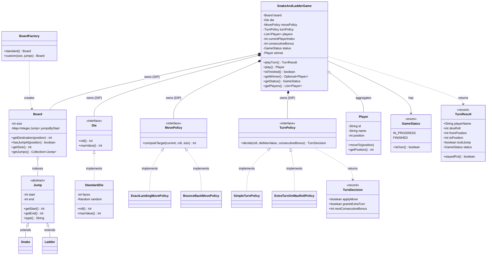

# Snake & Ladder — Design Document (D.I.C.E. Format)

A turn-based Snake & Ladder engine: configurable board, snakes and ladders unified as a single
"jump" abstraction, pluggable die and overshoot rule, and full board-setup validation.

Follows the D.I.C.E. workflow from `INSTRUCTIONS.md`.

---

## Step 1 — DEFINE (Requirements & Constraints)

### Functional Requirements

1. Configure a **board** of N cells (win cell = N) with a set of **snakes** and **ladders**.
2. Support **2 or more players** playing in a fixed turn order.
3. **Roll a die** each turn (pluggable — single fair die, loaded die, multi-dice).
4. **Move** the current player's token forward by the rolled value.
5. Landing on a **ladder bottom climbs** to its top; landing on a **snake head slides** to its tail.
6. A player **wins by reaching the final cell**; the overshoot rule is pluggable (exact-landing vs bounce-back).
7. After a move, the **turn passes** to the next player (unless the mover just won).
8. Track **game status** (IN_PROGRESS / FINISHED) and the **winner**; reject turns after the game ends.
9. **Validate board setup** at construction: jumps within bounds, snakes go down, ladders go up, no duplicate start cells, no chained jumps.

### Non-Functional Requirements

- **O(1) per turn** — jump resolution is a single `HashMap` lookup keyed by start cell.
- **Extensible** — die, overshoot rule, and jump kinds all vary independently of the game loop (OCP).
- **Reproducible** — the die takes an injectable seeded `Random` for deterministic games/tests.
- **Fail-fast setup** — an invalid board never constructs, so the game loop trusts its inputs.
- **Serialized turns** — a turn (roll + move + jump + win-check) applies atomically.

### Constraints

- In-memory, single JVM.
- Board size and jumps fixed at construction.
- `size >= 2`; every jump start/end in `[1, size]`.

### Out of Scope

- GUI / animation.
- Networked / persisted multiplayer.
- Betting, power-ups, variable board shapes.
- Extra-turn-on-six and player rankings (curveballs — see Step 6).

---

## Step 2 — IDENTIFY (Entities & Relationships)

### Noun → Verb extraction

> A **player** *rolls* a **die** on their **turn**; the **game** *asks* the **move policy* for the
> landing cell, then *asks* the **board** to *resolve* any **jump** (snake or ladder) on that cell,
> and *moves* the player there. Reaching the final cell *wins*; otherwise the **turn** *passes* on.

### Nouns → Candidate Entities

| Noun | Entity Type | Notes |
|---|---|---|
| GameStatus | Enum | IN_PROGRESS, FINISHED; `isOver()` |
| Player | Class | id, name, position (0 = off-board); `moveTo` |
| Jump | Abstract class | start, end; the shared snake/ladder mechanic |
| Snake | Class | extends Jump; validates head > tail |
| Ladder | Class | extends Jump; validates bottom < top |
| Board | Class | size + `Map<startCell, Jump>`; validates setup; `getDestination` |
| TurnResult | Record | Immutable per-turn snapshot for callers/UI |
| Die | Interface | `roll()`, `maxValue()` — pure randomizer, no game state |
| StandardDie | Class | fair n-faced die; injectable `Random` |
| MovePolicy | Interface | `computeTarget(current, roll, size)` — overshoot rule |
| ExactLandingMovePolicy | Class | overshoot → stay put |
| BounceBackMovePolicy | Class | overshoot → reflect off the end |
| TurnPolicy | Interface | `decide(roll, dieMax, streak)` — extra-turn / forfeit rule (pure function) |
| SimpleTurnPolicy | Class | every roll moves + passes; no bonus turns |
| ExtraTurnOnMaxRollPolicy | Class | max roll → extra turn; 3 in a row → forfeit |
| TurnDecision | Record | policy's explicit outcome: `applyMove`, `grantsExtraTurn`, `nextConsecutiveBonus` |
| BoardFactory | Class | canonical 100-cell board + custom builder |
| SnakeAndLadderGame | Class | Facade + orchestrator: playTurn / play / status / winner; owns turn rotation, win transition, and the bonus-streak state. No interface — one engine, nothing swaps it. |

### Verbs → Methods / Relationships

| Verb | Lives on |
|---|---|
| `playTurn()` / `play()` | `SnakeAndLadderGame` |
| `roll()` / `maxValue()` | `Die`, `StandardDie` |
| `computeTarget(current, roll, size)` | `MovePolicy` + impls |
| `decide(roll, dieMax, streak)` | `TurnPolicy` + impls |
| `getDestination(position)` | `Board` |
| `moveTo(position)` | `Player` |
| `getWinner()` / `getStatus()` | `SnakeAndLadderGame` |
| `standard()` / `custom()` | `BoardFactory` |

### Relationships

```
SnakeAndLadderGame ──owns──► Board                              (Composition / DIP)
SnakeAndLadderGame ──owns──► Die                                (Composition / DIP)
SnakeAndLadderGame ──owns──► MovePolicy                         (Composition / DIP)
SnakeAndLadderGame ──owns──► TurnPolicy                         (Composition / DIP)
SnakeAndLadderGame o── Player                                   (Aggregation — players passed in)
Board o── Jump                                                  (Aggregation — board indexes jumps)
Snake ──extends──► Jump                                         (Inheritance)
Ladder ──extends──► Jump                                        (Inheritance)
StandardDie ──implements──► Die                                 (Realization)
ExactLandingMovePolicy ──implements──► MovePolicy               (Realization)
BounceBackMovePolicy ──implements──► MovePolicy                 (Realization)
SimpleTurnPolicy ──implements──► TurnPolicy                     (Realization)
ExtraTurnOnMaxRollPolicy ──implements──► TurnPolicy            (Realization)
TurnPolicy ──returns──► TurnDecision                            (Dependency)
BoardFactory ──creates──► Board                                 (Dependency)
SnakeAndLadderGame ──returns──► TurnResult                      (Dependency)
```

### Design Patterns Applied

| Pattern | Where | Why |
|---|---|---|
| **Strategy (×3)** | `Die`, `MovePolicy`, `TurnPolicy` | Roll source, overshoot rule, and turn rule vary independently — each has ≥2 impls, so `BounceBackMovePolicy` / `ExtraTurnOnMaxRollPolicy` are drop-ins with zero game-loop edits. These are the *real* extension seams, which is why they keep interfaces. `TurnPolicy` is a **pure function** (game owns the streak state, passes it in) → reusable, trivially testable. |
| **Facade** | `SnakeAndLadderGame` (concrete class) | Hides dice, jumps, turn rules, and ordering behind `playTurn`/`play`. Facade is a *role*, not a Java interface — with one engine and nothing to swap, a plain class is the facade (a one-impl interface would be premature abstraction). |
| **Factory** | `BoardFactory` | Canonical layout lives in one place; also builds custom boards. |
| **Inheritance + Polymorphism** | `Jump` → `Snake` / `Ladder` | Snakes and ladders share one mechanic; the board reads `getEnd()` and never branches on type (no `instanceof`). Subclasses self-validate direction (LSP-safe). |

---

## Step 3 — CLASS DIAGRAM (Mermaid.js)



---

## Step 4 — PACKAGE STRUCTURE

```
com.lldprep.systems.snakeandladder/
│
├── DESIGN_DICE.md                          ← this file
├── README.md
├── class_diagram.mermaid
│
├── model/
│   ├── GameStatus.java                     ← enum: IN_PROGRESS, FINISHED + isOver()
│   ├── Player.java                         ← id, name, position; moveTo
│   ├── Jump.java                           ← abstract: start/end + type()
│   ├── Snake.java                          ← head > tail (self-validating)
│   ├── Ladder.java                         ← bottom < top (self-validating)
│   ├── Board.java                          ← size + jump index; setup validation
│   └── TurnResult.java                     ← record: per-turn snapshot
│
├── policy/
│   ├── Die.java                            ← interface: roll() + maxValue() (pure randomizer)
│   ├── StandardDie.java                    ← fair n-faced die (seedable)
│   ├── MovePolicy.java                     ← interface: overshoot rule
│   ├── ExactLandingMovePolicy.java         ← overshoot → stay
│   ├── BounceBackMovePolicy.java           ← overshoot → reflect
│   ├── TurnPolicy.java                     ← interface: extra-turn / forfeit rule (pure fn)
│   ├── TurnDecision.java                   ← record: applyMove / grantsExtraTurn / nextBonus
│   ├── SimpleTurnPolicy.java               ← always move + pass
│   └── ExtraTurnOnMaxRollPolicy.java       ← max roll → extra turn; 3 in a row → forfeit
│
├── factory/
│   └── BoardFactory.java                   ← standard() + custom()
│
├── service/
│   └── SnakeAndLadderGame.java             ← Facade + orchestrator (concrete; turn rotation + win)
│
├── exception/
│   ├── SnakeAndLadderException.java        ← base unchecked
│   ├── InvalidBoardException.java          ← bad board/jump setup
│   └── InvalidGameStateException.java      ← <2 players / turn after finish
│
└── demo/
    └── SnakeAndLadderDemo.java             ← all 9 FRs + policy swap + validation
```

---

## Step 5 — IMPLEMENTATION ORDER

1. `GameStatus`, `Player`
2. `exception/` — base + `InvalidBoardException`, `InvalidGameStateException`
3. `Jump` (abstract), `Snake`, `Ladder`
4. `Board`, `TurnResult`
5. `policy/` — `Die`/`StandardDie`, `MovePolicy`/`ExactLanding`/`BounceBack`, `TurnPolicy`/`TurnDecision`/`SimpleTurnPolicy`/`ExtraTurnOnMaxRollPolicy`
6. `factory/BoardFactory`
7. `service/SnakeAndLadderGame` (concrete facade + orchestrator)
8. `demo/SnakeAndLadderDemo`

---

## Step 6 — EVOLVE (Curveballs)

| Curveball | Impact on current design | Extension strategy |
|---|---|---|
| **Bounce-back on overshoot** | Different win/move rule | Already handled — inject `BounceBackMovePolicy` instead of `ExactLandingMovePolicy`. Zero game-loop changes. |
| **Extra turn on rolling a 6** (+ 3-in-a-row forfeit) | Turn rotation changes | **Implemented** — `TurnPolicy` strategy returns a `TurnDecision` (`applyMove` / `grantsExtraTurn` / `nextConsecutiveBonus`); `playTurn` consults it at the single rotation point. `SimpleTurnPolicy` = plain; `ExtraTurnOnMaxRollPolicy` = six-rule. The `Die` stays a pure randomizer — the rule keys off `die.maxValue()`, not a literal 6. |
| **Two dice / loaded die** | Roll source changes | New `Die` impl (`MultiDie` summing N dice, or `LoadedDie`). Injected at build time — no other change. |
| **Player rankings (not just first winner)** | Game continues after 1st win | Keep a `finishOrder` list; on reaching the final cell, append the player and remove from rotation instead of ending; game ends when one player remains. |
| **New jump kinds** (teleporter, wormhole) | Board must handle more mechanics | Add a `Jump` subclass; `Board.getDestination` already reads `getEnd()` polymorphically — no board or game-loop edits. |
| **Live UI / move log** | State changes must be observed | Add an observer notified with each `TurnResult`; `SnakeAndLadderGame` broadcasts after every turn. Inject observers at construction (OCP). |
```
