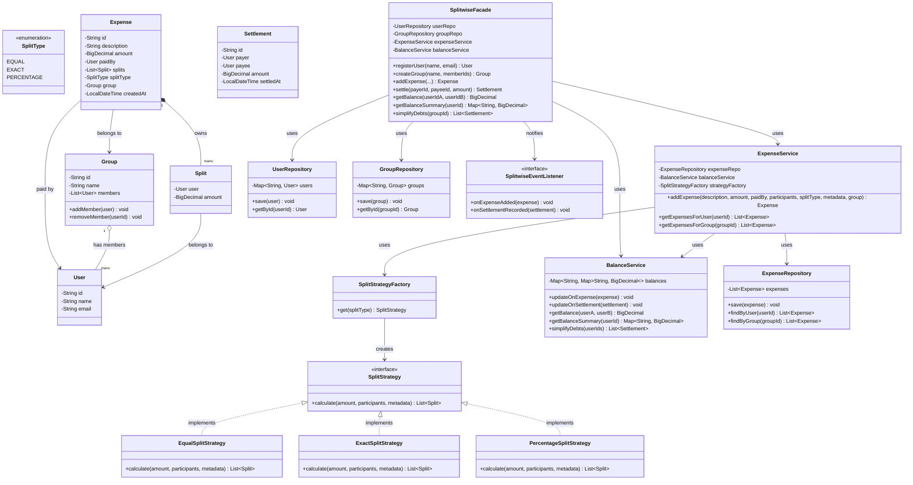

# Splitwise — Design Document (D.I.C.E.)

Follows the D.I.C.E. workflow from `INSTRUCTIONS.md`.

---

## Step 1 — DEFINE (Requirements & Constraints)

### Functional Requirements

1. A user can **register** with name and email.
2. A user can **create a group** and add members to it.
3. A user can **add an expense** — specify amount, who paid, participants, and how to split.
   - Split types: **Equal** (divide evenly), **Exact** (specify each person's amount), **Percentage** (specify each person's %).
4. A user can **view their balances** — who owes them, and who they owe, with net amounts.
5. A user can **settle up** with another user — record a direct payment to reduce a balance.
6. A user can **view expense history** — all expenses they are part of, chronologically.
7. The system can **simplify debts** — reduce a complex web of balances into standard greedy settlement suggestions.
8. A user can **view group balances** — net balances for all members within a specific group.

### Non-Functional Requirements

- **Correct balance accounting** — adding an expense must atomically update all affected balances. No partial updates.
- **O(1) balance lookup** per user pair — `getBalance(userA, userB)` must not scan expenses.
- **Debt simplification is on-demand** — computed at query time, not stored.
- **Thread-safe balance updates** — concurrent `addExpense` calls involving the same users must not corrupt balances.

### Constraints

- In-memory only — no database, no persistence.
- Single JVM process.
- Currency is a single unit (no multi-currency conversion).
- Maximum group size: 50 members.
- Expense amounts are `BigDecimal` — never `double` for money.
- Money is scale 2; equal and percentage splits assign rounding remainder to the final participant.

### Out of Scope

- User authentication — user ID is passed in.
- Push / email notifications on expense addition.
- Receipt / photo attachments.
- Multi-currency and FX conversion.
- Recurring expenses.
- Activity feed / comment threads on expenses.

---

## Step 2 — IDENTIFY (Entities & Relationships)

### Noun → Verb extraction

> A **user** *registers* → creates a **group**, adds **members** → *adds* an **expense**, picks a **split type** → the system *calculates* each member's **share**, *updates* **balances** → a user *views* their **balance summary** or *settles up* → the system *records* a **settlement** and *reduces* the balance.

### Entities

| Entity | Type | Responsibility |
|--------|------|---------------|
| `User` | Class | Identity — id, name, email |
| `Group` | Class | Collection of users who share expenses |
| `Expense` | Class | Who paid, total amount, split type, participants |
| `Split` | Class | One user's share of an expense (user + amount) |
| `SplitType` | Enum | EQUAL, EXACT, PERCENTAGE |
| `Balance` | Data structure | `Map<userId, Map<userId, BigDecimal>>` — net amounts between every pair |
| `Settlement` | Class | Direct payment from one user to another — reduces balance |
| `SplitStrategy` | Interface | Calculates each participant's share given the split type |

### Relationships

```
User ──member of──► Group        (M:N, Association)
Group ──owns──► Expense          (1:N, Aggregation — expense can exist without group)
Expense ──paid by──► User        (N:1, Association)
Expense ──contains──► Split      (1:N, Composition — Split cannot exist without Expense)
Split ──belongs to──► User       (N:1, Association)
User ──has──► Balance entries    (derived, not stored as entity)
Settlement ──from/to──► User     (N:1 each way, Association)
```

### Design Patterns Applied

| Pattern | Where | Why |
|---------|-------|-----|
| **Strategy** | `SplitStrategy` — `EqualSplitStrategy`, `ExactSplitStrategy`, `PercentageSplitStrategy` | Adding a new split type (Ratio, Shares-based) = new class only. Zero changes to `Expense` or `ExpenseService`. |
| **Factory** | `SplitStrategyFactory.get(SplitType)` | Centralises strategy creation. Caller never uses `new ConcreteStrategy()`. |
| **Observer** | `SplitwiseEventListener` implementations registered on `SplitwiseFacade` | Decouples balance change reactions (audit log, future notification). |
| **Repository** | `UserRepository`, `GroupRepository`, `ExpenseRepository` | In-memory stores, swappable for DB. Keeps service layer free of storage concerns. |
| **Facade** | `SplitwiseFacade` | Single entry point: `addExpense()`, `settle()`, `getBalance()`, `simplifyDebts()`. Hides expense, balance, and split services. |

---

## Step 3 — CLASS DIAGRAM (Mermaid.js)



---

## Step 4 — CORE ALGORITHM: Debt Simplification

This is the **DSA core** of the system. It converts noisy pairwise balances into a compact read-only settlement suggestion.

### Problem

```
Alice paid for Bob:  Bob owes Alice ₹100
Bob   paid for Charlie: Charlie owes Bob ₹80
Charlie paid for Alice: Alice owes Charlie ₹60
```

Naively: 3 transactions. After simplification:

```
Net balances:
  Alice:   +100 - 60 = +40  (owed ₹40)
  Bob:     -100 + 80 = -20  (owes ₹20)
  Charlie: -80  + 60 = -20  (owes ₹20)

Transactions: Bob → Alice ₹20, Charlie → Alice ₹20
Result: 2 transactions instead of 3.
```

### Algorithm — Minimum Cash Flow (Greedy)

```
1. Compute net balance for each user:
     netBalance[user] = sum of all amounts others owe them
                      - sum of all amounts they owe others

2. Separate into creditors (net > 0) and debtors (net < 0).
   Put in max-heap (creditors by amount owed DESC)
   and min-heap (debtors by amount owed ASC, i.e. most negative first).

3. While both heaps are non-empty:
     creditor = heap.pollMax()   // who is owed the most
     debtor   = heap.pollMin()   // who owes the most

     settlement = min(creditor.amount, abs(debtor.amount))
     record: debtor pays creditor `settlement`

     creditor.amount -= settlement
     debtor.amount   += settlement

     if creditor.amount > 0 → push back to creditor heap
     if debtor.amount   < 0 → push back to debtor heap

Complexity: O(n log n) where n = users with non-zero balance.
```

### Why Not Optimal (NP-Hard Context)

The greedy approach minimises the **number of transactions** approximately — it always finds a solution with at most `n-1` transactions. The truly optimal (fewest distinct payer-payee pairs reusing existing relationships) is NP-hard. For interview purposes, the greedy is the expected answer.

---

## Step 5 — BALANCE DATA STRUCTURE

```
balances: Map<String userId_A, Map<String userId_B, BigDecimal amount>>

Convention:
  balances.get(A).get(B) = X → A owes B the amount X (X > 0)
                               B owes A the amount |X| (X < 0)
```

**On addExpense (Alice pays ₹300, split equally among Alice/Bob/Charlie):**

```
Alice's share = ₹100, Bob's share = ₹100, Charlie's share = ₹100
Alice already paid, so only Bob and Charlie owe Alice.

balances[Bob][Alice]     += 100   →  Bob owes Alice ₹100
balances[Charlie][Alice] += 100   →  Charlie owes Alice ₹100
```

**On settlement (Bob pays Alice ₹100):**

```
balances[Bob][Alice] -= 100   →  Bob no longer owes Alice
```

Settlement invariant: payer must currently owe payee, and amount must not exceed outstanding payer → payee balance.

**Thread safety:** `BalanceService` holds a `ConcurrentHashMap<String, ConcurrentHashMap<String, BigDecimal>>`. Each balance update is wrapped in `synchronized(balancePairLock(userA, userB))` — a dedicated lock per ordered user pair — to prevent concurrent addExpense calls from corrupting the same balance entry.

---

## Step 6 — CONCURRENCY MODEL

### Critical Section: `updateOnExpense`

Multiple `addExpense` calls involving the same user pair (e.g., Alice–Bob) must not interleave their balance updates.

```java
// Consistent lock ordering prevents deadlock:
// always lock on min(userIdA, userIdB) + ":" + max(userIdA, userIdB)
private Object getLock(String userA, String userB) {
    String key = userA.compareTo(userB) < 0
        ? userA + ":" + userB
        : userB + ":" + userA;
    return lockMap.computeIfAbsent(key, k -> new Object());
}

// In updateOnExpense:
synchronized (getLock(split.userId, expense.paidBy.getId())) {
    balances
        .computeIfAbsent(split.userId, k -> new ConcurrentHashMap<>())
        .merge(expense.paidBy.getId(), split.getAmount(), BigDecimal::add);
}
```

**Why consistent lock ordering?** If Thread 1 holds lock(Alice, Bob) and tries to acquire lock(Bob, Charlie), while Thread 2 holds lock(Bob, Charlie) and tries lock(Alice, Bob) — deadlock. Ordering by userId string eliminates this.

### Thread Safety Summary

| Operation | Strategy |
|-----------|----------|
| `addExpense` | `synchronized` per ordered user pair during balance update |
| `settle` | `synchronized` on the same ordered pair lock |
| `getBalance` | `ConcurrentHashMap` read — no lock needed |
| `getBalanceSummary` | Weakly consistent snapshot — acceptable for display |
| `simplifyDebts` | Weakly consistent snapshot — read-only suggestion, not a transaction boundary |

### Known Trade-offs

- **Pair lock lifecycle:** `pairLocks` keeps one monitor per unique user pair and does not remove it when balance returns to zero. This avoids unsafe lock replacement while another thread may be waiting. Production designs can use striped locks or reference-counted lock cleanup.
- **Snapshot consistency:** summary/simplification snapshots can miss concurrent writes. They are intentionally query-time views, not settlement commits.

---

## Step 7 — IMPLEMENTATION ORDER

1. Enums: `SplitType`
2. Model: `User`, `Split`, `Expense`, `Settlement`, `Group`
3. Strategy: `SplitStrategy` interface, `EqualSplitStrategy`, `ExactSplitStrategy`, `PercentageSplitStrategy`, `SplitStrategyFactory`
4. Repository: `UserRepository`, `GroupRepository`, `ExpenseRepository`
5. Service: `BalanceService` (balance map + simplification algorithm), `ExpenseService`
6. Facade: `SplitwiseFacade`
7. Demo: `SplitwiseDemo`

---

## Step 8 — EVOLVE (Curveballs)

| Curveball | Extension Strategy | Pattern |
|-----------|-------------------|---------|
| **New split type: Ratio** (Alice:Bob:Charlie = 2:3:5) | New `RatioSplitStrategy implements SplitStrategy`. Zero changes to Expense or facade. | Strategy (OCP) |
| **Multi-currency** | `Expense` gains `Currency currency`; `BalanceService` gains `CurrencyConverter` dependency; simplification runs per currency or converts first | Strategy (`CurrencyConversionStrategy`) |
| **Notifications on expense add** | `SplitwiseEventListener` implementations: `EmailNotifier`, `PushNotifier`. Register on facade construction. | Observer |
| **Expense categories** (food, travel, rent) | `Expense` gains `Category category` enum. `ExpenseRepository.findByCategory()`. Zero changes to split logic. | |
| **Expense comments / activity feed** | New `CommentService` — no changes to existing classes | SRP |
| **Recurring expenses** | New `RecurringExpenseScheduler` — wraps `addExpense()` on a timer | Adapter / Decorator |

---

## Self-Review Checklist

- [x] Requirements written before code
- [x] Class diagram produced with typed relationships
- [x] Every relationship typed
- [x] DSA algorithm documented (debt simplification — greedy, O(n log n))
- [x] Balance data structure and update convention documented
- [x] Concurrency model documented (per-pair lock ordering to prevent deadlock)
- [x] Patterns documented with "why" (Strategy, Factory, Observer, Repository, Facade)
- [x] Custom exceptions defined (SplitValidationException, UserNotFoundException, etc.)
- [x] Demo covers all 8 functional requirements
- [x] At least one curveball demonstrated
