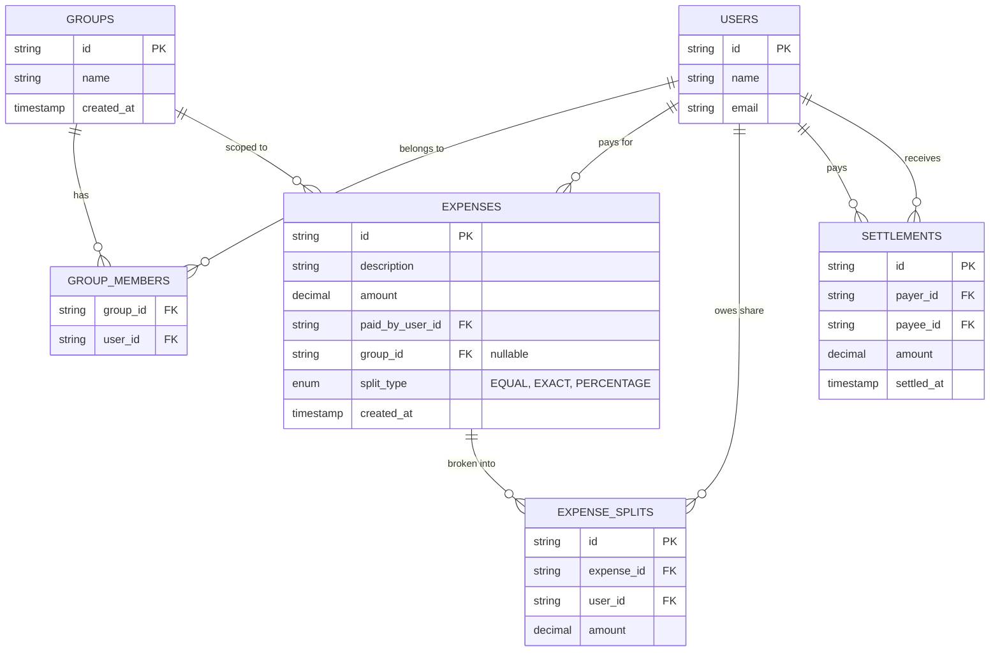

# Splitwise — Database Schema

> How the in-memory entities map to relational tables.

---

## ER Diagram



---

## Table Definitions

### 1. `users`

| Column | Type | Constraints |
|--------|------|------------|
| `id` | `VARCHAR(36)` | `PRIMARY KEY` |
| `name` | `VARCHAR(100)` | `NOT NULL` |
| `email` | `VARCHAR(200)` | `UNIQUE, NOT NULL` |

### 2. `groups`

| Column | Type | Constraints |
|--------|------|------------|
| `id` | `VARCHAR(36)` | `PRIMARY KEY` |
| `name` | `VARCHAR(100)` | `NOT NULL` |
| `created_at` | `TIMESTAMP` | `DEFAULT NOW()` |

### 3. `group_members` — Junction (M:N between users and groups)

| Column | Type | Constraints |
|--------|------|------------|
| `group_id` | `VARCHAR(36)` | `FOREIGN KEY → groups.id` |
| `user_id` | `VARCHAR(36)` | `FOREIGN KEY → users.id` |
| — | — | `PRIMARY KEY (group_id, user_id)` |

**Index:** `(user_id)` — to find all groups a user belongs to.

### 4. `expenses`

| Column | Type | Constraints |
|--------|------|------------|
| `id` | `VARCHAR(36)` | `PRIMARY KEY` |
| `description` | `VARCHAR(200)` | `NOT NULL` |
| `amount` | `DECIMAL(12,2)` | `NOT NULL, CHECK (amount > 0)` |
| `paid_by_user_id` | `VARCHAR(36)` | `FOREIGN KEY → users.id, NOT NULL` |
| `group_id` | `VARCHAR(36)` | `FOREIGN KEY → groups.id, NULLABLE` |
| `split_type` | `ENUM('EQUAL','EXACT','PERCENTAGE')` | `NOT NULL` |
| `created_at` | `TIMESTAMP` | `DEFAULT NOW()` |

**Index:** `(paid_by_user_id, created_at)` — user expense history sorted by time.
**Index:** `(group_id, created_at)` — group expense history.

**Business Rule:** `group_id` is nullable — an expense can exist between friends without a group.

### 5. `expense_splits` — One row per participant per expense

| Column | Type | Constraints |
|--------|------|------------|
| `id` | `VARCHAR(36)` | `PRIMARY KEY` |
| `expense_id` | `VARCHAR(36)` | `FOREIGN KEY → expenses.id` |
| `user_id` | `VARCHAR(36)` | `FOREIGN KEY → users.id` |
| `amount` | `DECIMAL(12,2)` | `NOT NULL, CHECK (amount >= 0)` |

**Business Rule:** `SUM(amount) over expense_id` must equal `expenses.amount`. Enforced at application layer.

**Index:** `(user_id)` — to compute net balance per user without scanning all expenses.

**Index:** `(expense_id)` — to load all splits for one expense.

### 6. `settlements` — Direct payments between users

| Column | Type | Constraints |
|--------|------|------------|
| `id` | `VARCHAR(36)` | `PRIMARY KEY` |
| `payer_id` | `VARCHAR(36)` | `FOREIGN KEY → users.id` |
| `payee_id` | `VARCHAR(36)` | `FOREIGN KEY → users.id` |
| `amount` | `DECIMAL(12,2)` | `NOT NULL, CHECK (amount > 0)` |
| `settled_at` | `TIMESTAMP` | `DEFAULT NOW()` |

**Index:** `(payer_id, payee_id)` — to compute net settlement between a pair.

**Business Rules:**
- `payer_id != payee_id` — enforced by a `CHECK` constraint.
- Settlement amount must not exceed the outstanding payer → payee balance — enforced by application logic.

---

## Balance Derivation Query

Balances are **not stored** — they are derived on read. This avoids the synchronisation problem of keeping a denormalised balance table consistent.

```sql
-- Net amount user_A owes user_B:
-- expense debt A->B - expense debt B->A - settlements A->B + settlements B->A

SELECT
    COALESCE(owe.amount, 0)
  - COALESCE(owed.amount, 0)
  - COALESCE(paid.amount, 0)
  + COALESCE(received.amount, 0) AS net_balance
FROM
    (SELECT SUM(s.amount) AS amount
     FROM expense_splits s
     JOIN expenses e ON s.expense_id = e.id
     WHERE s.user_id = :userA AND e.paid_by_user_id = :userB) AS owe,

    (SELECT SUM(s.amount) AS amount
     FROM expense_splits s
     JOIN expenses e ON s.expense_id = e.id
     WHERE s.user_id = :userB AND e.paid_by_user_id = :userA) AS owed,

    (SELECT SUM(amount) AS amount
     FROM settlements
     WHERE payer_id = :userA AND payee_id = :userB) AS paid,

    (SELECT SUM(amount) AS amount
     FROM settlements
     WHERE payer_id = :userB AND payee_id = :userA) AS received;
-- Positive result → userA owes userB that amount
-- Negative result → userB owes userA |result|
```

**Why not store balances?** A separate `balances` table would need to be updated transactionally with every `expense_splits` insert. Under concurrent writes, this is a coordination hot-spot. Deriving on read is simpler and correct — it only needs to be fast at read time, which an index on `(user_id)` in `expense_splits` ensures.

---

## Concurrency Model

| Scenario | In-Memory | Database |
|----------|-----------|----------|
| Add expense | `synchronized` on ordered user pair lock per balance entry | `BEGIN; INSERT INTO expenses; INSERT INTO expense_splits (N rows); COMMIT;` — single transaction, no balance table to update |
| Settle up | `synchronized` on ordered pair lock; reject over-settlement | `BEGIN; validate outstanding balance; INSERT INTO settlements; COMMIT;` |
| Read balance | `ConcurrentHashMap` read (no lock) | `SELECT` with index scan — no lock needed; derive from splits + settlements |
| Simplify debts | Snapshot balances; compute greedy on snapshot | Run the balance derivation query for all users in group; compute greedy in application |
| Concurrent addExpense (same pair) | Per-pair lock prevents interleaving | Database transaction serialises via row-level locks on `expense_splits` |

---

## Migration from In-Memory

| In-Memory Component | Database Equivalent |
|--------------------|---------------------|
| `UserRepository.users` Map | `users` table |
| `GroupRepository.groups` Map | `groups` + `group_members` tables |
| `ExpenseRepository.expenses` List | `expenses` + `expense_splits` tables |
| `BalanceService.balances` nested Map | Derived query over `expense_splits` + `settlements` |
| `Settlement` objects in list | `settlements` table |
| Per-pair `synchronized` lock | `SELECT ... FOR UPDATE` on `expense_splits` for the affected pair within the expense transaction |
