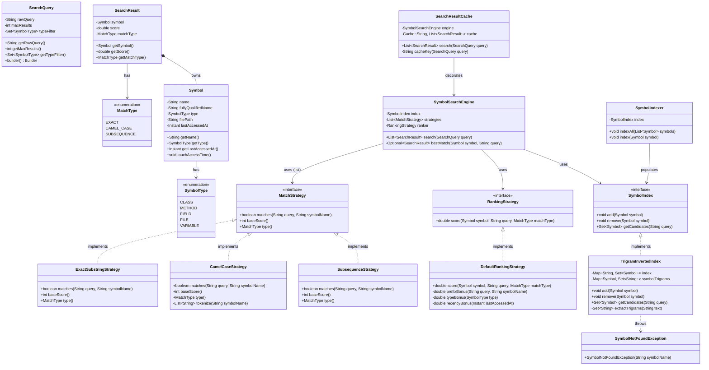

# Symbol Search Engine — Design Document

Inspired by IntelliJ IDEA's "Search Everywhere" (`double shift`).
Typing `"amthe"` finds `"letsSayIAmTheWord"` — this document explains how.

Follows the D.I.C.E. workflow from `INSTRUCTIONS.md`.

---

## Step 1 — DEFINE (Requirements & Constraints)

### Functional Requirements

1. A caller can **index a symbol** (class, method, field, file, variable) into the engine.
2. A caller can **remove a symbol** from the index (e.g., when a file is deleted or renamed).
3. A user can **search by query string** and receive a ranked list of matching symbols.
4. The engine matches using three strategies in order of precision:
   - **Exact substring** — `"amthe"` matches `"IAmTheWord"` because `"amthe"` appears literally (case-insensitive).
   - **CamelCase token** — `"amthe"` matches `"IAmTheWord"` because the query chars span the tokens `Am` + `The` in order.
   - **Subsequence** — `"amthe"` matches `"IAmTheWord"` because all 5 chars appear in that order within the name.
5. A user can **filter results by symbol type** (e.g., only show `CLASS` or `METHOD` results).
6. A user can **configure the maximum number of results** returned (default: 10).
7. The engine returns results **ranked by relevance** — exact matches outrank CamelCase, which outranks subsequence; prefix matches score higher than mid-name matches; recently accessed symbols rank higher.
8. The engine **caches recent query results** so repeated identical queries are served without re-running the search.

### Non-Functional Requirements

- **Near-instant query response** — pre-built trigram inverted index reduces candidate set to O(K) before any matching; K is small even for 100K+ symbol codebases.
- **Incremental index updates** — adding or removing a symbol does not trigger a full rebuild.
- **Thread-safe** — concurrent queries from multiple threads must not corrupt index state.
- **OCP-compliant** — adding a new match strategy or ranking strategy requires zero changes to existing classes.

### Constraints

- In-memory only — no persistence, no disk.
- Symbol names use lowercase Latin alphabet characters only (no unicode or special chars).
- Maximum 10 results by default (configurable per query).
- Single JVM process.

### Out of Scope

- File system watching / automatic re-indexing on file save.
- Fuzzy / typo-tolerant matching (Levenshtein distance).
- Distributed or network-based indexing.
- Persistence across JVM restarts.

---

## Step 2 — IDENTIFY (Entities & Relationships)

### Noun → Verb extraction

> A **user** *types* a **query** → the **engine** *retrieves candidates* from the **index** → each **strategy** *matches* each **symbol** → the **ranker** *scores* the **results** → the **cache** *returns* recent **results** without re-searching.

### Nouns → Candidate Entities

| Noun | Entity Type | Notes |
|---|---|---|
| Symbol | Class (model) | The thing being searched: name, type, file, last accessed |
| SymbolType | Enum | CLASS, METHOD, FIELD, FILE, VARIABLE |
| SearchQuery | Class (value object) | User's input: raw query string, max results, type filter. Uses Builder. |
| SearchResult | Class (value object) | A matched symbol with its relevance score and which strategy matched it |
| MatchType | Enum | EXACT, CAMEL_CASE, SUBSEQUENCE — used for scoring and display |
| MatchStrategy | Interface | Decides whether a query matches a symbol name; returns its base score |
| ExactSubstringStrategy | Class | `symbolName.toLowerCase().contains(query.toLowerCase())` |
| CamelCaseStrategy | Class | Splits symbol on camelCase boundaries; query chars must span tokens in order |
| SubsequenceStrategy | Class | All query chars appear in symbol name in order (two-pointer) |
| RankingStrategy | Interface | Computes a final relevance score combining match type, position, type, recency |
| DefaultRankingStrategy | Class | Implements scoring: match bonus + prefix bonus + type bonus + recency bonus |
| SymbolIndex | Interface | Core index contract: add, remove, getCandidates |
| TrigramInvertedIndex | Class | `Map<String trigram, Set<Symbol>>` — fast pre-filter before matching |
| SymbolIndexer | Class (service) | Bulk-loads a list of symbols into the index at startup |
| SymbolSearchEngine | Class (service) | Orchestrates: index → match → rank → top-K |
| SearchResultCache | Class (decorator) | Wraps SymbolSearchEngine; serves repeated queries from an LRU cache |
| SymbolNotFoundException | Exception | Thrown when removing a symbol not present in the index |

### Verbs → Methods / Relationships

| Verb | Lives on |
|---|---|
| `index(Symbol)` / `remove(Symbol)` | SymbolIndex, SymbolIndexer |
| `getCandidates(String query)` | SymbolIndex |
| `matches(String query, String symbolName)` | MatchStrategy |
| `baseScore()` | MatchStrategy |
| `score(Symbol, String query, MatchType)` | RankingStrategy |
| `search(SearchQuery)` | SymbolSearchEngine, SearchResultCache |
| `indexAll(List<Symbol>)` | SymbolIndexer |

### Relationships

```
SymbolIndexer       ──uses──►       SymbolIndex            (Dependency)
SymbolSearchEngine  ──uses──►       SymbolIndex            (Association — injected)
SymbolSearchEngine  ──uses──►       MatchStrategy (list)   (Association — injected)
SymbolSearchEngine  ──uses──►       RankingStrategy        (Association — injected)
SearchResultCache   ──decorates──►  SymbolSearchEngine     (Decorator)
SearchResult        ──wraps──►      Symbol                 (Composition)
SearchResult        ──has──►        MatchType              (Association)
Symbol              ──has──►        SymbolType             (Association)
TrigramInvertedIndex ──implements── SymbolIndex            (Realization)
ExactSubstringStrategy ──implements── MatchStrategy        (Realization)
CamelCaseStrategy      ──implements── MatchStrategy        (Realization)
SubsequenceStrategy    ──implements── MatchStrategy        (Realization)
DefaultRankingStrategy ──implements── RankingStrategy      (Realization)
```

### Design Patterns Applied

| Pattern | Where | Why |
|---|---|---|
| **Strategy** | `MatchStrategy`, `RankingStrategy` | Swap or add matching/ranking algorithms without touching the engine |
| **Decorator** | `SearchResultCache` wraps `SymbolSearchEngine` | Adds caching transparently; the engine has no knowledge of caching |
| **Builder** | `SearchQuery` | `maxResults` and `typeFilter` are optional; Builder avoids telescoping constructors |
| **Template Method** | `SymbolSearchEngine.search()` | Fixed algorithm skeleton (index → match → rank → slice); steps are injected via interfaces |
| **Null Object / Strategy list** | Engine runs all strategies in order, takes the best match | No `instanceof` or `switch` — engine loops the strategy list polymorphically |

---

## Step 3 — CLASS DIAGRAM (Mermaid.js)



---

## Step 4 — PACKAGE STRUCTURE

```
com.lldprep.symbolsearch/
│
├── DESIGN.md                              ← this file
│
├── model/
│   ├── Symbol.java                        ← searchable entity (name, type, file, lastAccessed)
│   ├── SymbolType.java                    ← enum: CLASS, METHOD, FIELD, FILE, VARIABLE
│   ├── SearchQuery.java                   ← value object with Builder (query, maxResults, typeFilter)
│   ├── SearchResult.java                  ← value object: Symbol + score + MatchType
│   └── MatchType.java                     ← enum: EXACT, CAMEL_CASE, SUBSEQUENCE
│
├── index/
│   ├── SymbolIndex.java                   ← interface: add / remove / getCandidates
│   └── TrigramInvertedIndex.java          ← Map<trigram, Set<Symbol>> — fast candidate pre-filter
│
├── match/
│   ├── MatchStrategy.java                 ← interface: matches + baseScore + type
│   ├── ExactSubstringStrategy.java        ← case-insensitive contains check (score: 100)
│   ├── CamelCaseStrategy.java             ← query chars span camelCase tokens in order (score: 80)
│   └── SubsequenceStrategy.java           ← two-pointer: all chars appear in order (score: 60)
│
├── rank/
│   ├── RankingStrategy.java               ← interface: score(Symbol, query, MatchType)
│   └── DefaultRankingStrategy.java        ← matchBonus + prefixBonus + typeBonus + recencyBonus
│
├── service/
│   ├── SymbolIndexer.java                 ← bulk loader: indexAll(List<Symbol>)
│   └── SymbolSearchEngine.java            ← orchestrator: index → match → rank → top-K
│
├── cache/
│   └── SearchResultCache.java             ← Decorator: LRU cache over SymbolSearchEngine
│
├── exception/
│   └── SymbolNotFoundException.java       ← thrown on remove of unknown symbol
│
└── demo/
    └── SymbolSearchDemo.java              ← exercises all features + curveball
```

---

## Step 5 — IMPLEMENTATION ORDER (per INSTRUCTIONS.md)

Interfaces and enums first. Models second. Implementations third. Orchestration fourth. Demo last.

1. `model/SymbolType.java` — enum
2. `model/MatchType.java` — enum
3. `model/Symbol.java` — entity
4. `model/SearchQuery.java` — value object + Builder
5. `model/SearchResult.java` — value object, implements `Comparable<SearchResult>` by score desc
6. `index/SymbolIndex.java` — interface
7. `match/MatchStrategy.java` — interface
8. `rank/RankingStrategy.java` — interface
9. `match/ExactSubstringStrategy.java`
10. `match/CamelCaseStrategy.java`
11. `match/SubsequenceStrategy.java`
12. `rank/DefaultRankingStrategy.java`
13. `index/TrigramInvertedIndex.java`
14. `exception/SymbolNotFoundException.java`
15. `service/SymbolIndexer.java`
16. `service/SymbolSearchEngine.java`
17. `cache/SearchResultCache.java`
18. `demo/SymbolSearchDemo.java` — last

---

## Step 6 — EVOLVE (Curveballs)

| Curveball | Impact on current design | Extension strategy |
|---|---|---|
| **Typo tolerance** ("amteh" finds "AmThe") | New match strategy only | Add `FuzzyMatchStrategy implements MatchStrategy` — Levenshtein within edit distance 1. Zero changes to engine or existing strategies. |
| **Scope filter** (search only within current file) | `SearchQuery` gains `scopeFile` field | Engine adds one pre-filter: `if (scopeFile != null) skip candidates from other files`. Minimal change — single guard in engine. |
| **Concurrent indexing** (file watcher updates index while queries run) | `TrigramInvertedIndex` needs thread safety | Replace `HashMap` with `ConcurrentHashMap` and `Set<Symbol>` with `CopyOnWriteArraySet`. Interface unchanged. |
| **Usage frequency boost** (recently used symbols rank higher) | Ranking adjustment only | Add `FrequencyRankingStrategy implements RankingStrategy` that tracks per-symbol hit counts. Inject instead of `DefaultRankingStrategy`. |
| **Symbol rename** (file refactor changes a method name) | Index supports it already | `index.remove(oldSymbol)` + `index.add(newSymbol)`. `SymbolIndex` interface already has both operations. |
| **Multi-word query** (`"am the"` → split and intersect) | Query parsing only | Extend `SearchQuery` to split on whitespace; engine intersects candidate sets per token. No changes to strategies or index. |

---

## How the Trigram Pre-filter Works

> This is the core reason queries feel O(1).

**On index:**
Lowercase the symbol name and extract all 3-character substrings (trigrams).
`"IAmTheWord"` → `"iamtheword"` → trigrams: `iam, amt, mth, the, hew, ewo, wor, ord`
Store each trigram → Set\<Symbol\> in the map.

**On query:**
Extract trigrams from the (lowercased) query.
`"amthe"` → trigrams: `amt, mth, the`
Intersect the three sets from the map.
Only symbols containing ALL query trigrams survive — a very small candidate set.

**Then** run `MatchStrategy.matches()` on candidates only (not all 100K+ symbols).

**Why trigrams and not bigrams or 4-grams?**
Bigrams produce too many false positives (intersection too large). 4-grams miss short queries (query "ab" has no 4-gram). 3 is the practical sweet spot.

**Edge case — queries shorter than 3 chars:**
No trigrams can be extracted. Fall back to scanning all symbols with `MatchStrategy` directly. This is acceptable — short queries are rare and the candidate set is bounded.

---

## Scoring Breakdown (DefaultRankingStrategy)

| Component | Value | Condition |
|---|---|---|
| Match type bonus | 100 | EXACT match |
| Match type bonus | 80 | CAMEL_CASE match |
| Match type bonus | 60 | SUBSEQUENCE match |
| Prefix bonus | +20 | Query matches at start of symbol name |
| Type bonus | +10 | SymbolType is CLASS |
| Type bonus | +5 | SymbolType is METHOD |
| Recency bonus | +15 | Symbol accessed within the last 60 minutes |
| Recency bonus | +8 | Symbol accessed within the last 24 hours |

Final score = sum of all applicable bonuses. Results sorted descending. Top-K returned.

---

## Self-Review Checklist

- [x] Requirements written before any class design
- [x] Class diagram produced with typed relationships
- [x] Every relationship typed (composition, association, realization, dependency)
- [x] Every class has a single nameable responsibility
- [x] Adding a new MatchStrategy requires zero changes to engine or existing strategies (OCP)
- [x] Adding a new RankingStrategy requires zero changes to engine (OCP)
- [x] `SymbolSearchEngine` depends on `MatchStrategy` interface, not concrete types (DIP)
- [x] `SearchResultCache` decorates without modifying `SymbolSearchEngine` (OCP + Decorator)
- [x] `MatchStrategy` interface is minimal — no fat methods (ISP)
- [x] Patterns documented with "why"
- [ ] Thread-safety addressed in `TrigramInvertedIndex` implementation
- [ ] Custom exception defined in `exception/`
- [ ] Demo covers all 8 functional requirements
- [ ] At least one curveball demonstrated in demo
