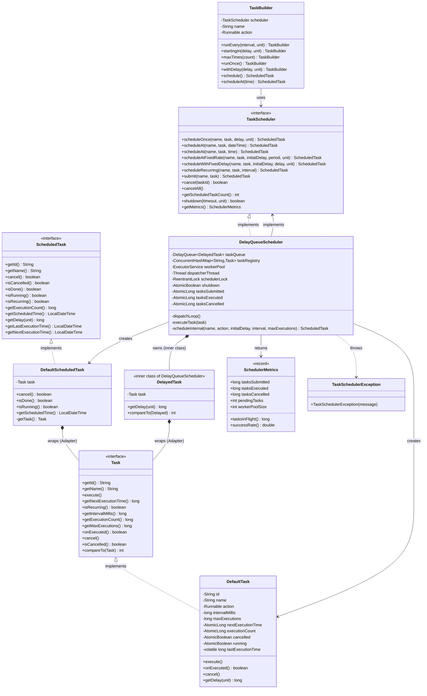

# Task Scheduler — Design Document (D.I.C.E. Format)

Inspired by cron-style task scheduling in production systems.
Supports one-time, recurring, and wall-clock-time scheduled execution with a thread-safe dispatcher + worker pool model.

Follows the D.I.C.E. workflow from `INSTRUCTIONS.md`.

---

## Step 1 — DEFINE (Requirements & Constraints)

### Functional Requirements

1. A caller can **schedule a one-time task** to run after a specified delay.
2. A caller can **schedule a one-time task at an absolute wall-clock time** (`LocalDateTime` or `LocalTime`).
3. A caller can **schedule a recurring task at a fixed rate** — period measured from the start of each execution.
4. A caller can **schedule a recurring task with a fixed delay** — period measured from the end of each execution.
5. A caller can **cancel a scheduled task** by ID at any time before or during execution.
6. A caller can **cancel all scheduled tasks** in one call.
7. The scheduler **limits recurring tasks to a maximum execution count** (0 = unlimited).
8. The scheduler **exposes live metrics**: tasks submitted, executed, cancelled, pending, in-flight, success rate.
9. The scheduler **shuts down gracefully**, waiting up to a configured timeout for running tasks to finish.

### Non-Functional Requirements

- **Thread-safe** — multiple threads may schedule and cancel tasks concurrently without corruption.
- **O(log n) scheduling** — `DelayQueue` (heap) orders tasks by execution time.
- **O(1) cancellation** — `ConcurrentHashMap` registry enables lookup by ID.
- **Dispatcher isolation** — a single dedicated dispatcher thread separates scheduling logic from execution logic; worker threads only execute task payloads.

### Constraints

- In-memory only — no persistence, no disk.
- Single JVM process.
- Worker pool is fixed-size (configured at construction time).
- `DelayQueue` is unbounded — unbounded task growth is a documented limitation.

### Out of Scope

- Cron expression parsing.
- Distributed scheduling across multiple JVM nodes.
- Persistence / crash recovery.
- Dynamic worker pool resizing at runtime.

---

## Step 2 — IDENTIFY (Entities & Relationships)

### Noun → Verb extraction

> A **caller** *schedules* a **task** → the **scheduler** *stores* it in a **registry** and *enqueues* a **delayed wrapper** into a **queue** → a **dispatcher thread** *takes* ready **tasks** → *submits* them to a **worker pool** → **metrics** *track* all lifecycle events.

### Nouns → Candidate Entities

| Noun | Entity Type | Notes |
|---|---|---|
| Task | Interface | Core unit of work: id, name, execute(), scheduling state |
| DefaultTask | Class | Implements `Task`; all state mutation via `AtomicLong` / `AtomicBoolean` |
| ScheduledTask | Interface | Client-facing handle: cancel, status queries, execution counts |
| DefaultScheduledTask | Class | Adapts `Task` to `ScheduledTask` — wraps the internal `Task` reference |
| TaskScheduler | Interface | Facade: all schedule/cancel/metrics operations |
| DelayQueueScheduler | Class | Production implementation using `DelayQueue` + dispatcher thread + worker pool |
| DelayedTask | Inner class | Adapter: wraps `Task` to implement `Delayed` for `DelayQueue` |
| TaskBuilder | Class | Builder: fluent API for complex task configuration |
| SchedulerMetrics | Record | Immutable snapshot: submitted, executed, cancelled, pending, pool size |
| TaskSchedulerException | Exception | Unchecked; thrown on illegal scheduler state (e.g. schedule-after-shutdown) |

### Verbs → Methods / Relationships

| Verb | Lives on |
|---|---|
| `scheduleOnce / scheduleAt / scheduleAtFixedRate / scheduleWithFixedDelay / scheduleRecurring / submit` | `TaskScheduler`, `DelayQueueScheduler` |
| `execute()` | `Task`, `DefaultTask` |
| `onExecuted()` — update state, return whether to reschedule | `Task`, `DefaultTask` |
| `cancel(taskId)` / `cancelAll()` | `TaskScheduler`, `DelayQueueScheduler` |
| `getDelay(TimeUnit)` | `DelayedTask` (Delayed adapter) |
| `getMetrics()` | `TaskScheduler`, `DelayQueueScheduler` |
| `shutdown(timeout, unit)` | `TaskScheduler`, `DelayQueueScheduler` |

### Relationships

```
TaskBuilder         ──uses──►       TaskScheduler          (Dependency)
DelayQueueScheduler ──implements──► TaskScheduler          (Realization)
DefaultTask         ──implements──► Task                   (Realization)
DefaultScheduledTask ──implements── ScheduledTask          (Realization)
DefaultScheduledTask ──wraps──►     Task                   (Adapter / Composition)
DelayedTask         ──wraps──►      Task                   (Adapter — inner class of DelayQueueScheduler)
DelayQueueScheduler ──owns──►       DelayQueue<DelayedTask> (Composition)
DelayQueueScheduler ──owns──►       ConcurrentHashMap (registry) (Composition)
DelayQueueScheduler ──owns──►       ExecutorService (worker pool) (Composition)
DelayQueueScheduler ──owns──►       Thread (dispatcher)     (Composition)
DelayQueueScheduler ──creates──►    DefaultTask             (Dependency)
DelayQueueScheduler ──creates──►    DefaultScheduledTask    (Dependency)
DelayQueueScheduler ──returns──►    SchedulerMetrics        (Dependency)
```

### Design Patterns Applied

| Pattern | Where | Why |
|---|---|---|
| **Facade** | `TaskScheduler` interface | Hides `DelayQueue`, dispatcher thread, worker pool, registry — callers see one clean API |
| **Builder** | `TaskBuilder` | `initialDelay`, `interval`, `maxTimes`, `scheduleAt` are optional; Builder avoids telescoping constructors |
| **Adapter (×2)** | `DelayedTask` wraps `Task` for `DelayQueue`; `DefaultScheduledTask` wraps `Task` for the client API | `DelayQueue` requires `Delayed`; clients need `ScheduledTask` — neither matches `Task` directly |
| **Producer-Consumer** | Caller threads produce tasks into `DelayQueue`; dispatcher thread consumes | Decouples scheduling timing from execution; dispatcher never blocks on task logic |
| **State** | `DefaultTask` manages `SCHEDULED → RUNNING → COMPLETED / CANCELLED` via `AtomicBoolean` flags | Atomic CAS (`compareAndSet`) prevents double-execution under concurrent dispatcher + cancel races |
| **Command** | `DefaultTask` encapsulates a `Runnable action` as an object | Allows the scheduler to hold, delay, cancel, and re-enqueue work without knowing what the work is |

---

## Step 3 — CLASS DIAGRAM (Mermaid.js)



---

## Step 4 — PACKAGE STRUCTURE

```
com.lldprep.taskscheduler/
│
├── DESIGN_DICE.md                         ← this file (D.I.C.E. format)
├── DESIGN.md                              ← original design notes (retained)
├── CURVEBALL_SCENARIOS.md
├── Q_AND_A.md
├── README.md
│
├── TaskScheduler.java                     ← Facade interface: all scheduling operations
├── Task.java                              ← interface: unit of work + lifecycle contract
├── ScheduledTask.java                     ← interface: client handle for a scheduled task
├── DefaultTask.java                       ← Task implementation; AtomicBoolean/AtomicLong for thread-safe state
├── DefaultScheduledTask.java              ← Adapter: wraps Task to expose ScheduledTask to callers
├── DelayQueueScheduler.java               ← Main implementation: DelayQueue + dispatcher + worker pool
│     └── (inner) DelayedTask              ← Adapter: wraps Task to implement Delayed for DelayQueue
├── TaskBuilder.java                       ← Builder: fluent API for complex task configuration
├── SchedulerMetrics.java                  ← Record: immutable metrics snapshot
│
├── exception/
│   └── TaskSchedulerException.java        ← unchecked; thrown on schedule-after-shutdown
│
└── demo/
    └── TaskSchedulerDemo.java             ← exercises all functional requirements
```

---

## Step 5 — IMPLEMENTATION ORDER (per INSTRUCTIONS.md)

Interfaces first. Models second. Implementations third. Orchestration fourth. Demo last.

1. `exception/TaskSchedulerException.java` — unchecked exception
2. `Task.java` — interface with `default compareTo`
3. `ScheduledTask.java` — interface
4. `TaskScheduler.java` — facade interface
5. `SchedulerMetrics.java` — record (pure data)
6. `DefaultTask.java` — Task implementation; all Atomic state
7. `DefaultScheduledTask.java` — Adapter wrapping Task
8. `DelayQueueScheduler.java` — orchestrator (inner `DelayedTask` lives here)
9. `TaskBuilder.java` — Builder over `TaskScheduler`
10. `demo/TaskSchedulerDemo.java` — last

---

## Step 6 — EVOLVE (Curveballs)

| Curveball | Impact on current design | Extension strategy |
|---|---|---|
| **Cron expression support** (`"0 9 * * MON-FRI"`) | New scheduling strategy only | Add `CronSchedulingStrategy implements SchedulingStrategy` that computes `nextExecutionTime` from a cron string. `DefaultTask` accepts a `SchedulingStrategy` instead of a raw `intervalMillis`. Zero changes to dispatcher or interface. |
| **Retry with exponential backoff** (failed task retries after 1s, 2s, 4s…) | `onExecuted()` return contract unchanged | Add `ExponentialBackoffTask extends DefaultTask` overriding `onExecuted()` to set `nextExecutionTime = now + (baseDelay * 2^attempt)`. Dispatcher re-enqueues as before. |
| **Task persistence / crash recovery** | Registry is in-memory | Extract `TaskStore` interface (`save / delete / loadAll`). `DelayQueueScheduler` calls `taskStore.save(task)` on schedule and `taskStore.delete(id)` on completion. Inject `InMemoryTaskStore` now; swap to `FileTaskStore` or `RedisTaskStore` later. Zero changes to dispatcher. |
| **Distributed scheduling** (multiple JVM nodes, one execution guarantee) | `executeTask` needs a distributed lock | Add `TaskLock` interface (`acquire(taskId) / release(taskId)`). Dispatcher calls `lock.acquire()` before submitting to worker pool; releases in `finally`. Inject `NoOpTaskLock` locally; swap to `RedisTaskLock` for distributed. Zero interface changes. |
| **Pausing and resuming the scheduler** | Dispatcher loop runs unconditionally | Add `AtomicBoolean paused` field. Dispatcher checks `paused.get()` and calls `LockSupport.parkNanos` instead of `queue.take()`. `pause()` / `resume()` on the interface — only `DelayQueueScheduler` changes. |
| **Priority scheduling** (high-priority tasks preempt low-priority) | `DelayQueue` orders only by time | Add `priority` field to `Task`; change `compareTo` to sort by `(executionTime, priority)`. `DelayedTask.compareTo` updated accordingly. One-line change; interface unchanged. |

---

## How the Dispatcher + DelayQueue Works

> This is why tasks fire at the right time without busy-polling.

**On schedule:**
A caller invokes `scheduleOnce(...)` → `DelayQueueScheduler.scheduleInternal()` creates a `DefaultTask` (stores in registry) and wraps it in a `DelayedTask`, then calls `taskQueue.put(delayedTask)`. `DelayQueue.put()` is non-blocking and thread-safe.

**On dispatch:**
The dispatcher thread loops on `taskQueue.take()`. `DelayQueue.take()` **blocks** until the head element's `getDelay()` returns ≤ 0. When a task's time arrives, `take()` unblocks and returns the `DelayedTask`. The dispatcher checks the cancellation flag, then submits `task.execute()` to the worker pool and returns to blocking — it never does real work itself.

**On reschedule (recurring):**
After `task.execute()` completes in a worker thread, `task.onExecuted()` updates `nextExecutionTime = now + intervalMillis` and returns `true`. The worker re-wraps the task in a new `DelayedTask` and calls `taskQueue.put()` again. The cycle continues.

**Why a separate dispatcher thread?**
If the caller thread blocked on `take()` it couldn't schedule new tasks. If worker threads blocked on `take()` they'd be wasted while idle. The single dedicated dispatcher thread is the minimal design: one cheap thread that does nothing but wait and hand off.

---

## Thread Safety Analysis

| Operation | Thread Safety | Mechanism |
|---|---|---|
| `schedule*()` | ✅ | `ReentrantLock` around registry + queue put; `ConcurrentHashMap.put`; `DelayQueue.put` is thread-safe |
| `cancel(id)` | ✅ | `AtomicBoolean.set(true)` on task; `ConcurrentHashMap.remove` |
| `execute()` | ✅ | `AtomicBoolean.compareAndSet(false, true)` — only one thread can enter execution |
| `onExecuted()` | ✅ | `AtomicLong.incrementAndGet()`; `AtomicLong.set()` for next time |
| Dispatcher loop | ✅ | `DelayQueue.take()` is thread-safe; dispatcher is the only consumer |
| Metrics reads | ✅ | All `AtomicLong` — reads are always consistent |

**Key race: cancel vs dispatcher**
The task's `cancelled` flag is checked **twice**: once in the dispatcher before submitting to the pool, and once in `task.execute()` itself. This double-check prevents a task from running if it was cancelled in the window between `take()` and `submit()`.

---

## Scoring Breakdown (SchedulerMetrics)

| Metric | How computed |
|---|---|
| `tasksSubmitted` | Incremented atomically on every `scheduleInternal` call |
| `tasksExecuted` | Incremented atomically after each successful `task.execute()` |
| `tasksCancelled` | Incremented atomically on `cancel()` / `cancelAll()` |
| `pendingTasks` | Live count: registry entries that are not cancelled and not completed |
| `tasksInFlight` | `submitted - executed - cancelled` |
| `successRate` | `executed / (executed + cancelled)` |

---

## Self-Review Checklist

- [x] Requirements written before any class design
- [x] Class diagram produced with typed relationships
- [x] Every relationship typed (composition, adapter, realization, dependency)
- [x] Every class has a single nameable responsibility
- [x] Adding a new scheduling strategy (cron, backoff) requires zero changes to dispatcher (OCP)
- [x] `DelayQueueScheduler` depends on `Task` and `TaskScheduler` interfaces, not concrete types (DIP)
- [x] `TaskBuilder` depends on `TaskScheduler` interface — can target any implementation (DIP)
- [x] `ScheduledTask` is a minimal client-facing interface — callers never see `DefaultTask` internals (ISP)
- [x] Patterns documented with "why"
- [x] Thread-safety addressed with double-check cancel guard and Atomic state
- [x] Custom exception defined in `exception/`
- [x] Demo covers all 9 functional requirements
- [x] Curveball scenarios in `CURVEBALL_SCENARIOS.md` and Step 6 above
