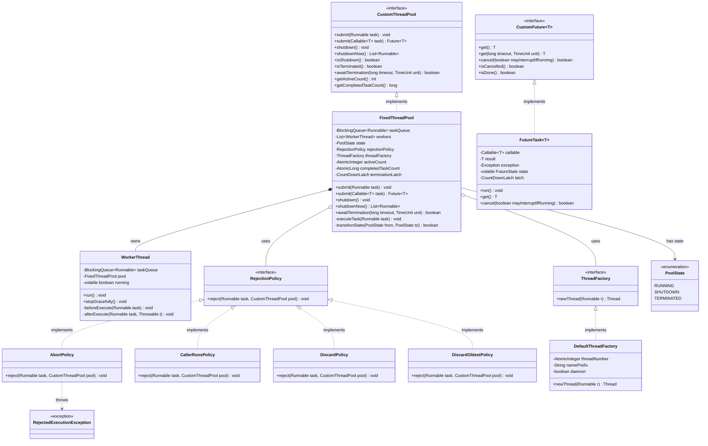

# Custom Thread Pool - Low-Level Design Document

**Problem**: Design a production-grade custom thread pool executor without using `java.util.concurrent.ExecutorService`.

**Date**: 2026-03-28  
**Complexity**: O(1) for task submission (with bounded queue), O(k) for shutdown where k = number of threads

---

## Step 1: DEFINE — Requirements & Constraints

### Functional Requirements (Actor-Verb-Noun)

- **FR1**: User can submit tasks (Runnable/Callable) for asynchronous execution
- **FR2**: User can configure pool size (fixed, core/max for dynamic pools)
- **FR3**: User can configure task queue capacity and rejection policy
- **FR4**: User can retrieve task results via Future interface
- **FR5**: User can gracefully shutdown pool (finish existing tasks)
- **FR6**: User can forcefully shutdown pool (interrupt running tasks)
- **FR7**: User can wait for termination with timeout (awaitTermination)
- **FR8**: User can monitor pool metrics (active threads, completed tasks)
- **FR9**: System handles task exceptions without crashing worker threads
- **FR10**: User can customize thread creation (names, daemon status, priority)

### Non-Functional Requirements

- **NFR1**: **Thread Safety** — All operations must be thread-safe for concurrent access
- **NFR2**: **Resource Management** — Prevent memory leaks from unbounded queues
- **NFR3**: **Graceful Degradation** — Handle task rejection without crashing
- **NFR4**: **Observability** — Provide metrics for monitoring and debugging
- **NFR5**: **Extensibility** — Support custom rejection policies and thread factories
- **NFR6**: **Performance** — Minimize lock contention, use lock-free structures where possible

### Constraints

- **C1**: **No java.util.concurrent.Executor** — Must implement from scratch
- **C2**: **Bounded Resources** — Queue capacity must be configurable to prevent OOM
- **C3**: **Lifecycle Management** — Clear state transitions (RUNNING → SHUTDOWN → TERMINATED)
- **C4**: **No Thread Leaks** — All threads must terminate on shutdown

### Out of Scope

- Work-stealing algorithms (ForkJoinPool)
- Scheduled/periodic task execution (ScheduledThreadPoolExecutor)
- Distributed thread pools across multiple JVMs
- Priority-based task queues

---

## Step 2: IDENTIFY — Entities & Relationships

### Noun-Verb Analysis

**Nouns** (Candidate Entities):
- Thread Pool → `CustomThreadPool` (interface)
- Fixed Thread Pool → `FixedThreadPool` (implementation)
- Worker Thread → `WorkerThread` (thread that executes tasks)
- Task Queue → `BlockingQueue<Runnable>` (composition)
- Rejection Policy → `RejectionPolicy` (interface)
- Thread Factory → `ThreadFactory` (interface)
- Future → `CustomFuture<T>` (interface for task results)
- Lifecycle State → `PoolState` (enum: RUNNING, SHUTDOWN, TERMINATED)
- Pool Metrics → `ThreadPoolMetrics` (monitoring data)

**Verbs** (Candidate Methods):
- "submit task" → `submit(Runnable task)`, `submit(Callable<T> task)`
- "shutdown gracefully" → `shutdown()`
- "shutdown immediately" → `shutdownNow()`
- "wait for termination" → `awaitTermination(long timeout, TimeUnit unit)`
- "reject task" → `reject(Runnable task, CustomThreadPool pool)`
- "create thread" → `newThread(Runnable r)`
- "get task result" → `get()`, `get(long timeout, TimeUnit unit)`
- "cancel task" → `cancel(boolean mayInterruptIfRunning)`

### Relationships

| From | To | Type | Meaning |
|------|-----|------|---------|
| `FixedThreadPool` | `CustomThreadPool` | **Realization** | Implements the pool interface |
| `FixedThreadPool` | `WorkerThread` | **Composition** | Pool owns worker threads |
| `FixedThreadPool` | `BlockingQueue<Runnable>` | **Composition** | Pool owns task queue |
| `FixedThreadPool` | `RejectionPolicy` | **Dependency (Strategy)** | Uses pluggable rejection strategy |
| `FixedThreadPool` | `ThreadFactory` | **Dependency (Factory)** | Uses factory to create threads |
| `WorkerThread` | `Thread` | **Inheritance** | Worker is a specialized thread |
| `CustomFuture<T>` | `Future<T>` | **Realization** | Implements future interface |
| `AbortPolicy` | `RejectionPolicy` | **Realization** | Concrete rejection strategy |
| `CallerRunsPolicy` | `RejectionPolicy` | **Realization** | Concrete rejection strategy |

---

## Step 3: Design Patterns Applied

### 1. **Strategy Pattern** ⭐ (Primary)

**Problem**: Different applications need different rejection behaviors when queue is full.

**Solution**: Define `RejectionPolicy` interface with multiple implementations.

**Implementations**:
- `AbortPolicy` — Throw exception (fail-fast)
- `CallerRunsPolicy` — Execute in caller's thread (backpressure)
- `DiscardPolicy` — Silently drop task
- `DiscardOldestPolicy` — Drop oldest task, retry new one

**Benefit**: Open/Closed Principle — add new policies without modifying pool code.

---

### 2. **Factory Pattern** ⭐ (Primary)

**Problem**: Thread creation needs customization (naming, daemon status, priority, exception handlers).

**Solution**: Define `ThreadFactory` interface to abstract thread creation.

**Benefit**: 
- Centralized thread configuration
- Easy to add custom thread naming strategies
- Supports UncaughtExceptionHandler injection

---

### 3. **Builder Pattern** ⭐ (Primary)

**Problem**: Thread pool construction has many optional parameters:
- Pool size (required)
- Queue capacity (optional, default unbounded)
- Rejection policy (optional, default abort)
- Thread factory (optional, default simple factory)
- Keep-alive time (for dynamic pools)

**Solution**: `FixedThreadPool.Builder` with fluent API.

**Benefit**:
- Readable construction
- Validation before object creation
- Immutable pool after construction

---

### 4. **State Pattern** (Implicit)

**Problem**: Thread pool has distinct lifecycle states with different behaviors.

**Solution**: `PoolState` enum with state transitions:
```
RUNNING → SHUTDOWN → TERMINATED
```

**State Behaviors**:
- `RUNNING`: Accept new tasks, execute queued tasks
- `SHUTDOWN`: Reject new tasks, execute queued tasks
- `TERMINATED`: Reject new tasks, no tasks executing

---

### 5. **Observer Pattern** (Implicit)

**Problem**: Callers need to know when tasks complete and retrieve results.

**Solution**: `CustomFuture<T>` with blocking `get()` and callback support.

**Benefit**: Decouples task submission from result retrieval.

---

### 6. **Template Method Pattern** (Considered, NOT used)

**Decision**: Worker thread execution loop is simple enough that extracting a template method would be over-engineering. Keep it explicit.

---

## Step 4: Class Diagram (Mermaid.js)



---

## Step 5: SOLID Principles Compliance

### ✅ Single Responsibility Principle (SRP)
- `FixedThreadPool` — manages thread lifecycle and task distribution
- `WorkerThread` — executes tasks from queue
- `RejectionPolicy` — handles task rejection
- `ThreadFactory` — creates and configures threads
- `FutureTask` — manages task result and cancellation

### ✅ Open/Closed Principle (OCP)
- Adding new rejection policy = new class implementing `RejectionPolicy`
- Adding new thread factory = new class implementing `ThreadFactory`
- Zero modifications to existing pool code

### ✅ Liskov Substitution Principle (LSP)
- Any `RejectionPolicy` implementation can replace another
- Any `ThreadFactory` implementation can replace another
- All honor their interface contracts

### ✅ Interface Segregation Principle (ISP)
- `RejectionPolicy` has one method: `reject()`
- `ThreadFactory` has one method: `newThread()`
- `CustomThreadPool` interface is cohesive (all methods related to pool management)

### ✅ Dependency Inversion Principle (DIP)
- `FixedThreadPool` depends on `RejectionPolicy` interface, not concrete classes
- `FixedThreadPool` depends on `ThreadFactory` interface, not concrete classes
- Dependencies injected via Builder

---

## Step 6: Lifecycle State Machine

```
┌─────────┐  submit()   ┌──────────┐  shutdown()   ┌──────────┐
│ RUNNING │ ──────────> │ RUNNING  │ ───────────> │ SHUTDOWN │
└─────────┘             └──────────┘              └──────────┘
                             │                          │
                             │ shutdownNow()            │ all tasks done
                             │                          │
                             └──────────────────────────┘
                                        │
                                        v
                                  ┌──────────┐
                                  │TERMINATED│
                                  └──────────┘
```

**State Transitions**:
1. **RUNNING → SHUTDOWN**: `shutdown()` called, no new tasks accepted
2. **RUNNING → TERMINATED**: `shutdownNow()` called, interrupt all threads
3. **SHUTDOWN → TERMINATED**: All queued tasks completed

---

## Step 7: Thread Safety Strategy

### Lock-Free Structures
- `AtomicInteger` for active thread count
- `AtomicLong` for completed task count
- `volatile` for state transitions

### Blocking Structures
- `BlockingQueue` for thread-safe task queue
- `CountDownLatch` for termination signaling
- `ReentrantLock` for state transitions (if needed)

### Synchronization Points
- Task submission: Queue offer/put (may block if bounded)
- Task retrieval: Queue take (blocks until available)
- Shutdown: Interrupt all workers, wait for termination

---

## Step 8: Exception Handling Strategy

### Task Exceptions
- Caught in `WorkerThread.run()` → logged, worker continues
- Stored in `FutureTask` → rethrown on `get()`

### Thread Exceptions
- `UncaughtExceptionHandler` set via `ThreadFactory`
- Fatal errors → log and resurrect worker thread (optional)

### Rejection Exceptions
- `AbortPolicy` → throws `RejectedExecutionException`
- Other policies → handle gracefully

---

## Step 9: Package Structure

```
com.lldprep.threadpool/
    ├── DESIGN.md                       (this file)
    ├── README.md                       (usage examples)
    ├── CustomThreadPool.java           (interface)
    ├── FixedThreadPool.java            (main implementation with Builder)
    ├── WorkerThread.java               (worker thread)
    ├── PoolState.java                  (enum)
    ├── ThreadPoolMetrics.java          (metrics data class)
    ├── policy/
    │   ├── RejectionPolicy.java        (interface)
    │   ├── AbortPolicy.java
    │   ├── CallerRunsPolicy.java
    │   ├── DiscardPolicy.java
    │   └── DiscardOldestPolicy.java
    ├── factory/
    │   ├── ThreadFactory.java          (interface)
    │   └── DefaultThreadFactory.java
    ├── future/
    │   ├── CustomFuture.java           (interface)
    │   └── FutureTask.java             (implementation)
    ├── exception/
    │   └── RejectedExecutionException.java
    └── demo/
        ├── ThreadPoolDemo.java         (basic demo)
        ├── RejectionPolicyDemo.java    (rejection scenarios)
        └── FutureDemo.java             (Callable/Future demo)
```

---

## Step 10: Curveball Scenarios

| Curveball | How to Handle |
|-----------|---------------|
| **"Add support for task priorities"** | Replace `BlockingQueue` with `PriorityBlockingQueue`, tasks implement `Comparable` |
| **"Add scheduled execution"** | Create `ScheduledThreadPool` with `DelayQueue`, wrap tasks in `ScheduledFutureTask` |
| **"Support work stealing"** | Create `WorkStealingThreadPool` with per-thread `Deque`, workers steal from others |
| **"Add thread pool resizing"** | Implement `DynamicThreadPool` with core/max sizes, add/remove workers dynamically |
| **"Support task cancellation"** | Already supported via `FutureTask.cancel()` |
| **"Add completion callbacks"** | Extend `FutureTask` with `addListener(Runnable callback)` |
| **"Monitor thread pool health"** | Add `ThreadPoolMetrics` with saturation, throughput, latency metrics |

---

## Step 11: Time/Space Complexity

### Time Complexity
- `submit()`: O(1) amortized (queue offer)
- `shutdown()`: O(k) where k = number of threads
- `awaitTermination()`: O(1) (wait on latch)
- `get()` on Future: O(1) (wait on latch)

### Space Complexity
- O(k + n) where k = number of threads, n = queue capacity
- Bounded queue prevents O(∞) memory growth

---

## Interview Communication Notes

**What to say during interview**:

1. **After requirements**: "I'll use Strategy pattern for rejection policies since different apps need different backpressure strategies, and Factory pattern for thread creation to support custom naming and exception handlers."

2. **During design**: "I'm making the queue bounded by default to prevent OutOfMemoryError. If the queue fills up, the rejection policy decides what to do—abort, run in caller's thread, or discard."

3. **Trade-offs**: "I chose `BlockingQueue` over lock-free queues for simplicity and correctness. In production, we could optimize with `ConcurrentLinkedQueue` + `LockSupport.park()` for lower latency."

4. **Proactive extensibility**: "After the base implementation, I can extend this to support scheduled execution with `DelayQueue`, or work-stealing with per-thread deques."

---

**Next Steps**: Implement the design following this document.
