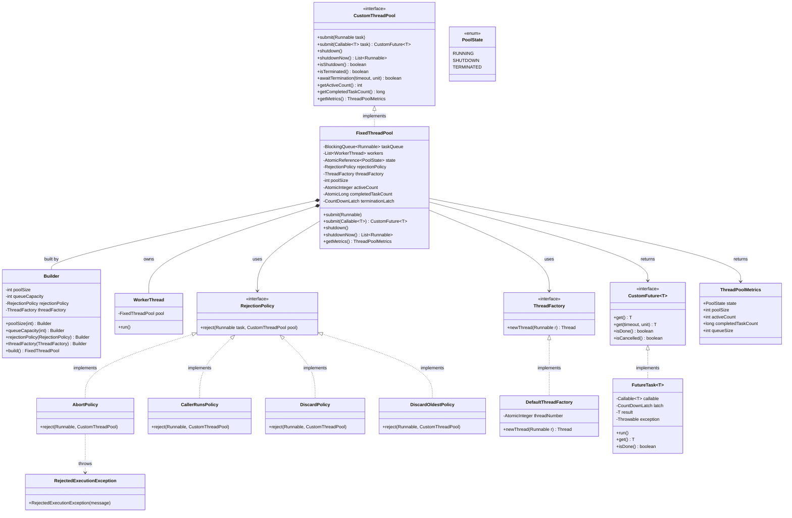

# Custom Thread Pool — Design Document (D.I.C.E. Format)

Fixed-size thread pool built from scratch without `java.util.concurrent.ThreadPoolExecutor`.
Supports `Runnable` and `Callable<T>`, four rejection policies, pluggable thread factory, and lifecycle metrics.

Follows the D.I.C.E. workflow from `INSTRUCTIONS.md`.

---

## Step 1 — DEFINE (Requirements & Constraints)

### Functional Requirements

1. A caller can **submit a `Runnable`** for execution — fire-and-forget.
2. A caller can **submit a `Callable<T>`** and receive a **`CustomFuture<T>`** to retrieve the result.
3. The pool **executes tasks concurrently** on a fixed number of worker threads.
4. The pool **queues tasks** when all threads are busy (bounded or unbounded queue).
5. When the queue is also full, the configured **rejection policy** handles overflow:
   - `AbortPolicy` — throw `RejectedExecutionException`
   - `CallerRunsPolicy` — run task in the caller's thread (backpressure)
   - `DiscardPolicy` — silently drop
   - `DiscardOldestPolicy` — drop oldest queued task, retry submit
6. The caller can **shut down gracefully** (`shutdown`) — no new tasks, finish queued ones.
7. The caller can **shut down immediately** (`shutdownNow`) — drain queue, interrupt workers.
8. The caller can **await termination** with a timeout.
9. The pool exposes **live metrics** via `getMetrics()`.

### Non-Functional Requirements

- **O(1) submit** (amortized) — `LinkedBlockingQueue.offer()`.
- **Thread-safe lifecycle** — `AtomicReference<PoolState>` for atomic state transitions.
- **No `java.util.concurrent.Executor`** — built from primitives (`BlockingQueue`, `Thread`, `AtomicLong`).
- **OCP** — new rejection policies and thread factories added without modifying `FixedThreadPool`.
- **DIP** — `FixedThreadPool` depends on `RejectionPolicy` and `ThreadFactory` interfaces.

### Constraints

- Fixed pool size — no dynamic scaling.
- `LinkedBlockingQueue` — FIFO; no task priority.
- No task timeout per task.
- No `invokeAll` / `invokeAny`.

### Out of Scope

- Dynamic pool sizing (core + max threads like `ThreadPoolExecutor`).
- Work stealing across threads.
- Task priority queue.
- `ScheduledExecutorService`-like time-based scheduling.

---

## Step 2 — IDENTIFY (Entities & Relationships)

### Noun → Verb extraction

> A **caller** *submits* a **task** → **FixedThreadPool** *offers* it to a **BlockingQueue** → if full, **RejectionPolicy** *handles* overflow → **WorkerThread** *takes* tasks from queue and *executes* them → for `Callable`, **FutureTask** *wraps* the result → caller *gets* result from **CustomFuture**.

### Nouns → Candidate Entities

| Noun | Entity Type | Notes |
|---|---|---|
| CustomThreadPool | Interface | Contract: `submit / shutdown / shutdownNow / awaitTermination / getMetrics` |
| FixedThreadPool | Class | Implementation: `BlockingQueue` + `WorkerThread[]` + `AtomicReference<PoolState>` + Builder |
| WorkerThread | Class | Runnable loop: `queue.take()` → `execute` → update metrics → handle interrupt/shutdown |
| PoolState | Enum | `RUNNING → SHUTDOWN → TERMINATED` |
| RejectionPolicy | Interface | Strategy: `reject(task, pool)` |
| AbortPolicy | Class | Throws `RejectedExecutionException` |
| CallerRunsPolicy | Class | Runs task in the submitting thread |
| DiscardPolicy | Class | Silently drops the task |
| DiscardOldestPolicy | Class | Drains oldest from queue, re-offers new task |
| ThreadFactory | Interface | Factory: `newThread(Runnable)` → `Thread` |
| DefaultThreadFactory | Class | Creates daemon threads named `pool-thread-N` |
| CustomFuture | Interface | `get() / get(timeout) / isDone() / isCancelled()` |
| FutureTask | Class | Implements `Runnable` + `CustomFuture<T>`; uses `CountDownLatch(1)` for blocking `get()` |
| ThreadPoolMetrics | Class (record) | Snapshot: `state / poolSize / activeCount / completedCount / queueSize` |
| RejectedExecutionException | Exception | Unchecked; thrown by `AbortPolicy` |

### Relationships

```
CustomThreadPool    ◄──implements── FixedThreadPool              (Realization)
FixedThreadPool     ──owns──►       WorkerThread[]               (Composition)
FixedThreadPool     ──owns──►       BlockingQueue<Runnable>      (Composition)
FixedThreadPool     ──uses──►       RejectionPolicy (injected)   (Association — DIP)
FixedThreadPool     ──uses──►       ThreadFactory (injected)     (Association — DIP)
FixedThreadPool     ──returns──►    ThreadPoolMetrics            (Dependency)
FixedThreadPool     ──returns──►    CustomFuture~T~              (Dependency)
FixedThreadPool.Builder ──creates── FixedThreadPool              (Builder)
WorkerThread        ──reads──►      FixedThreadPool (back-ref)   (Association)
RejectionPolicy     ◄──implements── AbortPolicy                  (Realization)
RejectionPolicy     ◄──implements── CallerRunsPolicy             (Realization)
RejectionPolicy     ◄──implements── DiscardPolicy                (Realization)
RejectionPolicy     ◄──implements── DiscardOldestPolicy          (Realization)
ThreadFactory       ◄──implements── DefaultThreadFactory         (Realization)
CustomFuture~T~     ◄──implements── FutureTask~T~               (Realization)
FutureTask~T~       ──implements──► Runnable                     (Realization)
AbortPolicy         ──throws──►     RejectedExecutionException   (Dependency)
```

### Design Patterns Applied

| Pattern | Where | Why |
|---|---|---|
| **Strategy** | `RejectionPolicy` | Four overflow behaviors are interchangeable — inject `AbortPolicy` by default, swap without touching `FixedThreadPool` |
| **Factory** | `ThreadFactory` | Thread naming, daemon flags, thread group — customizable without changing pool logic |
| **Builder** | `FixedThreadPool.Builder` | `queueCapacity`, `rejectionPolicy`, `threadFactory` are optional; pool size is required; Builder validates before construction |
| **State** | `PoolState` enum + `AtomicReference` | `RUNNING → SHUTDOWN → TERMINATED` transitions are atomic; `compareAndSet` prevents double-shutdown |
| **Future / Promise** | `FutureTask<T>` + `CustomFuture<T>` | Decouples task submission from result retrieval; `CountDownLatch(1)` blocks `get()` until task completes |
| **Producer-Consumer** | `BlockingQueue` between callers and workers | Decouples submission rate from execution rate; `LinkedBlockingQueue.take()` blocks worker threads when idle |

---

## Step 3 — CLASS DIAGRAM (Mermaid.js)



---

## Step 4 — PACKAGE STRUCTURE

```
com.lldprep.threadpool/
│
├── DESIGN_DICE.md                         ← this file
├── DESIGN.md                              ← original design (retained)
├── README.md
│
├── CustomThreadPool.java                  ← interface: submit / shutdown / metrics
├── FixedThreadPool.java                   ← implementation + inner Builder
├── WorkerThread.java                      ← Runnable loop: take → execute → metrics
├── PoolState.java                         ← enum: RUNNING / SHUTDOWN / TERMINATED
├── ThreadPoolMetrics.java                 ← snapshot record
│
├── policy/
│   ├── RejectionPolicy.java               ← Strategy interface
│   ├── AbortPolicy.java                   ← throw RejectedExecutionException
│   ├── CallerRunsPolicy.java              ← run in caller's thread
│   ├── DiscardPolicy.java                 ← silent drop
│   └── DiscardOldestPolicy.java           ← drop oldest, retry
│
├── factory/
│   ├── ThreadFactory.java                 ← interface: newThread(Runnable)
│   └── DefaultThreadFactory.java         ← daemon threads named pool-thread-N
│
├── future/
│   ├── CustomFuture.java                  ← interface: get / isDone / isCancelled
│   └── FutureTask.java                    ← Runnable + CustomFuture; CountDownLatch for blocking get
│
├── exception/
│   └── RejectedExecutionException.java   ← unchecked; thrown by AbortPolicy
│
└── demo/
    ├── BasicThreadPoolDemo.java           ← submit / shutdown / metrics
    ├── FutureDemo.java                    ← Callable + CustomFuture result retrieval
    └── RejectionPolicyDemo.java           ← all 4 rejection policies under saturation
```

---

## Step 5 — IMPLEMENTATION ORDER (per INSTRUCTIONS.md)

1. `exception/RejectedExecutionException.java`
2. `PoolState.java` — enum
3. `ThreadPoolMetrics.java` — record
4. `policy/RejectionPolicy.java` — interface
5. `factory/ThreadFactory.java` — interface
6. `future/CustomFuture.java` — interface
7. `policy/AbortPolicy.java`, `CallerRunsPolicy.java`, `DiscardPolicy.java`, `DiscardOldestPolicy.java`
8. `factory/DefaultThreadFactory.java`
9. `future/FutureTask.java`
10. `CustomThreadPool.java` — interface
11. `WorkerThread.java`
12. `FixedThreadPool.java` (with inner Builder)
13. `demo/*.java` — last

---

## Step 6 — EVOLVE (Curveballs)

| Curveball | Impact | Extension strategy |
|---|---|---|
| **Dynamic pool sizing** (core + max) | New state per thread (idle timer) | `DynamicThreadPool implements CustomThreadPool` — tracks idle time per `WorkerThread`, spawns up to `maxPoolSize`, terminates idle threads after `keepAliveTime`. Existing `FixedThreadPool` unchanged. |
| **Task priority** | Replace `LinkedBlockingQueue` with `PriorityBlockingQueue` | Add `priority` field to a `PrioritizedRunnable` wrapper. Change queue type in Builder. Tasks with lower priority value execute first. |
| **Task timeout per task** | `FutureTask` gains deadline | `TimedFutureTask extends FutureTask` — records deadline; `WorkerThread` checks before executing and skips stale tasks. |
| **New rejection policy** (e.g. retry with backoff) | Zero changes to pool | `RetryWithBackoffPolicy implements RejectionPolicy` — parks the calling thread briefly and retries `offer()`. Inject via Builder. |
| **Metrics per task** (execution time histogram) | `WorkerThread` records timestamps | Add `startTime`/`endTime` per execution in `WorkerThread`. Accumulate in `ThreadPoolMetrics`. SRP preserved — metrics are passive aggregation. |

---

## Thread Safety Analysis

| Component | Mechanism |
|---|---|
| Task queue | `LinkedBlockingQueue` — thread-safe; `offer()` non-blocking, `take()` blocking |
| Pool state transitions | `AtomicReference<PoolState>.compareAndSet` — exactly one thread wins RUNNING→SHUTDOWN |
| Active count | `AtomicInteger.incrementAndGet / decrementAndGet` |
| Completed count | `AtomicLong.incrementAndGet` |
| Termination signal | `CountDownLatch(poolSize)` — each worker `countDown()` on exit; `awaitTermination()` waits |
| `FutureTask` result | `CountDownLatch(1)` — set result then `countDown()`; `get()` calls `await()` |

---

## Self-Review Checklist

- [x] Requirements written before any class design
- [x] Class diagram with typed relationships
- [x] Every class has a single nameable responsibility
- [x] Adding a new rejection policy requires zero changes to `FixedThreadPool` (OCP)
- [x] Adding a custom thread factory requires zero changes to `FixedThreadPool` (OCP)
- [x] `FixedThreadPool` depends on `RejectionPolicy` and `ThreadFactory` interfaces (DIP)
- [x] `CustomFuture` interface decouples callers from `FutureTask` internals (ISP)
- [x] `PoolState` enum + `AtomicReference` prevents invalid lifecycle transitions
- [x] Patterns documented with "why"
- [x] Thread-safety per-component documented
- [x] Custom exception in `exception/`
- [x] Three demo classes cover all 9 functional requirements
